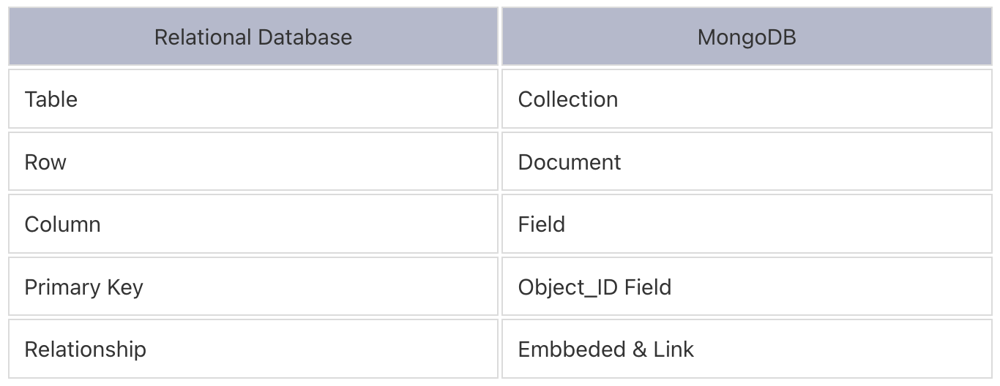
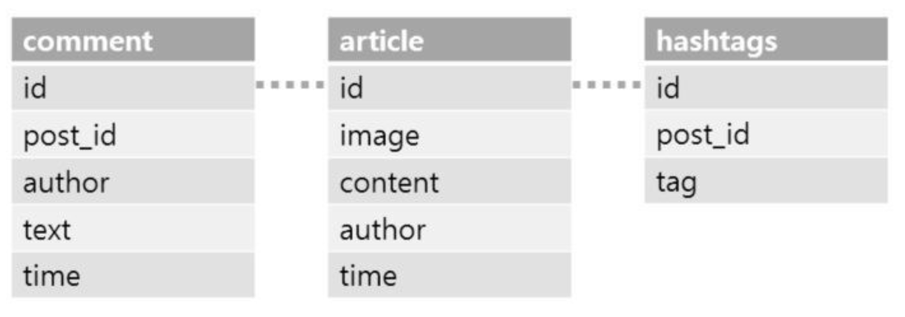
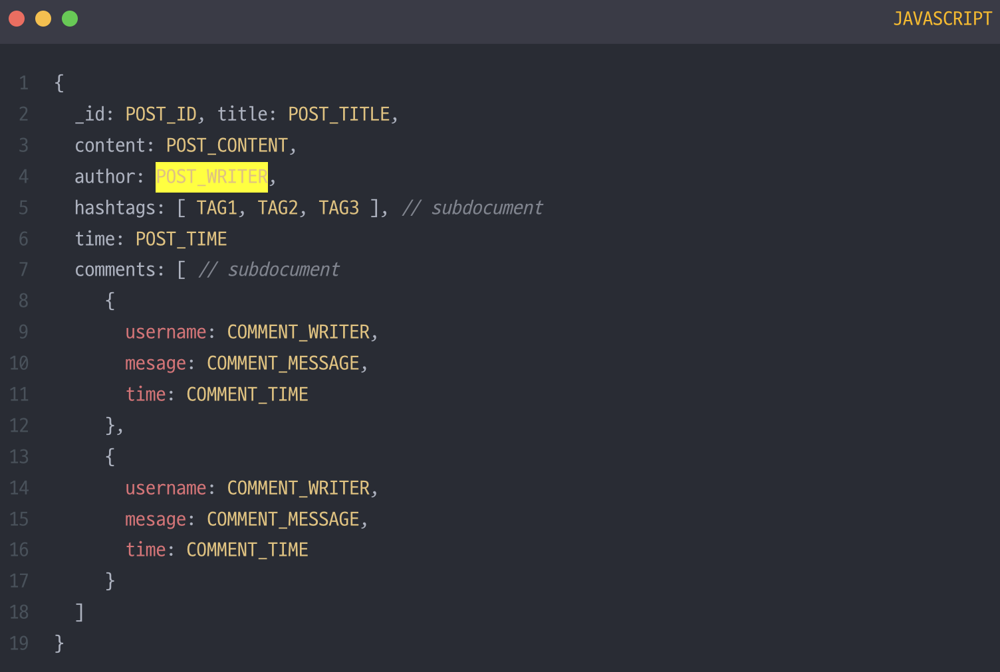

# NoSQL (MongoDB)
- `Not Only SQL`  : SQL(관계형 DB)만을 사용하지 않고, 관계형 데이터베이스를 포함한 여러 유형의 데이터베이스를 사용
- 데이터의 정합성 보다는 시간 및 가용성을 더 중요시
- 정형화 되지 않은 대용량의 데이터가 필요한 경우 사용
- 데이터 구조를 자주 업데이트 하는 경우 사용

## RDB와의 차이
### RDB
- 데이터의 정합성에 중요한 초점을 둠
- 데이터의 중복 제거 및 무결성 보장을 위해 정규화를 함
- 정규화를 하기 때문에, `JOIN` 에 대한 비용이 큼
- 테이블 간의 설계가 중요
- 테이블마다 스키마가 정해져 있음
- `ACID` 
    - `Atomicity` (원자성) : 트랜잭션은 모두 성공하거나 실패
    - `Consistency` (일관성) : 트랜잭션 실행 후 항상 제약조건을 만족
    - `Isolation` (격리성) : 트랜잭션끼리 간섭하지 않음
    - `Durability` (지속성) : 트랜잭션이 성공하면 데이터는 영구 저장

### NoSQL
- 중첩데이터 형태를 써서 불필요한 `JOIN` 을 최소화
- 비정형 데이터이기 때문에 설계비용 감소
- 유연한 스키마를 제공
- 스키마에 따라 데이터를 읽어옴(`schema on read` )
- `BASE` 
    - `Basically Available`  (기본적인 가용성)
        - 데이터의 일부가 손실되거나 네트워크 문제가 있어도 시스템은 계속 작동 (노드를 나중에 전달하는 식)
        - Replica와 같은 이론들을 사용하여 가능
    - `Soft State`  (소프트 상태)
        - 시스템의 상태는 항상 정확하지 않을 수 있음
        - 데이터는 시간이 지나면서 일관성을 얻어갈 수 있음
    - `Eventual Consistency`  (최종적 일관성)
        - 즉각적인 일관성을 보장하지 않더라도, 일정 시간이 지나면 모든 노드가 동일한 데이터 상태에 도달

  

## MongoDB 구조
### Database
- `Collection` 들이 저장되는 물리적 컨테이너

### Collection
- RDB의 `Table` 과 유사
- `Document` 들을 지님
- 스키마가 따로 없고, 동적으로 스키마를 생성

### Document
- RDB의 `Row` 와 유사
- 한개 이상의 `key:value`  쌍으로 이루어짐

### Key/Field
- RDB의 `Column` 과 유사
- 컬럼 명과 저장 값


  

## MongoDB 특징
- 눈으로 보이는건 `JSON`  형태로 저장하는 것 같지만, 실제로는 `BSON` 형태로 저장하여 사용
- 왜 `BSON` 을 사용하는가?
    - 초기에는 `JSON` 으로 만들었으나, 문제점이 나타나기 시작
    - `JSON` 은 텍스트 기반으로 구문 분석이 느림(컴퓨터가 읽기 위해 추가 파싱 필요)
    - `JSON` 은 공간 효율성과는 거리가 멈
    - `BSON` 은 이진데이터로 컴퓨터가 처리하기 쉬움
    - `BSON` 은 전송 시 속도가 빠르고 용량이 효율적
    - `BSON` 은 데이터 타입 정보와 길이를 명시적으로 저장하고 있어서 타입 확인이 빠르고 크기 효율성을 가짐
- 이미 `Collection` 에 어떤 스키마를 가진 `Document` 들이 저장되어 있을 때, 다른 스키마를 가진 `Document` 를 넣을 수 있음 (유효성 검사 X)
    - 하지만 이렇게 될 경우, 다음과 같은 문제점이 존재
        - 어떤 조회에 대해, 모든 데이터가 대상이 되지 않을 수 있음
        - 인덱스 관리가 복잡해짐

## MongoDB 명령어
```
mongosh // 서버 접속

//---

use myDatabase // myDatabase라는 이름의 데이터베이스 선택 (또는 생성)
show dbs        // 사용 가능한 데이터베이스 목록 보기
db              // 현재 선택된 데이터베이스 확인

//------

db.createCollection("myCollection") // myCollection이라는 컬렉션 생성
show collections                    // 현재 데이터베이스의 컬렉션 목록 보기

//---

// 단일 문서 삽입
db.myCollection.insertOne({ name: "Alice", age: 25, city: "Seoul" })

// 다중 문서 삽입
db.myCollection.insertMany([
    { name: "Bob", age: 30, city: "Busan" },
    { name: "Charlie", age: 28, city: "Incheon" }
])

//---

// 전체 문서 조회
db.myCollection.find()

// 특정 조건으로 조회 (예: age가 25 이상인 문서)
db.myCollection.find({ age: { $gte: 25 } })

// 특정 필드만 표시 (예: name 필드만 표시하고 _id는 숨김)
db.myCollection.find({}, { name: 1, _id: 0 })

// 첫 번째 문서만 조회
db.myCollection.findOne()

//---

// 단일 문서 업데이트 (Alice의 city를 변경)
db.myCollection.updateOne(
    { name: "Alice" },              // 조건
    { $set: { city: "Daegu" } }     // 업데이트 내용
)

// 다중 문서 업데이트 (age가 30 이상인 문서의 status 필드 추가)
db.myCollection.updateMany(
    { age: { $gte: 30 } },          // 조건
    { $set: { status: "senior" } }  // 업데이트 내용
)

//---

// 단일 문서 삭제 (name이 Alice인 문서 삭제)
db.myCollection.deleteOne({ name: "Alice" })

// 다중 문서 삭제 (age가 30 미만인 문서 모두 삭제)
db.myCollection.deleteMany({ age: { $lt: 30 } })

//---

// age를 기준으로 내림차순 정렬 후 상위 2개 문서만 조회
db.myCollection.find().sort({ age: -1 }).limit(2)

//---

db.myCollection.drop() // myCollection 컬렉션 삭제

db.dropDatabase() // 현재 선택된 데이터베이스 삭제
```

## MongoDB 인덱스
### 인덱스 생성
```
db.users.createIndex({ age: 1 }); // 단일 인덱스

db.users.createIndex({ age: 1, name: -1 }); // 복합 인덱스

db.products.createIndex({ description: "text" }); // 텍스트 인덱스

db.users.createIndex({ _id: "hashed" }); // 해시 인덱스

db.collection.createIndex({ location: "2d" }) // 지리 데이터 인덱스
db.collection.createIndex({ location: "2dsphere" }) // 지리 데이터 인덱스

db.logs.createIndex({ createdAt: 1 }, { expireAfterSeconds: 3600 }); // TTL 인덱스

db.collection.createIndex({ field: 1 }, { unique: true }) // 고유 인덱스
```

### 인덱스 확인 & 삭제
```
db.collection.getIndexes() // 인덱스 확인

db.collection.dropIndex("indexName") // 특정 인덱스 삭제

db.collection.dropIndexes() // 모든 인덱스 삭제
```
