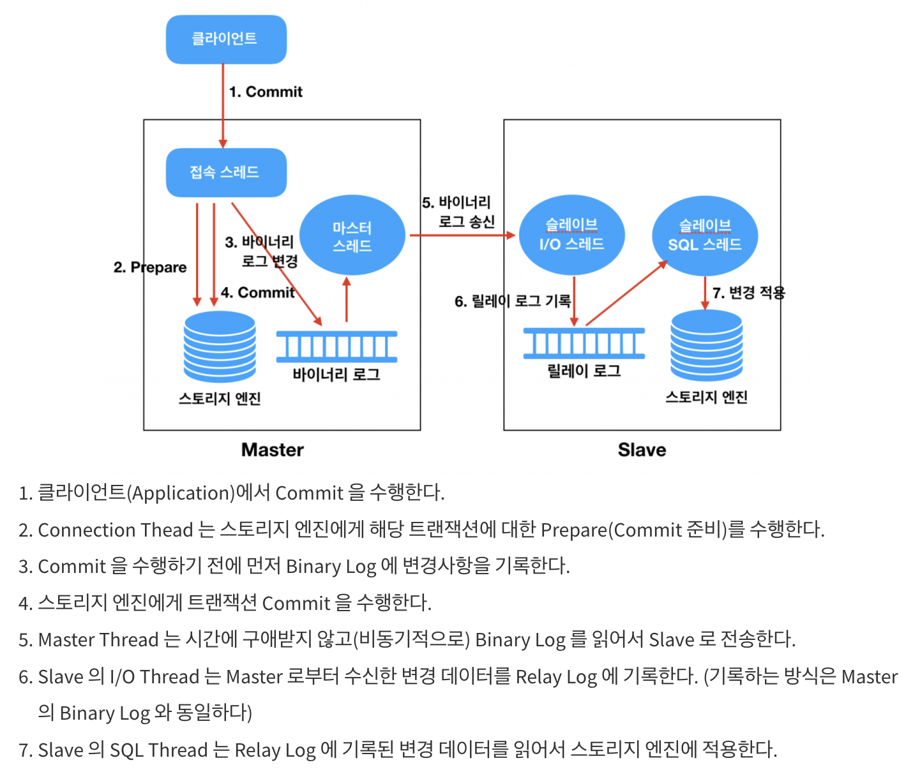

# DB Replication
- DB의 과부하 문제를 해결하는 방법 중 하나
- `Master DB` 
    - `INSERT` , `UPDATE` , `DELETE` 와 같은 데이터 수정 작업
- `Slave DB` 
    - `SELECT`  쿼리 수행
    - `SELECT`  쿼리가 대부분의 세션 시간을 차지

## 바이너리 로그 기반 복제
- `MySQL` 의 `Replication`  방식
- `Slave DB` 에 데이터를 복제할 때 “로그"기반으로 복제
- `MySQL` 이 변화에 대한 이벤트를 이진 파일로 기록 하는 것

### 동작 원리
1. `Master Node` 에서 변경되는 데이터에 대한 이력을 로그에 기록
2. `Replication Master Thread` 가 비동기적으로 읽어서 `Slave DB` 쪽으로 전송

## 장점
- `SELECT`  성능 향상
    - N개의 `Slave DB` 를 가질 수 있으므로 `Read` 에 대한 부하 감소
- 데이터 백업
    - `Master DB` 에 문제가 발생할 시 `Slave DB`  중 하나의 데이터를 백업하여 `Master DB` 로 활용

## 단점
- 데이터 정합성을 보장할 수 없음
    - 여러가지 상황(ex. `Slave DB` 가 `Master DB` 의 처리량을 따라가지 못하는 경우)에서 정합성에 이상이 발생할 수 있음
- 바이너리 로그 파일 관리
    - `Master DB` 는 `Slave DB` 의 로그까지 관리하지 않기 때문에, 로그의 차이가 발생할 수 있음
- `Fail Over`  불가
    - `Slave DB` 는 `Read` 만 가능하기 때문에 `Fail Over` 기능을 지원하지 않음

## 참고
- [https://velog.io/@zpswl45/DB-Replication-%EA%B0%9C%EB%85%90-%EC%A0%95%EB%A6%AC](https://velog.io/@zpswl45/DB-Replication-%EA%B0%9C%EB%85%90-%EC%A0%95%EB%A6%AC)
- [http://cloudrain21.com/mysql-replication](http://cloudrain21.com/mysql-replication)