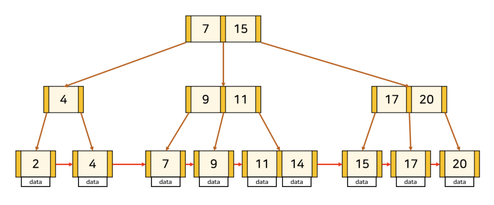

# 인덱스
- 테이블에 저장된 데이터의 검색 속도를 향상시키기 위한 **자료구조**
- 특정 컬럼 / 컬럼의 조합 / 행의 위치를 매핑하여 쿼리의 성능을 최적화
- 인덱스를 통해 검색 대상 레코드의 범위를 줄일 수 있음

### 인덱스의 생성
- 인덱스를 생성하면, 해당 컬럼의 데이터들을 **정렬**하여 인덱스를 저장
- 인덱스에 맞는 조회 시, `Optimizer` 에서 판단하여 생성된 인덱스를 통해 조회

### 장점
- 인덱스 테이블에 데이터들이 정렬되어 있기 때문에, `Full Scan` 을 하지 않아도 빠른 조회가 가능
- 이미 정렬되어 있기 때문에 부하가 큰 `Order By` 의 정렬 과정을 피할 수 있음
- 데이터가 정렬되어 있기 때문에 `Min` , `Max`  등의 값을 효율적으로 가져올 수 있음

### 단점
- 인덱스를 위한 추가적인 저장 공간 필요 ( 데이터베이스의 약 10% 추가공간이 필요 )
- `INSERT` , `UPDATE` , `DELETE`  를 통해 데이터의 변동이 생기면, 인덱스 테이블의 데이터들을 다시 정렬 해주어야 함
    - `INSERT`  : 새로운 데이터에 대한 인덱스를 추가
    - `UPDATE`  : 기존 인덱스를 사용하지 않음 처리하고, 갱싱된 데이터에 대한 인덱스를 추가
    - `DELETE`  : 기존 인덱스를 사용하지 않음 처리
- 항상 인덱스가 있다고 유리한 것은 아님

### 좋은 인덱스
- 규모가 작지 않은 테이블의 인덱스
- 중복되는 데이터가 최소한인 컬럼
- 호출 빈도가 높은 컬럼
- `Order By` 에 자주 사용되는 컬럼
- `Join`  조건으로 자주 사용되는 컬럼

### 인덱스 구조
- 주로 `B+ Tree` 구조를 자주 사용
    - `Root Node` , `Branch Node` , `Leaf Node` 으로 구성
    - `Leaf Node` 는 데이터를 가지고 있음
    - `Root Node` 와 `Branch Node` 는 데이터를 위한 인덱스만을 가짐
    - `Leaf Node` 들 끼리는 `Linked List` 로 연결되어 있어 선형 시간효율이 좋음

## 참고 사이트

- [블로그 1](https://mangkyu.tistory.com/96 "https://mangkyu.tistory.com/96")
- [블로그 2](https://ittrue.tistory.com/331 "https://ittrue.tistory.com/331")
- [블로그 3](https://velog.io/@alicesykim95/DB-%EC%9D%B8%EB%8D%B1%EC%8A%A4Index%EB%9E%80 "https://velog.io/@alicesykim95/DB-%EC%9D%B8%EB%8D%B1%EC%8A%A4Index%EB%9E%80")