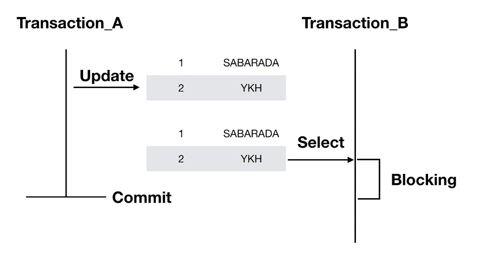
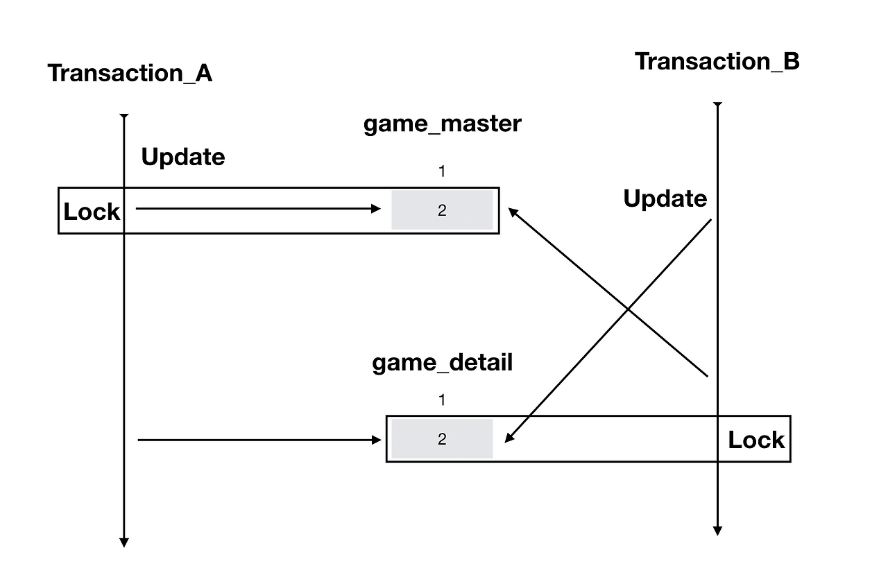

## DeadLock
- `Lock` 은 데이터의 일관성, 무결성을 지키기 위해 필수적인 요소
- 잘못 사용하게 되면 교착상태(`DeadLock` )을 유발

## Lock의 종류
### Row-Level Lock
#### 1\. Shared Lock(공유 락, S-Lock)
- 데이터를 읽을 때 사용하는 Lock (Read Lock)
- Read Lock끼리는 무결성을 해치지 않기 때문에 동시 접근이 가능
- Exclusive Lock의 접근을 막음 (읽는 동안 데이터가 변경되면 일관성이 지켜지지 않음)

#### 2\. Exclusive Lock(배타 락, X-Lock)
- 데이터를 변경할 때 사용하는 Lock (Write Lock)
- Exclusive Lock이 끝날때까지 어떤 접근도 허용하지 않음
- 하나의 데이터에 대해서 하나의 Exclusive Lock만 허용 함

### Record Lock
- DB의 `index record` 에 걸리는 lock
- 인덱스를 통해 특정 행을 수정하거나 조회할 때 사용
- ex. `TransactionA` 에서 Table의 index 10을 락잡을 때, `TransactionB` 가 index 10을 수정 불가

### Gab Lock
- 인덱스 레코드 사이의 범위(gap)에 걸리는 lock
    - gap이란 index 중 DB에 실제 record가 없는 부분
- ex. index가 7, 10만 있을 때 7미만, 8~9, 10초과는 Gab Lock을 사용

## Lock의 설정 범위(Level)
#### Database
- 전체 데이터베이스 기준의 lock
- 거의 사용하지 않고, DB 소프트웨어 버전을 올리는 등의 주요 DB 업데이트에 사용

#### Table
- DDL 구문과 함께 사용

#### Row
- DML에 대해 사용

## Blocking
- `X-Lock`  - `X-Lock`  혹은 `X-Lock`  - `S-Lock`  사이에 발생
- 이전 트랜잭션이 완료 되어야 블로킹이 해소 됨
- 

## Dead Lock
- 두 트랜잭션이 서로의 Lock을 획득하기 위해 영원히 대기하는 상태
- 

  

  
## 참조 블로그
- [참조 블로그 1](https://velog.io/@sweet_sumin/DB-%EB%8D%B0%EB%93%9C%EB%9D%BD)  
- [참조 블로그 2](https://sabarada.tistory.com/121)  
- [참조 블로그 3](https://jaeseongdev.github.io/development/2021/06/16/Lock%EC%9D%98-%EC%A2%85%EB%A5%98-\(Shared-Lock,-Exclusive-Lock,-Record-Lock,-Gap-Lock,-Next-key-Lock\)/)