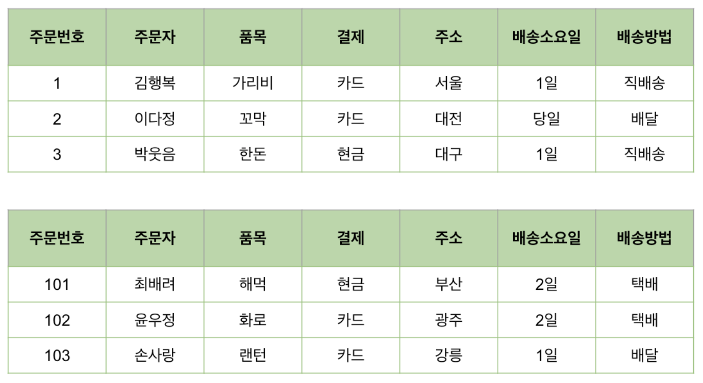
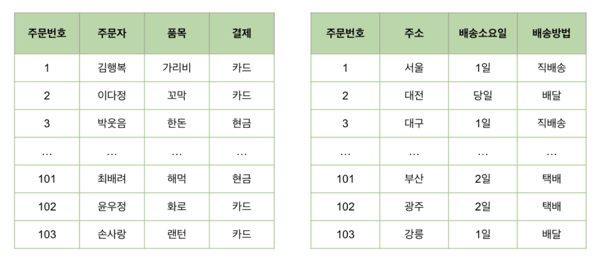
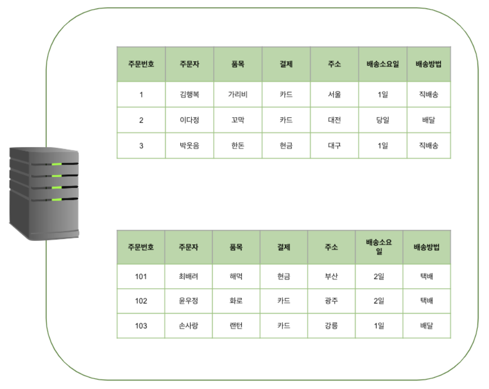
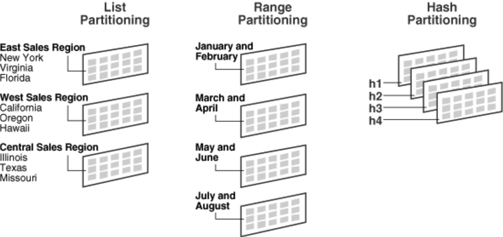
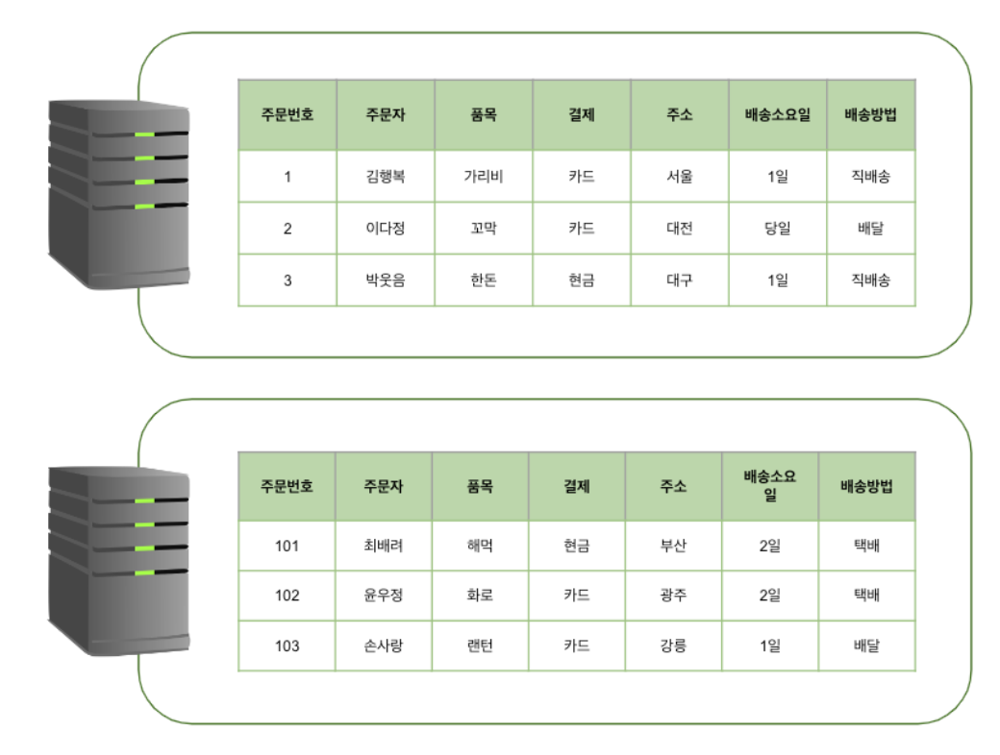
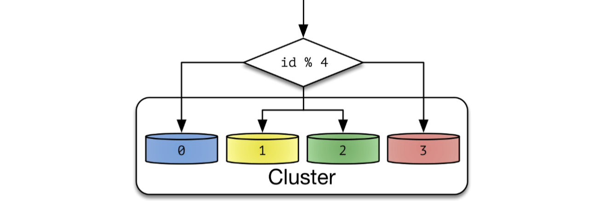
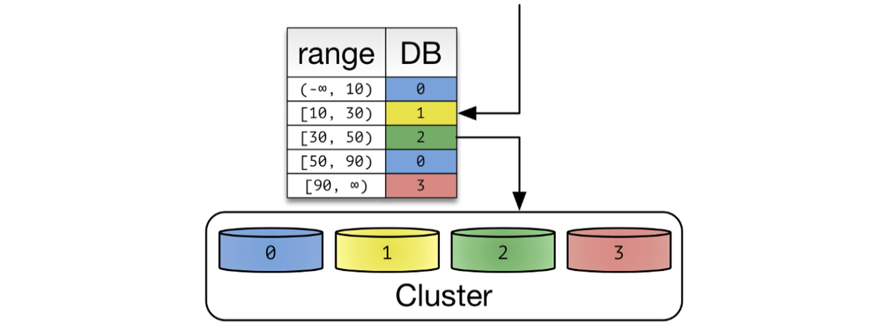

# 데이터베이스 분할 (파티셔닝, 샤딩)
- 테이블이 커질수록 `Read/Write` 성능은 감소
- 따라서 거대한 데이터에 대해 데이터의 분할이 필요
- 거대한 데이터셋을 서브셋으로 분리하여 관리

## 분할 종류
### Horizontal
- 레코드별로 분리하는 수평 분할
- 
- 장점
    - `Full Scan` 에서 데이터 접근범위를 줄여 줌 → 성능 향상
    - 테이블을 레코드 단위로 Disk I/O를 분산하여 경합을 줄임 → `UPDATE`  성능 향상
- 단점
    - 하나의 테이블이 레코드 단위로 쪼개지므로 테이블간 조인 비용 증가
    - 테이블을 분할 할 경우, 인덱스도 동일하게 분할 해야 함
    - 데이터를 찾는 과정이 기존보다 복잡해짐

### Vertical
- 스키마(컬럼)를 나누고 데이터가 따라 분산
- 
- 장점
    - 자주 사용하는 컬럼을 분리하여 성능 향상
    - 같은 타입의 데이터가 저장되어 데이터 압축률 향상
    - 필요 없는 컬럼에 대한 조회를 하지 않아 조회 성능 향상
- 단점
    - 컬럼을 어떻게 쪼갤지 많은 고민이 필요
    - 데이터를 찾는 과정이 기존보다 복잡해짐

## 파티셔닝
- 하나의 큰 테이블을 여러개의 테이블로 분할 (동일한 서버 사용)
- 데이터는 물리적으로 여러 테이블로 분산되어 저장되지만, 사용자는 하나의 테이블에 접근하는 것처럼 사용
- 

### 파티셔닝의 종류(Horizontal)

1. `List Partitioning` 
    - 데이터의 값이 특정 목록에 포함된 경우 분리
    - ex. 지역명
2. `Range Partitioning` 
    - 데이터를 특정 범위 기준으로 분할
    - ex. 1~2월
3. `Hash Partitioning` 
    - 해시 함수를 사용하여 데이터를 분할
    - 특정 컬럼의 값을 해싱하여 저장할 파티션을 선택
4. `Composite Partitioning` 
    - 위 기법 중 두 종류 이상을 사용하는 방식

## 샤딩
- 여러대의 데이터베이스 서버에 데이터를 작은 단위(`Shard` )로 나누어 분산 저장
- 여러 `Shard` 에 걸쳐 저장되므로, 데이터를 조인하는 것이 어려움
- 하나의 `Shard` 에 찾으려는 데이터가 몰려있으면 성능적 이점이 없음
- 

### 샤딩의 종류(Horizontal)

1. `Hash Sharding` 
    - 
    - PK값의 모듈러 연산 결과를 통해 샤드를 결정하는 방식
    - 총 `Shard`  수가 정해져있을 때 유리
    - `Shard` 수가 변경되면 해시함수도 변경해야 하고, 데이터의 재정렬을 해야 함
2. `Range Sharding` 
    - 
    - PK 값을 범위로 지정하여 `Shard` 를 지정하는 방식
    - `Shard` 증설에 큰 리소스가 소요되지 않음

## 참고 사이트
- [블로그 1](https://www.google.com/search?q=DB+%EC%83%A4%EB%94%A9+%ED%8C%8C%ED%8B%B0%EC%85%94%EB%8B%9D&sca_esv=2101594b0329fe21&sca_upv=1&sxsrf=ADLYWILAXoIFS1Kkb_p9LkDP1krwOJsUIA%3A1726928239582&ei=b9XuZpKNI6be2roPsLGWiQc&ved=0ahUKEwjSgJeCndSIAxUmr1YBHbCYJXEQ4dUDCA8&uact=5&oq=DB+%EC%83%A4%EB%94%A9+%ED%8C%8C%ED%8B%B0%EC%85%94%EB%8B%9D&gs_lp=Egxnd3Mtd2l6LXNlcnAiFkRCIOyDpOuUqSDtjIzti7DshZTri50yBRAAGIAEMggQABiABBiiBDIIEAAYgAQYogQyCBAAGIAEGKIESIAeUPgDWPYccAR4AZABA5gBugGgAdwXqgEEMC4xObgBA8gBAPgBAZgCC6ACpQnCAgoQABiwAxjWBBhHwgIKECMYgAQYJxiKBcICChAAGIAEGEMYigXCAgoQABiABBgUGIcCwgIIEAAYogQYiQXCAgYQABgFGB7CAgQQABgemAMAiAYBkAYKkgcDNC43oAfuQQ&sclient=gws-wiz-serp "https://www.google.com/search?q=DB+%EC%83%A4%EB%94%A9+%ED%8C%8C%ED%8B%B0%EC%85%94%EB%8B%9D&sca_esv=2101594b0329fe21&sca_upv=1&sxsrf=ADLYWILAXoIFS1Kkb_p9LkDP1krwOJsUIA%3A1726928239582&ei=b9XuZpKNI6be2roPsLGWiQc&ved=0ahUKEwjSgJeCndSIAxUmr1YBHbCYJXEQ4dUDCA8&uact=5&oq=DB+%EC%83%A4%EB%94%A9+%ED%8C%8C%ED%8B%B0%EC%85%94%EB%8B%9D&gs_lp=Egxnd3Mtd2l6LXNlcnAiFkRCIOyDpOuUqSDtjIzti7DshZTri50yBRAAGIAEMggQABiABBiiBDIIEAAYgAQYogQyCBAAGIAEGKIESIAeUPgDWPYccAR4AZABA5gBugGgAdwXqgEEMC4xObgBA8gBAPgBAZgCC6ACpQnCAgoQABiwAxjWBBhHwgIKECMYgAQYJxiKBcICChAAGIAEGEMYigXCAgoQABiABBgUGIcCwgIIEAAYogQYiQXCAgYQABgFGB7CAgQQABgemAMAiAYBkAYKkgcDNC43oAfuQQ&sclient=gws-wiz-serp")
- [블로그 2](https://aiday.tistory.com/123 "https://aiday.tistory.com/123")
- [블로그 3](https://code-lab1.tistory.com/202 "https://code-lab1.tistory.com/202")