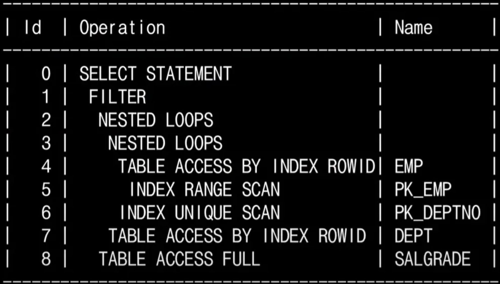
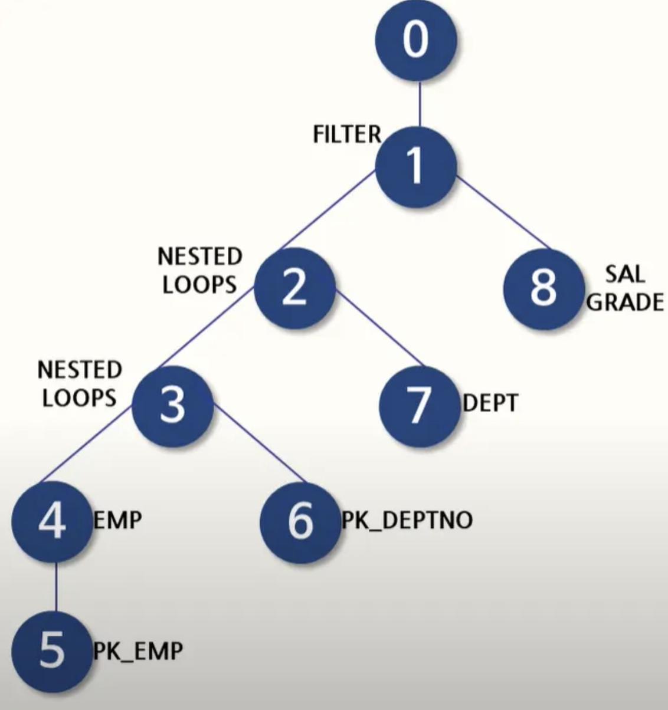
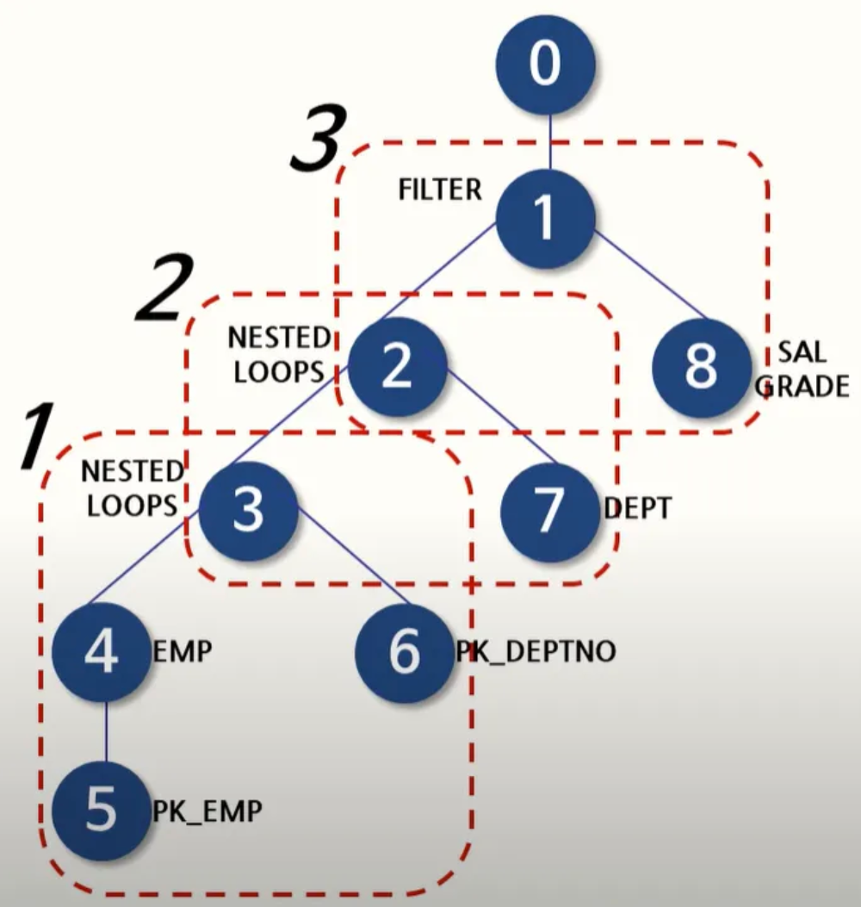
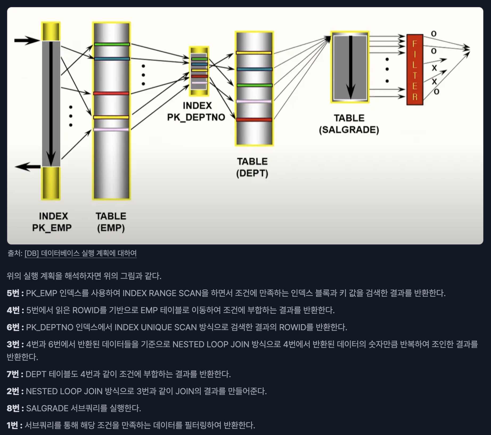

# 쿼리 실행 계획
- DBMS가 쿼리를 처리하기 위해 사용하는 실행 계획
- 쿼리 실행에 필요한 단계를 보여주며, 각 단계에서 DBMS가 사용하는 액세스 경로를 보여주고 쿼리 실행에 필요한 리소스 및 비용 정보를 제공
- 쿼리의 실행 순서는 아래와 같음
    - SQL 문법 해석 및 분석 : 쿼리를 해석하고 분석
    - 최적화 : 옵티마이저가 여러 계획 중에서 테이블 정보, 인덱스, 조인 등 여러 정보를 통해 최적의 계획을 선택
    - 실행 계획 수립 : 선택된 계획으로 실제 데이터에 접근
    - 실행 : 최종적으로 쿼리를 실행
- 옵티마이저의 종류는 아래와 같음
    - `Cost-Based Optimizer`  : 쿼리를 처리하기 위해 여러 방법을 만들고 코스트가 가장 적은 방법을 선택
    - `Rule-Based Optimizer`  : 옵티마이저에 내장된 우선순위로 실행 계획을 선택

### 평가 구성 요소
- `Cardinality`  : 각 작업에서 나오는 행의 개수 추정치
- `Access Method`  : 데이터에 접근하는 방법, 테이블 검색 또는 인덱스 액세스를 통해 함
- `Join Method`  : 테이블을 서로 결합하는 데 사용되는 방법
- `Join Type`  : 테이블 결합 유형
- `Join Order`  : 테이블이 서로 결합되는 순서
- `Partition Pruning`  : 쿼리를 해결하기 위해 필요한 파티션만 액세스하고 있는지 여부
- `Parallel Execution`  : 병렬 실행의 경우, 계획의 각 작업이 병렬로 수행되고 있는지 확인하는 것

## 실행 계획 해석
### 실행 계획 읽기
- 실행 계획은 여러 가지 `스텝` 으로 이루어져 있음
- 실행 계획을 읽는 규칙
    - 위에서 아래로 읽어 내려가면서, 제일 먼저 읽을 스텝을 찾는다.
    - 내려가는 과정에서 같은 들여 쓰기가 존재한다면, 무조건 위 → 아래 순으로 읽는다.
    - 읽고자 하는 스텝보다 들여 쓰기가 된 하위 스텝이 존재한다면, 가장 안쪽으로 들여쓰기 된 스텝을 시작으로 하여 한 단계씩 상위 스텝으로 읽어 나온다.
- 규칙을 사용한 읽기 순서
  - 
  - 

### 실행 계획 해석하기
- 가장 나중에 실행된 것(트리의 좌측 아래)부터 역순으로 해석
- 
- 5 → 4 → 6 → 3 → 7 → 2 → 8 → 1 → 0
- 
