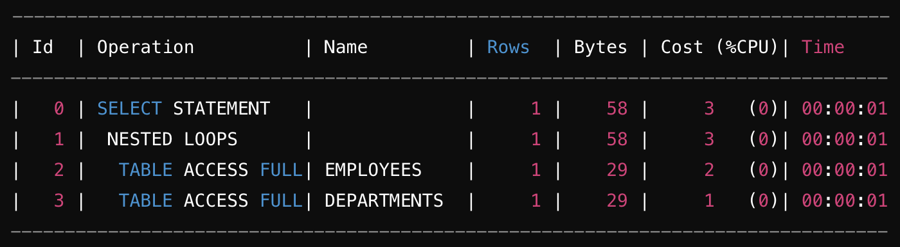
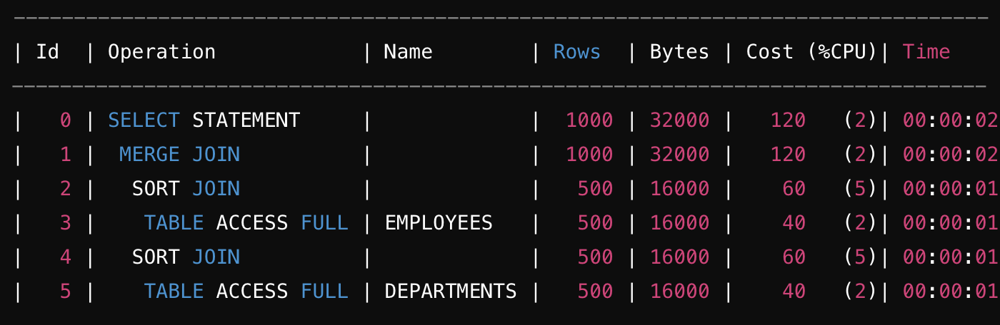
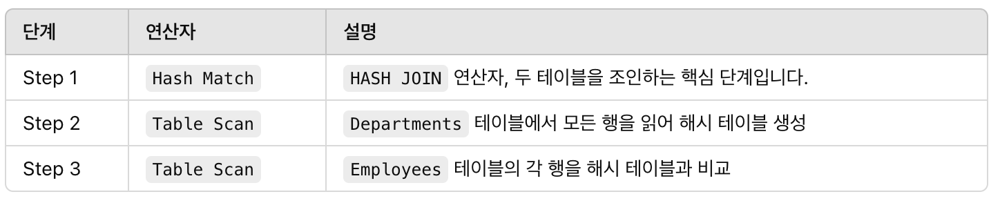
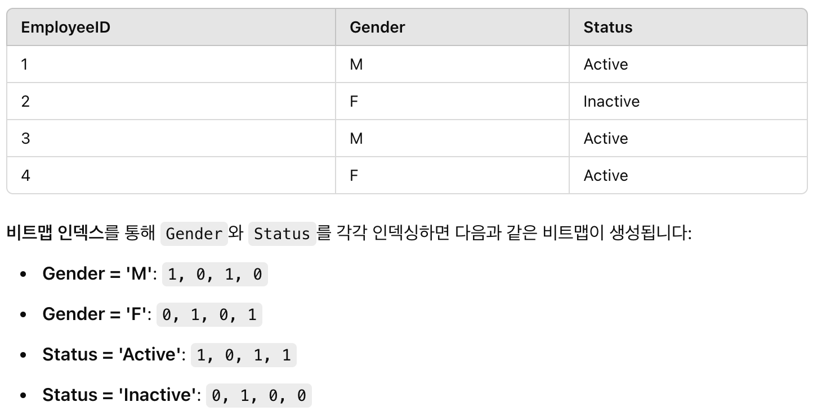

# 실행 계획 용어

## NESTED LOOP
- 두 개 이상의 테이블을 조인할 때 사용되는 조인 기법
- 한 테이블을 기준으로, 다른 테이블을 반복적으로 조회하여 조인하는 방법
- 주로 작은 데이터셋과 함께 사용할 때 효율적이며, 소량의 데이터를 빠르게 처리하는데 적합

### 동작 방식
1. 외부 테이블에서 레코드를 하나씩 가져옴
2. 가져온 레코드들에 대해, 내부 테이블을 조회하여 일치하는 레코드를 찾음
3. 외부 테이블의 모든 레코드에 대해 위 작업을 반복

### 예시
```sql
SELECT *
FROM employees e --외부 테이블
JOIN departments d ON e.department_id = d.department_id; --내부 테이블
```
 

1. `SELECT STATEMENT` 
    - 쿼리의 최종 결과를 반환
2. `MERGE JOIN` 
    - 병합하여 조인하는 단계
3. `TABLE ACCESS FULL` 
    - 테이블의 데이터를 `Full Scan` 하여 읽음

### 특징
- 작은 데이터셋 / 인덱스가 잘 설계된 경우 효율적
- 내부 테이블에 인덱스가 있을 때 성능 향상

### 힌트
- `employee` 를 외부 테이블로, `departments` 를 내부 테이블로 강제하려면
    - 의미 : `e` 를 외부 테이블로 지정하고, `e` 와 `d` 를 `NESTED LOOP`  조인해라
```
SELECT /*+ LEADING(e) USE_NL(e d) */
*
FROM employees e
JOIN departments d ON e.department_id = d.department_id;
```

---

## MERGE JOIN
- 두 개 이상의 테이블을 조인할 때 사용되는 조인 기법
- 정렬된 데이터를 기반으로 두 테이블을 병합하여 조인
- 크고 정렬된 데이터셋을 처리하는데 효율적
- 조인 대상이 정렬되어 있거나, 인덱스를 통해 정렬이 쉽게 이루어질 때 성능이 좋음

### 동작 방식
1. 정렬되어 있지 않다면, 두 테이블을 `Join Key`  기준으로 정렬
2. 두 테이블을 동시에 읽으면서 같은 값이 나올 때까지 각 테이블의 포인터를 이동하며 일치하는 행을 찾음
3. 두 테이블의 포인터가 일치하는 값을 찾으면, 해당 행들을 병합하여 결과를 반환

### 예시
```
SELECT *
FROM employees e
JOIN departments d ON e.department_id = d.department_id;
```
  

1. `SELECT STATEMENT` 
    - 쿼리의 최종 결과를 반환
2. `MERGE JOIN` 
    - 병합하여 조인하는 단계
3. `SORT JOIN` 
    - 데이터를 읽기 전에, `Join Key` 기준으로 정렬
4. `TABLE ACCESS FULL` 
    - 테이블의 데이터를 `Full Scan` 하여 읽음

### 특징
- `SORT`  비용이 발생해서 성능이 저하될 수 있음

### 힌트
- 강제로 `MERGE JOIN` 하게 하고 싶다면
```
SELECT /*+ USE_MERGE(e d) */
*
FROM employees e
JOIN departments d ON e.department_id = d.department_id;
```

---

## HASH JOIN
- 주로 인덱스가 없거나 큰 테이블들을 조인할 때 사용
- `Hash Table` 을 사용하여 매칭되는 행을 찾는 방식

### 동작 방식
1. 작은 테이블을 선택하고, 해시함수를 사용하여 `Hash Table` 을 생성
2. 큰 테이블의 행을 읽으면서, `Hash Table` 에 해당 키값이 있는지 확인
3. 키가 일치하는 경우, 두 행을 조합

### 예시
```
SELECT E.EmployeeID, E.EmployeeName, D.DepartmentName
FROM Employees E
JOIN Departments D ON E.DepartmentID = D.DepartmentID;
```


### 특징
- 인덱스가 없는 대용량 데이터셋의 조인에 유리
- 내부적으로 `Hash Table` 을 사용하기 때문에, 메모리 사용량이 큼

---

## BITMAP INDEX란?
- 특정 컬럼의 값을 비트맵 형태로 저장하여 빠르게 검색을 수행
- 저장공간이 적게들고, 여러 복잡한 쿼리를 효율적으로 처리
- 고유한 값이 많지 않을 때 유리


## BITMAP > CONVERSION > TO ROWIDS
- 비트맵 인덱스를 사용하여 특정 행의 `ROWID` 를 반환
### 동작 방식
1. `BITMAP` 
    - 비트맵 인덱스를 사용하여 조건에 맞는 레코드를 검색
2. `CONVERSION` 
    - 조건을 통해 비트맵 인덱스를 만족하는 행을 식별하여 `ROWID` 를 반환
3. `TO ROWIDS` 
    - 식별된 행들의 `ROWID`  목록을 반환

## BITMAP > CONVERSION > FROM ROWIDS
- `ROWID` 를 기반으로 실제 데이터에 접근하여 반환
### 동작 방식
1. `BITMAP` 
    - 비트맵 인덱스를 사용하여 조건에 맞는 레코드를 검색
2. `CONVERSION` 
    - 조건을 통해 비트맵 인덱스를 만족하는 행을 식별하여 `ROWID` 를 반환
3. `FROM ROWIDS` 
    - 식별된 `ROWID` 를 통해 테이블의 실제 데이터에 접근하여 반환

## BITMAP > CONVERSION > COUNT
- 비트맵 인덱스를 활용하여 조건에 맞는 행의 개수를 효율적으로 반환
### 동작 방식
1. `BITMAP` 
    - 비트맵 인덱스를 사용하여 조건에 맞는 레코드를 검색
2. `CONVERSION` 
    - 조건을 통해 비트맵 인덱스를 만족하는 행을 식별하여 비트맵 형태로 반환
3. `COUNT` 
    - 반환된 비트맵을 통해, COUNT를 계산
