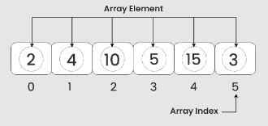
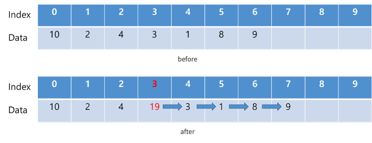
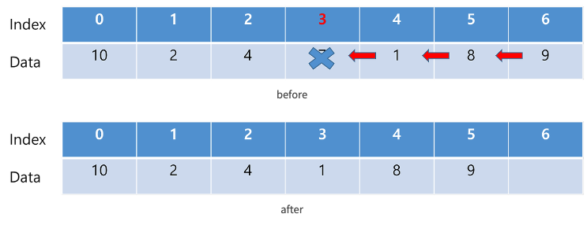
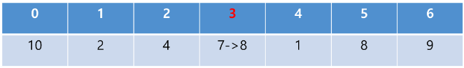

# 배열(Array)


## 특징
- 선형 자료 구조
- 고정된 크기를 가짐
  - **장점** : 데이터 양에 맞게 초기 생성하므로, 추가적인 메모리 오버헤드가 없음
  - **단점** : 실제 배열 크기만큼 데이터를 사용하지 않는다면, 메모리가 낭비됨
- 인덱스로 빠르게 접근이 가능
  - 초기 위치가 정해져있고, 인덱스로 주소값을 바로 찾을 수 있음
- 같은 타입의 데이터만 저장이 가능
- 데이터가 메모리에 연속적으로 저장됨

## 성능(시간복잡도)
- 삽입 : `O(N)`
  - 
- 삭제 : `O(N)`
  - 
- 검색 : `O(1)`
  - 

## 언어별 Array
### Java
```java
String[] names = { "유율택", "김호인" };
```

### C#
```C#
string[] names = ["유율택", "김호인"];
```

## 참고 사이트
- https://ongveloper.tistory.com/403
