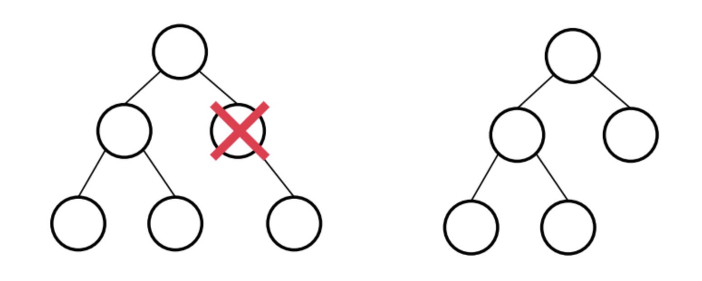
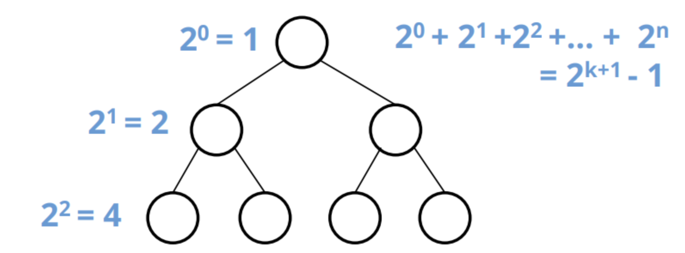
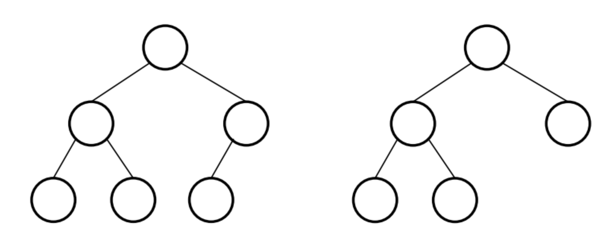
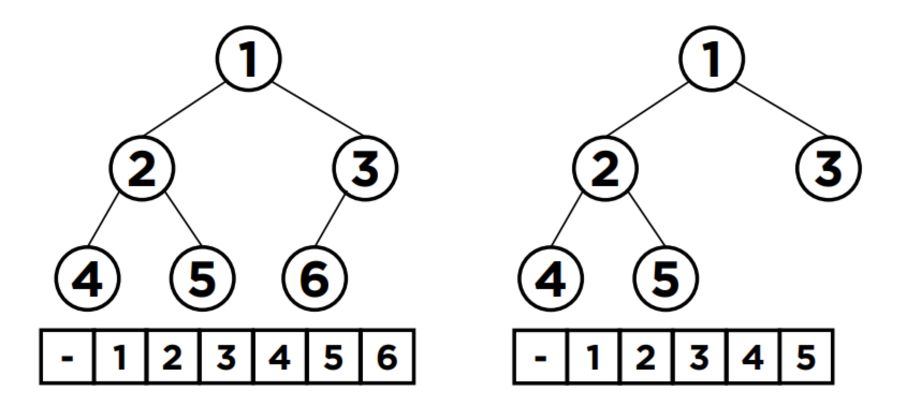
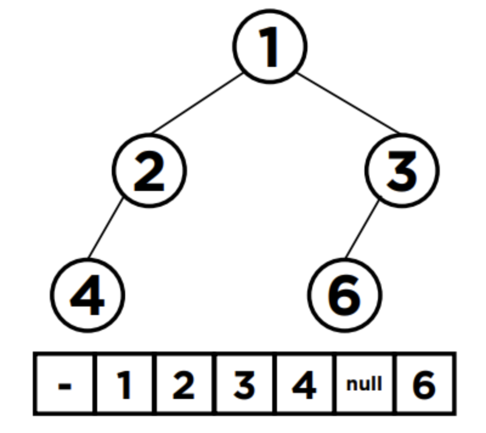
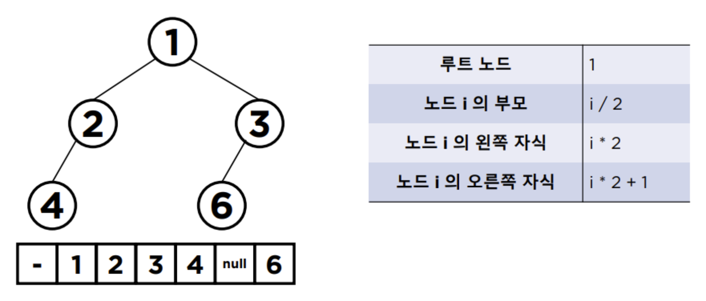

# 이진 트리(Binary Tree)
- 각 노드가 최대 2개의 자식을 가지는 Tree 구조
- 왼쪽 자식 노드와, 오른쪽 자식 노드가 구분 되어야 함

## 이진트리 종류
### Full Binary Tree
- 정 이진 트리
- 
- 자식이 0개 혹은 2개

### Perfect Binary Tree
- 포화 이진 트리
- 
- 모든 노드가 2개의 자식 노드를 가지고 있고, `Leaf Node`가 모두 같은 레벨
- 모든 레벨의 노드가 차있으므로, 2의 제곱수만큼 증가

### Complete Binary Tree
- 완전 이진 트리
- 
- 마지막 레벨을 제외하고 모든 노드가 채워져 있어야 함
- 노드는 왼쪽에서 오른쪽 방향으로 채워짐

## 이진트리 특징
- 1차원 배열로 표현할 수 있음
- 
- 
- 첫 번째 인덱스를 비워둠
- 인덱스를 쉽게 계산할 수 있음
- 
- 배열로 표현할 수 있지만, 데이터의 변동 시 기존 데이터 이동과 같은 단점이 존재하여 보통 클래스를 따로 만들어 사용

## 참고 사이트
- https://rosweet-ai.tistory.com/55