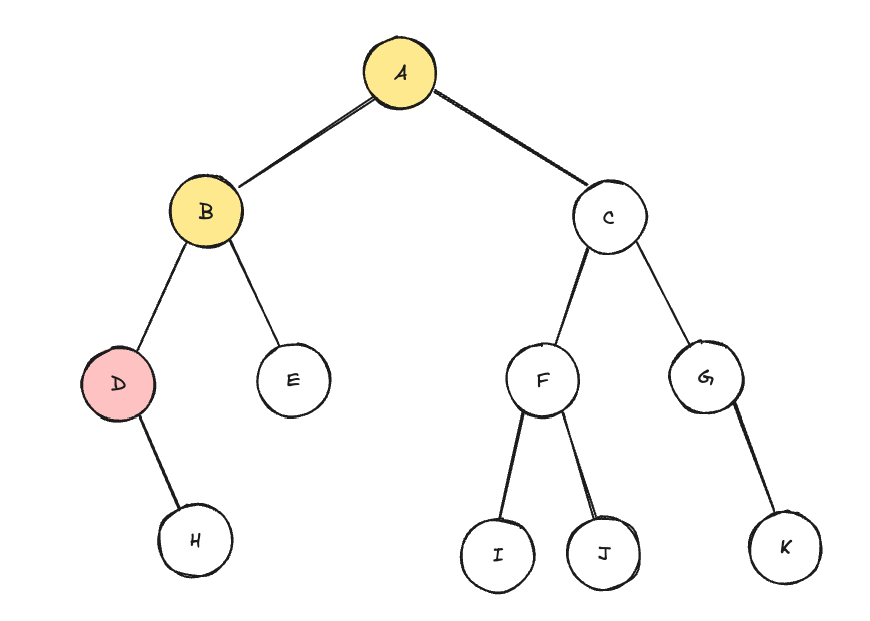
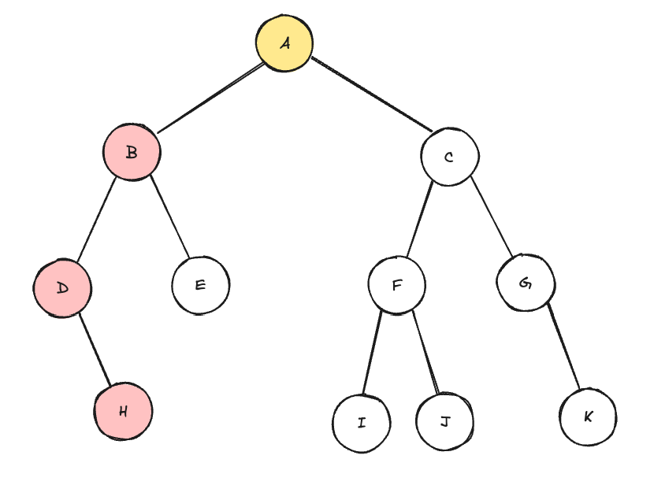
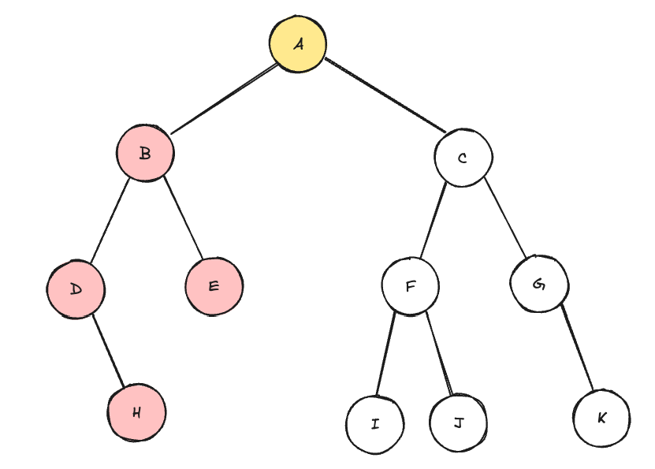
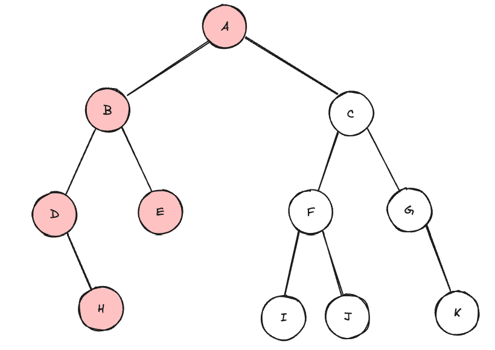
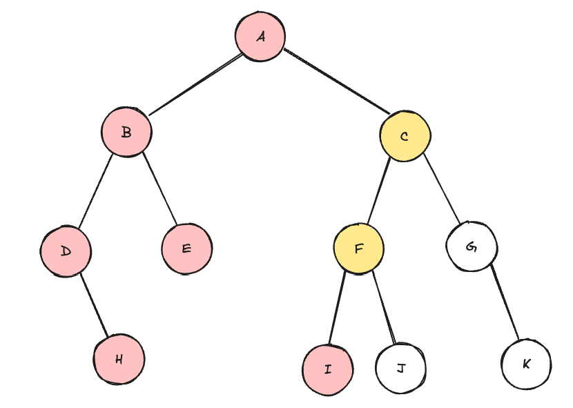
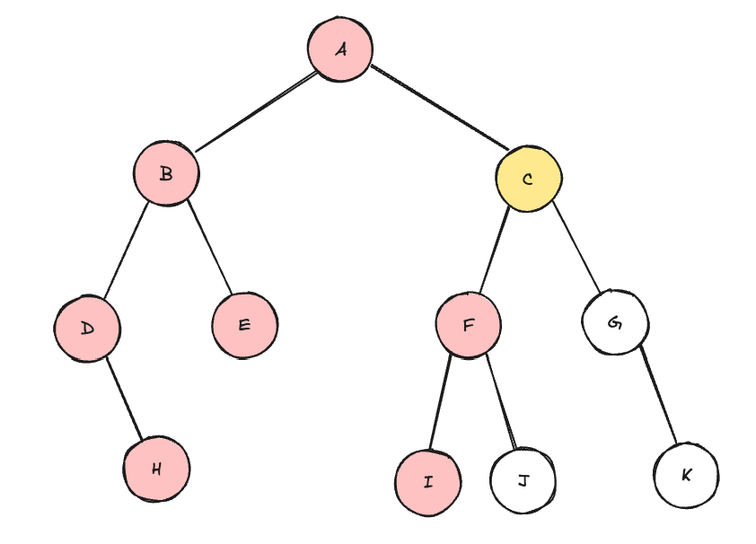
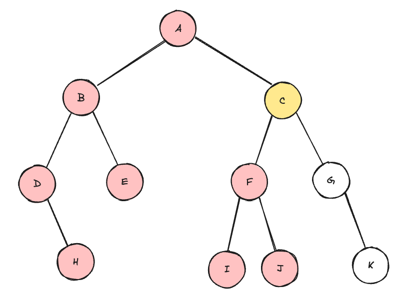
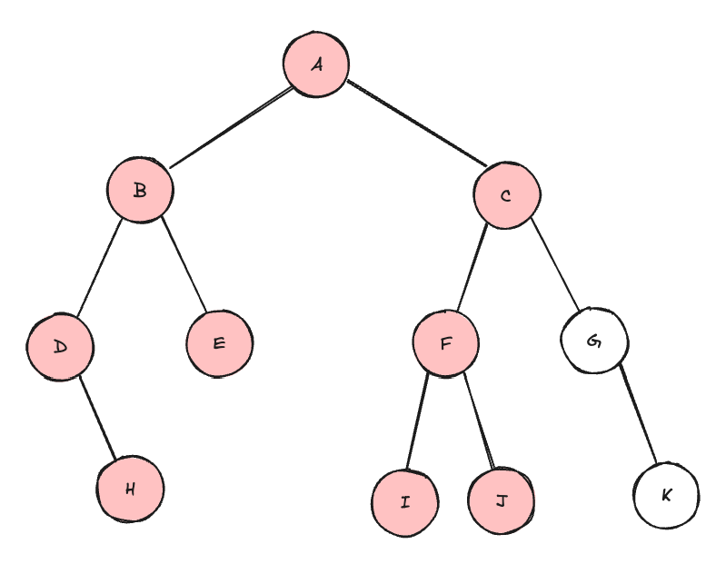
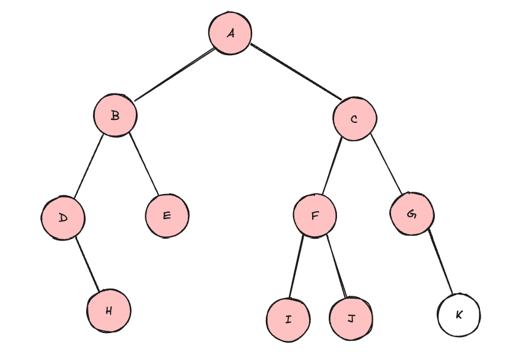
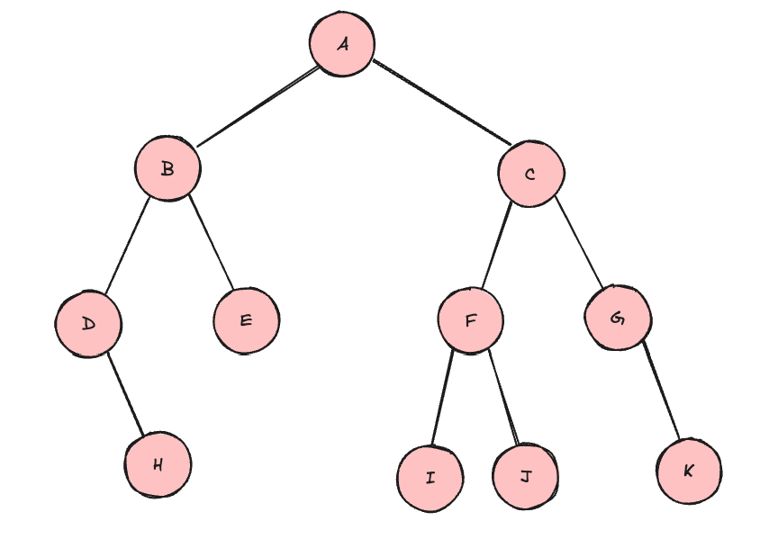

# 이진 트리 중위 탐색
1. 왼쪽 서브 트리를 inorder(재귀 탐색)
2. 루트 노드 방문
3. 오른쪽 서브 트리를 inorder(재귀 탐색)

## Q. 다음과 같은 트리는 전위 탐색 시 어떤 순서로 검색할까?

D

D-H-B

D-H-B-E

D-H-B-E-A

D-H-B-E-A-I

D-H-B-E-A-I-F

D-H-B-E-A-I-F-J

D-H-B-E-A-I-F-J-C

D-H-B-E-A-I-F-J-C-G

D-H-B-E-A-I-F-J-C-G-K
