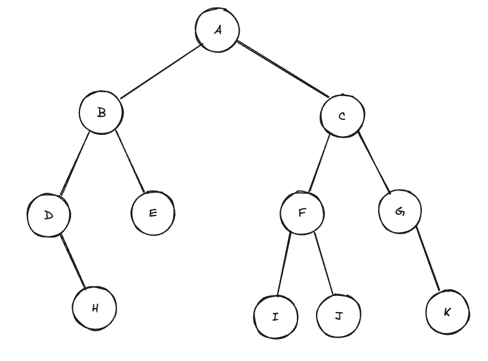
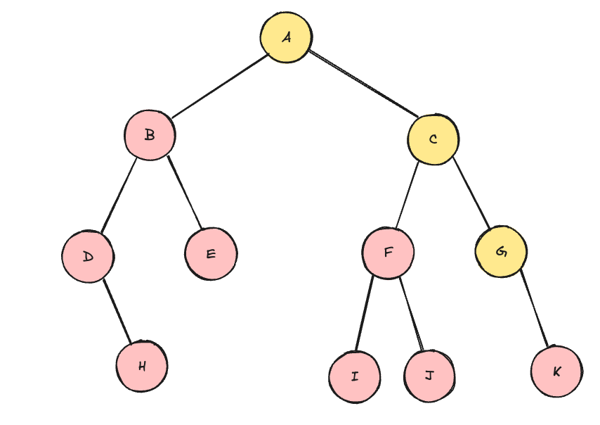

# 이진 트리 후위 탐색
1. 왼쪽 서브 트리를 inorder(재귀 탐색)
2. 오른쪽 서브 트리를 inorder(재귀 탐색)
3. 루트 노드 방문

## Q. 다음과 같은 트리는 전위 탐색 시 어떤 순서로 검색할까?

H

H-D

H-D-E

H-D-E-B

H-D-E-B-I

H-D-E-B-I-J

H-D-E-B-I-J-F

H-D-E-B-I-J-F-K

H-D-E-B-I-J-F-K-G

H-D-E-B-I-J-F-K-G-C

H-D-E-B-I-J-F-K-G-C-A
