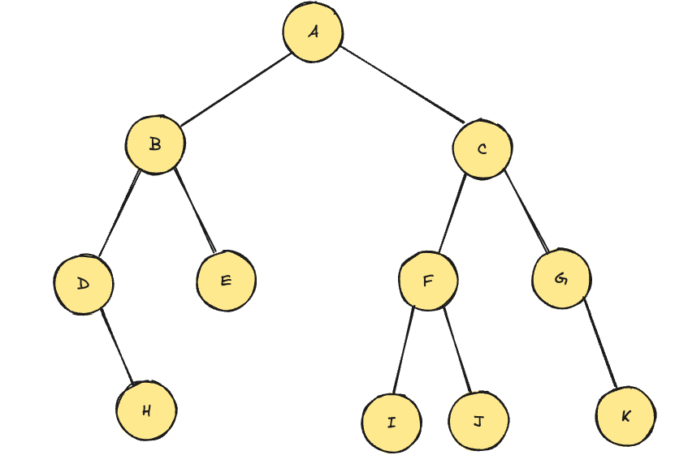

# 이진 트리 전위 탐색
1. 루트 노드 방문
2. 왼쪽 서브 트리를 preorder(재귀 탐색)
3. 오른쪽 서브 트리를 preorder(재귀 탐색)

## Q. 다음과 같은 트리는 전위 탐색 시 어떤 순서로 검색할까?

A-B-D

A-B-D-H-E

A-B-D-H-E-C-F-I

A-B-D-H-E-C-F-I-J

A-B-D-H-E-C-F-I-J-G-K

