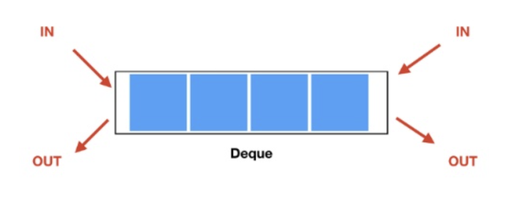

# 큐(Queue)


## 특징
- 데이터의 인입, 인출을 Queue의 양 끝에서 가능한 구조

## 사용 예
### Java
- `addFirst`, `addLast` : 데이터를 넣는 행위
- `removeFirst`, `removeLast` : 데이터를 빼는 행위
- `peekFist`, `peekLast` : 끝 데이터를 확인하는 행위(데이터가 소모되지 않음)
- 구현체
  - `ArrayDequeue` : 배열 기반
  - `LinkedList` : 이중 연결 리스트
  - `ConcurrentLinkedDequeue` : 스레드에 안전한 구조
  - `LinkedBlockingDequeue` : 요소가 꽉차있거나, 요소가 비어있을 때 대기시간을 줌으로써 `Produce-Consume` 패턴으로 사용
  - 

```java
Dequeue<String> dequeue = new LinkedList<>();
dequeue.addFirst("유율택");
dequeue.adFirst("김호인");
dequeue.peekFirst(); // "김호인"
String name = dequeue.removeLast(); // "유율택"
dequeue.peekLast(); // "김호인"
```

## 참고 블로그
- https://soft.plusblog.co.kr/24
