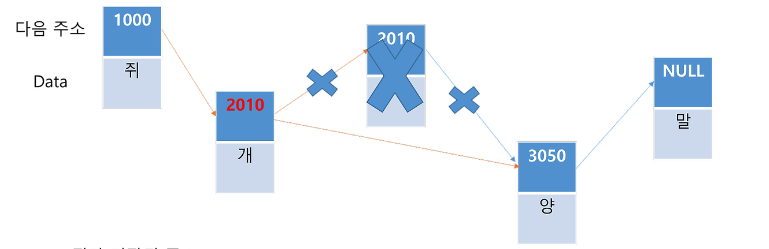
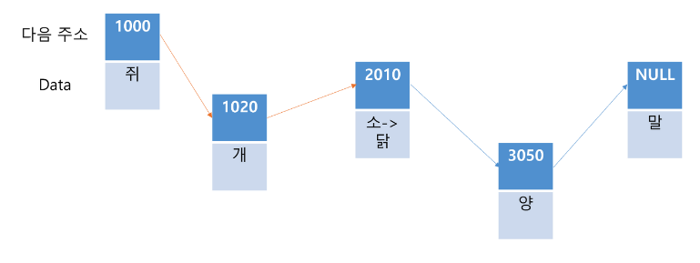
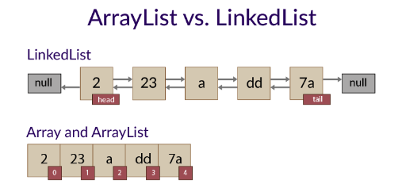
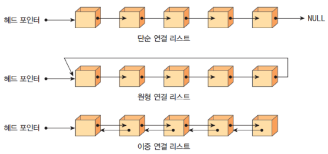

# 리스트(List)

## 특징
- 선형 자료 구조
- 가변적 데이터 크기를 가짐
  - **장점** : 메모리의 낭비가 없음
- 같은 타입의 데이터만 저장이 가능
- 데이터가 메모리에 비연속적으로 저장됨
  - **단점** : 데이터를 찾아야 하므로, `Array`에 비해서 조회가 느림

## 성능(시간복잡도 - `LinkedList 기준)
- 삽입 : `O(N)`
  - 
- 삭제 : `O(N)`
  - 
- 검색 : `O(N)`
  - 

## 언어별 List
### Java
- `Java`에서 `List`는 인터페이스
  - [List 공식문서](https://docs.oracle.com/javase/8/docs/api/java/util/List.html)
- 구현체로는 `LinkedList<T>`, `ArrayList<T>`, `Stack<T>`, `Vectore<T>`가 존재
  - 
#### ArrayList
- 내부적으로 `Array` 구조를 사용
- 데이터가 추가되면, 기존 배열 크기에서 `1.5`배로 새로운 배열을 생성하여 값들을 복사하는 과정이 존재
- 내부에서 `Array`를 사용하므로, 데이터 접근이 빠름
- 데이터가 빈번하게 추가되고 삭제되면 오버헤드가 많이 발생해서 불리
- `Vertor`의 경우, `ArrayList`와 비슷하지만 동기화된 메서드로 구성되어 `Thread Safe`함
#### LinkedList
- 각 요소의 주소를 참조하여 연결
- 데이터를 찾을 때, 무조건 순차적으로 접근해야 해서 `ArrayList`보다 조회가 상대적으로 느림
- 여러 종류의 `LinkedList`가 존재
  - 
```java
List<String> names = new ArrayList<>();
names.add("유율택");
names.add("김호인");
names.remove("유율택");

List<String> company = new LinkedList<>();
company.add("올리브영");
company.add("쿠팡");
company.remove("쿠팡");
```

### C#
- `C#`에서는 `IList` 인터페이스가 존재
- 구현체로는 `List<T>`, `LinkedList<T>`, `ArrayList`, `BitArray`, `Array`가 존재
```C#
IList<string> names = new List<string>();
names.Add("유율택");
names.Add("김호인");
names.Remove("유율택");

IList<string> company = new LinkedList<string>();
company.Add("올리브영");
company.Add("쿠팡");
company.Remove("쿠팡");    

IList arrayList = new ArrayList(); // object
arrayList.Add("유율택");
arrayList.Add("김호인");
arrayList.Remove("유율택");            
```

## 참고 사이트
- https://ongveloper.tistory.com/403
- https://blog.naver.com/tutorials_korea/221610337593
