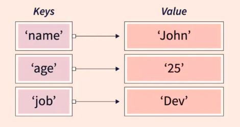
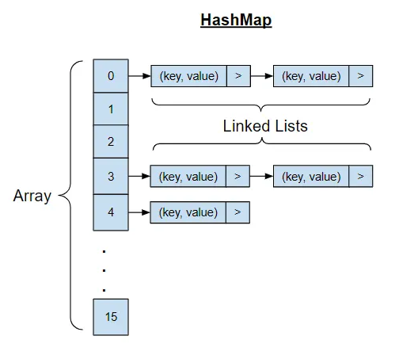

# 맵(Map)


## 특징
- Key-Value 형태로 데이터를 저장
- 기본적으로 Key에 대한 중복은 허용하지 않고, Value에 대한 중복은 허용
- 검색속도가 빠름(`Hash` 방식을 사용)

## HashMap

- `Map` 인터페이스를 구현한 컬렉션으로, `Hash`값을 사용하여 값을 저장
- 값이 저장되는 매커니즘
    1. 고정된 크기 만큼의 Index 테이블인, `HashTable`이 생성
    2. `Hash Method`에 `Key`를 파라미터로 사용하여, `HashCode(정수)`를 얻음
    3. `HashCode/(HashTable의 크기)`의 나머지를 Index로 활용하여, `HashTable`의 해당 Index에 저장
    4. 여기서 충돌(`Collision`)이 발생하게 되면, `LinkedList`로 값을 저장
- `HashCode`를 구하기만 하면 바로 `Index`를 계산할 수 있으므로, 검색 속도가 빠름
- 충돌(`Collision`)이 발생할 수 있음(최대 `O(N)`)
  - 따라서 `Hash Algorithm`이 중요
- 특정한 `Hash Algorithm`을 사용하려면, `hashCode()`를 오버라이딩하여 사용
- 오버라이딩 하지 않으면, `Object`의 `hashCode()`를 사용
  - 객체의 메모리 주소를 이용(`Native Code` -> `C/C++`)
  - 따라서 동일한 객체는 동일한 해시값을 가짐
- 동시성이 중요한 경우, `ConcurrentHashMap`을 사용

### Java
```java
Map<String, String> map = new HashMap<>();

map.put("유율택", "Lv.3");
map.put("김호인", "Lv.6");
map.containsKey("유율택"); // true
String findValue = map.get("유율택"); // "Lv.3"
```

## 참고 사이트
- https://selina-park.tistory.com/51
