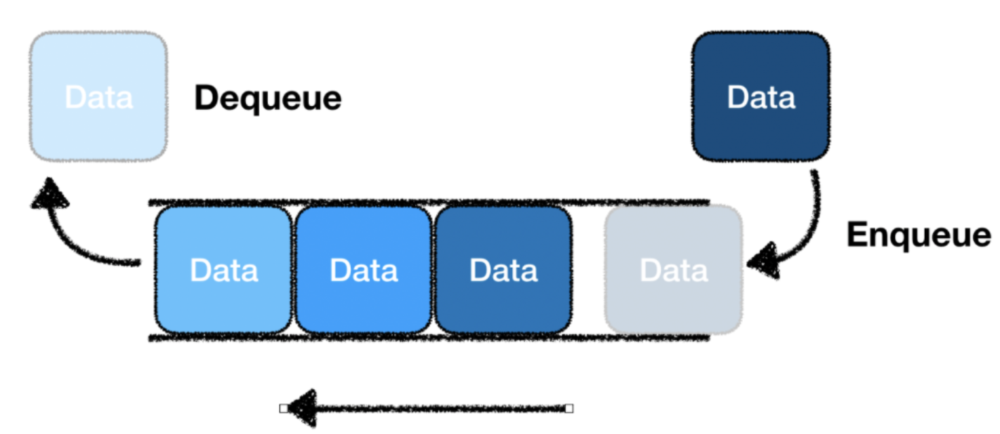

# 큐(Queue)


## 특징
- 한 곳에서만 데이터가 인입되고, 반대쪽에서 데이터가 인출됨
- 선입선출(FIFO : First In, First Out)의 구조를 가짐

## 사용 예
### Java
- `offer` : 데이터를 넣는 행위
- `poll` : 데이터를 빼는 행위
- `peek` : 맨 위 데이터를 확인하는 행위(데이터가 소모되지 않음)
- 구현체
  - `LinkedList` : 이중 연결 리스트
  - `PriorityQueue` : 우선순위 정렬 큐
  - `ArrayQueue`
  - `ConcurrentLinkedQueue` : 병렬 프로그래밍 환경에서 안전한 큐
  - `BlockingQueue` : 요소가 꽉차있거나, 요소가 비어있을 때 대기시간을 줌으로써 `Produce-Consume` 패턴으로 사용
  - `DelayQueue` : 요소들이 일정시간이 지날때까지 큐에서 제거되지 않음
  - `SynchronousQueue` : 크기가 항상 0이므로, 데이터를 추가하려면 항상 소비자가 데이터를 `Consume`해야 함

```java
Queue<String> queue = new LinkedList<>();
queue.offer("유율택");
queue.offer("김호인");
queue.peek(); // "유율택"
String name = queue.poll(); // "유율택"
queue.peek(); // "김호인"
```

## 참고 블로그
- https://ittrue.tistory.com/322
