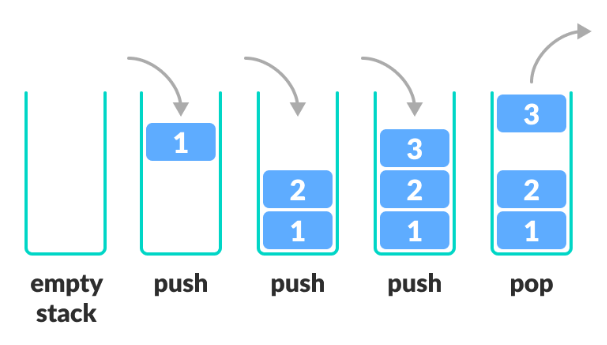

# 스택(Stack)


## 특징
- 데이터가 인입되고, 인출되는 곳이 한곳에서만 일어남
- 후입선출(LIFO : Last In, First Out)의 구조를 가짐
- 따라서 데이터의 인입, 인출의 속도가 빠름
- `Java`에서는 `Vector`를 상속하는 `Stack`이 있으나, 다음과 같은 이유로 사용하지 않는 것을 권장
  - `Java` 버전 1부터 있었기 때문에 안전하지 않음
  - `Vetor`를 상속하는 구조이기 때문에 `Vector`의 메서드들을 그대로 상속받아 안전하지 않음
- 위와 같은 이유로, `Dequeue`를 사용하기를 권장

## 사용 예
### Java
- `push` : 데이터를 넣는 행위
- `pop` : 데이터를 빼는 행위
- `peek` : 맨 위 데이터를 확인하는 행위(데이터가 소모되지 않음)
- `empty` : Stack이 비어있는지 확인하는 행위
- `search` : Stack에서 해당 객체의 위치를 확인하는 행위

```java
Stack<String> stack = new Stack<>();
stack.push("유율택");
stack.push("김호인");
stack.peek(); // "김호인"
String name = stack.pop(); // "김호인"
stack.peek(); // "유율택"
stack.empty(); // false
```

### C#
```c#
Stack stack = new Stack();
stack.Push("유율택");
stack.Peek(); // "유율택"
string name = stack.pop(); // "유율택"
```

## 참고 블로그
- https://inpa.tistory.com/entry/JCF-%F0%9F%A7%B1-Stack-%EA%B5%AC%EC%A1%B0-%EC%82%AC%EC%9A%A9%EB%B2%95-%EC%A0%95%EB%A6%AC
