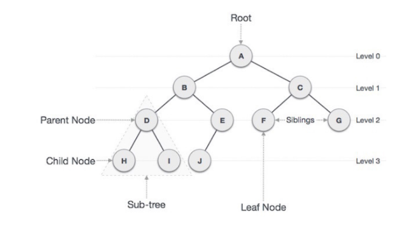
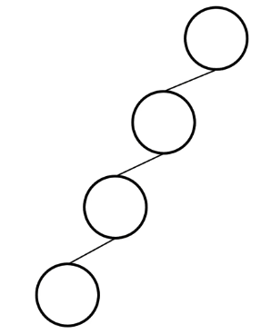
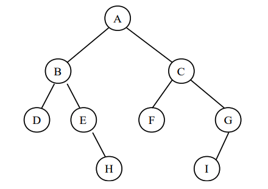
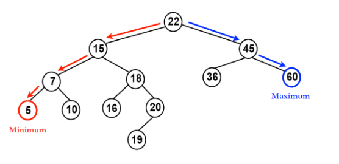
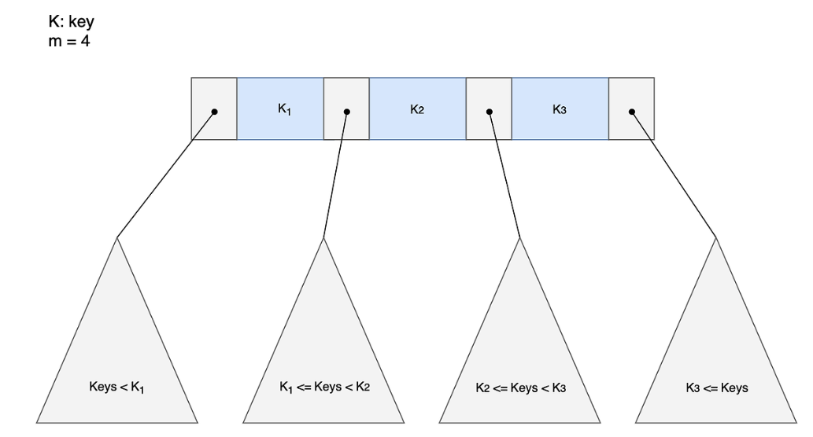
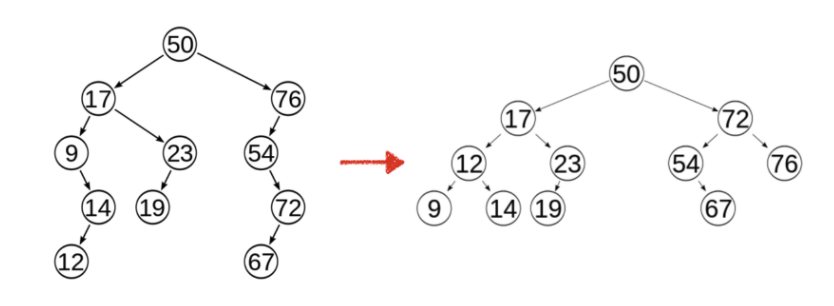

# 트리(Tree)

> Tree를 한 번에 공부하려면 분량이 많기 때문에, 나눠서 진행 할 예정

## 특징
- 비선형 자료구조(데이터에 계층이 존재)

## 용어
- `Node` : 트리를 구성하는 각 요소
- `Edge` : 노드와 노드를 연결하는 선
- `Root Node` : 최상위 계층의 노드
- `Level` : 트리의 깊이
- `Degree` : Sub Tree의 개수
- `Terminal Node(Leaf Node)` : 하위에 연결된 노드가 없는 노드

## 트리의 종류
### 편향 트리(skew tree)

- 모든 노드들이 하나의 자식 노드만을 가진 트리

### 이진 트리(Binary Tree)

- 각 노드가 최대 2명의 자식을 가지는 트리
- 왼쪽 자식/오른쪽 자식의 구분이 존재
- `LinkedList`로 구현이 가능

### 이진 탐색 트리(Binary Search Tree)

- 순서화된 이진 트리
- 노드의 왼쪽 자식은 부모의 값보다 항상 작은 값을 가짐
- 노드의 오른쪽 자식은 부모의 값보다 항상 큰 값을 가짐

### m원 탐색 트리(m-way Search Tree)

- 최대 m개의 서브 트리를 갖는 탐색 트리

### 균형 트리(Balanced Tree)

- m원 탐색 트리에서 높이 균형을 유지하는 트리
- Skew Tree를 피하기 위함

## 사용처
- 계층적 데이터 저장
- 효율적인 검색속도가 필요할 때
- Heap
- 데이터베이스 인덱싱(B-Tree, B+Tree, AVL-Tree)

## 참고 사이트
- https://nuemeel.tistory.com/18
- https://cdragon.tistory.com/entry/%EC%9E%90%EB%A3%8C%EA%B5%AC%EC%A1%B0-Tree-Binary-Tree%ED%8A%B8%EB%A6%AC-%EC%9D%B4%EC%A7%84-%ED%8A%B8%EB%A6%AC
- https://ahnyezi.github.io/java/javastudy-5-tree/
