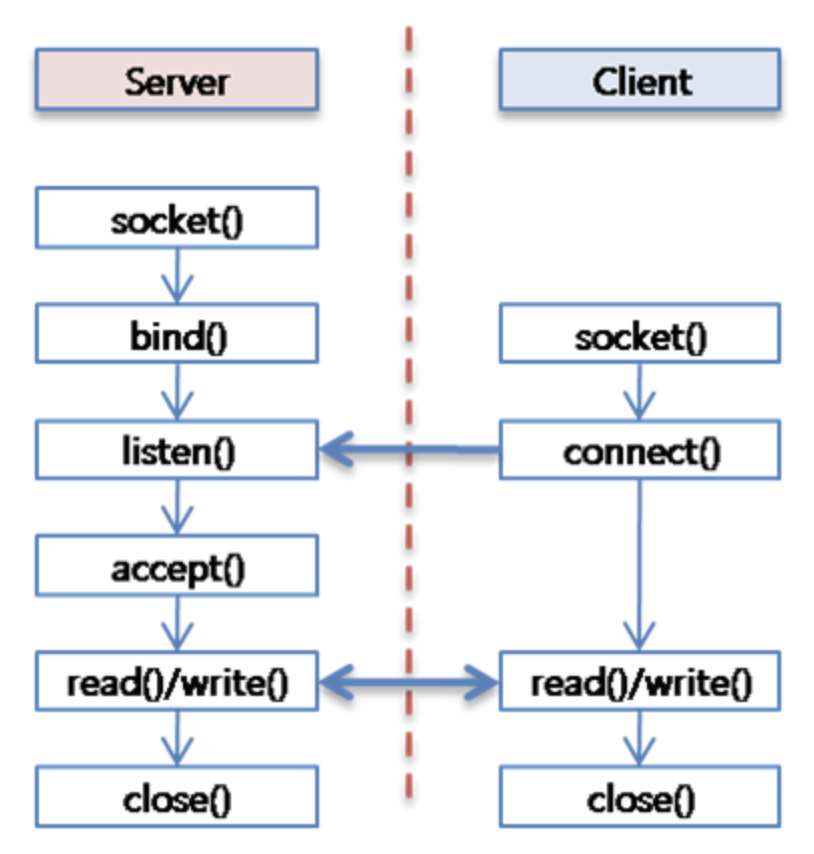

## 소켓 통신

## 소켓

- 전구의 연결 부분을 Socket이라고 함
- 두 프로그램간 데이터를 양방향으로 송수신할 수 있도록 해주는 연결 지점(EndPoint)
- `IP`와 `Port`를 사용하여 주소를 식별

## 소켓 통신

### 소켓 통신의 작동 방식

1. 서버의 소켓 생성
    1. 서버는 특정 포트번호에 소켓을 생성(`socket()`)하고, 주소를 할당(`bind()`)하여 클라이언트의 연결 요청을 기다림(`listen()`)
2. 클라이언트는 소켓을 생성(`socket()`)하고, 서버로 연결을 시도(`connect()`)
3. 서버는 클라이언트의 연결을 수락(`accept()`)하고, 데이터를 서로 주고 받음(`read()`/`write()`)
4. 프로그램간 데이터 송수신이 종료되면, 소켓을 종료(`close()`)

### 장점

- 서버/클라이언트간 연결을 계속 유지
    - 재연결이 필요 없으므로 대기시간이 낮음
    - 실시간으로 데이터 전송이 가능
- 서버 <-> 클라이언트 양방향 데이터 전송이 가능

### 단점

- 재처리, 순서보장 등 오류를 처리해야 하는 포인트가 많음
- 연결을 통해 서버 리소스를 소모하기 때문에, 서버의 리소스 소모가 증가
- 보안에 대한 강제가 없으므로 보안에 취약
- 개별 포트를 사용함으로써 방화벽에서 차단될 가능성이 존재

### TCP/IP 프로토콜

- 소켓 통신은 TCP/IP 프로토콜을 기반으로 함(현재의 대부분은 TCP/IP 프로토콜 사용)
- TCP/IP 프로토콜은 4개의 계층으로 나뉨
    - `애플리케이션 계층` : 사용자와 직접 상호 작용
    - `전송 계층` : 두 호스트 간의 데이터 전송을 담당
    - `네트워크 계층` : 데이터 패킷을 네트워크를 통해 목적지까지 전송
    - `링크 계층` : 물리적인 네트워크 매체를 통해 데이터를 전송
- 소켓은 `애플리케이션 계층`과 `전송 계층` 사이의 인터페이스 역할을 함
    - 두가지 연결 방법이 존재
        - `TCP 소켓` : 연결 지향적 / 데이터의 순서 보장 / 오류 검출 및 재전송
        - `UDP 소켓` : 비연결 지향적 / 신뢰성 보장 X / 순서 보장 X / 오버헤드 적음

> HTTP 프로토콜도 TCP/IP기반이지만, 애플리케이션 계층

 