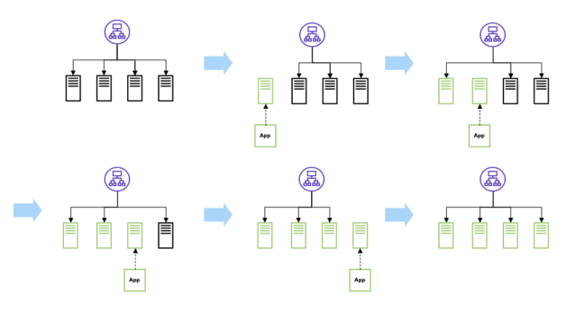
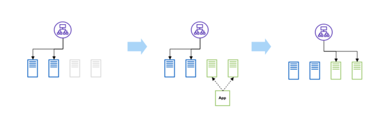
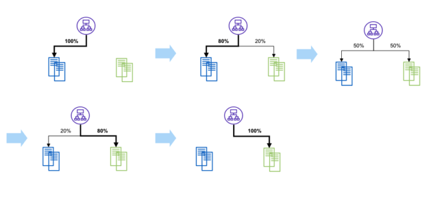

# 소프트웨어 배포 전략
- 배포 : 빌드된 소프트웨어를 서버에 구동시켜 실행가능하도록 하는 것

## 무중단 배포 전략

### Rolling Update Deployment : 롤링 배포
1. 여러개의 서버가 구버전으로 기동중인 상태
2. 연결된 서버 하나를 로드밸런서에서 제거하고, 신버전으로 업데이트
3. 신버전으로 업데이트된 서버를 로드밸런서에 연결
4. 2~3번을 모든 서버가 신버전으로 업데이트 될 때까지 반복

- 장점
  - 다운타임(클라이언트가 요청 불가능한 구간)이 없음
  - 많은 서버 자원을 확보하지 않아도 됨
- 단점
  - 서버가 로드밸런서에 제거된 동안 남은 서버로 트래픽이 몰림(트래픽양 파악 필요)
  - 구버전과 신버전이 공존되어 서비스되기 때문에 호환성 문제 발생가능

### Blue/Green Deployment : 블루/그린 배포
- `Blue` : 구버전
- `Green` : 신버전
1. `Blue`를 사용하고 있는 상태로, `Green` 상태의 서버를 생성
2. 로드밸런서를 `Blue`에서 `Green`으로 변경

- 장점
  - 다운타임이 없음
  - 로드밸런서를 `Blue`로 조정함으로써 즉각적인 롤백 가능
  - 트래픽을 한번에 옮기기 때문에, 호환성 문제 발생가능성이 적음(동시에 떠있는 시간이 짧음)
- 단점
  - 운영서버*2 만큼의 서버가 필요하므로, 비용 증가

### Canary Deployment : 카나리 배포
> 과거 광부들이 가스에 노출되어 질식하는 것을 막기 위해, 작업 전 예민한 카나리아 새를 먼저 보내 가스의 누출을 감지
1. 새버전으로 배포된 서버를 만들고, 로드밸런서를 사용해 요청들의 일부만 옮김
2. 점점 비율을 높여가며 로드밸런서를 통해 요청을 새버전으로 배포된 서버로 옮김

- 장점
  - 문제발생 시 새버전의 서버만 롤백하면 됨
  - 운영환경에서 신규버전을 테스트할 수 있음
  - 새로운 버전으로 인한 위험을 최소화
- 단점
  - 점진적인 적용으로 전체 배포에 시간이 지연 됨
  - 동시에 운영되는 기간에 오래 노출되므로 호환성 문제 발생가능성 큼
