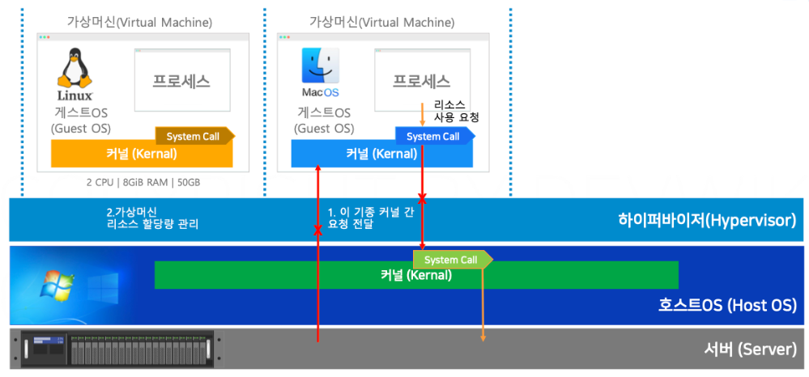
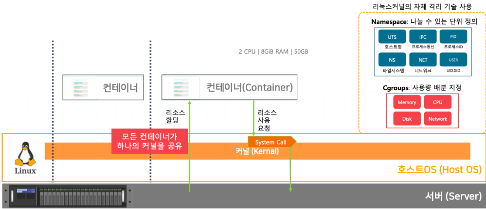
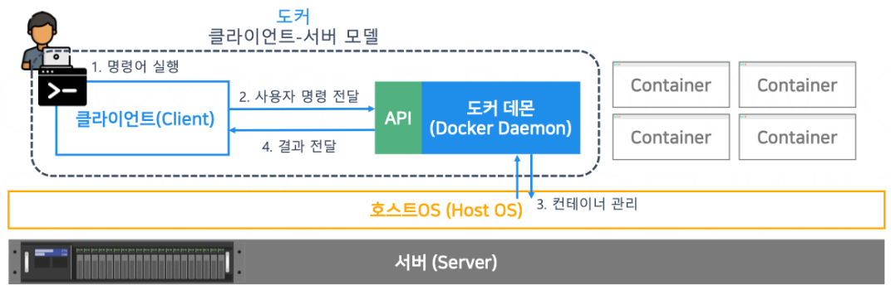
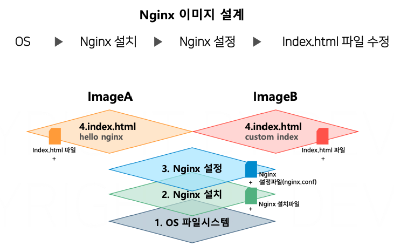

### 가상화 기술
1. 하이퍼 바이저
   - Host OS에 하이퍼바이저를 설치하고, Guest OS를 기동
   - Guest OS의 커널을 별개로 사용하고, Host OS의 커널로 System Call 을 요청
   - VMWare
   - 
2. 컨테이너
   - 리눅스의 `lxc`라는 자체 격리 기술을 사용
   - Host OS의 커널을 그대로 사용
   - Guest OS의 커널을 실행할 필요가 없으므로, 빠른 부팅 속도
   - 
  
### 클라이언트-서버구조
- Docker CLI는 사용자의 커맨드 명령어를 API로 번역하여 Docker Daemon으로 보냄
- 

### 이미지
- 이미지는 특정 시점의 파일 시스템을 저장한 압축 파일
- 이미지를 통해 컨테이너를 실행
- 이미지 안에 OS, 설정파일 등이 포함될 수 있으며 용량이 작아서 공유하기 용이
- 이미지를 레이어드화 하여 효율적으로 저장, 재활용에 용이
- 

### 이미지 레지스트리
- 이미지를 저장하는 저장소
- `docker hub`가 가장 유명

### 볼륨
- 영속성이 필요한 데이터를 위해 존재, 데이터를 외부에 보관
- 마운트를 통해 외부 저장 공간을 특정 경로에 연결

### 네트워크
- 도커 설치 시, 가상 IP를 할당받음(`docker0`)
- 컨테이너 실행 시 네트워크 IP주소 범위 내에서 가상의 IP를 할당
- 브릿지를 사용하여 컨테이너간 통신 가능