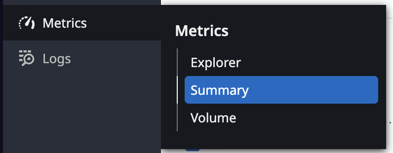
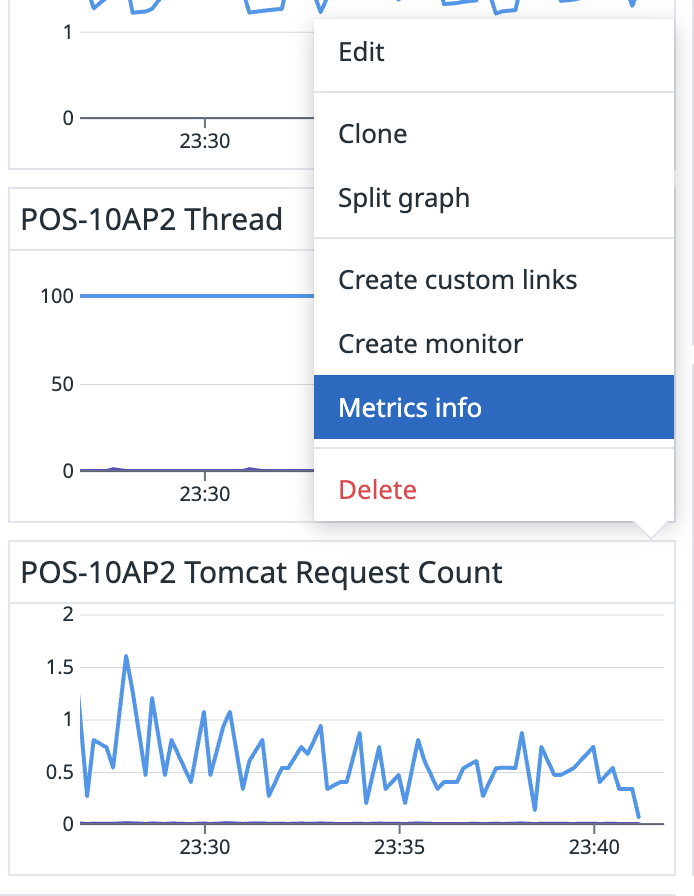
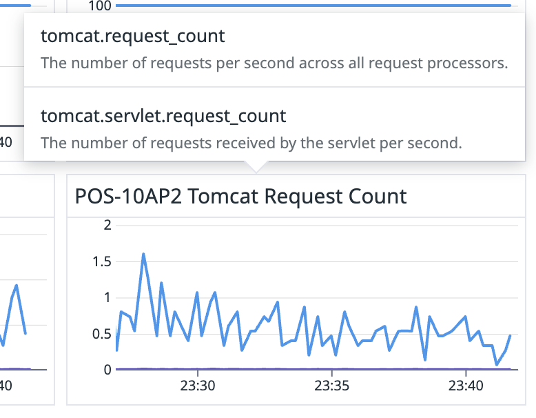
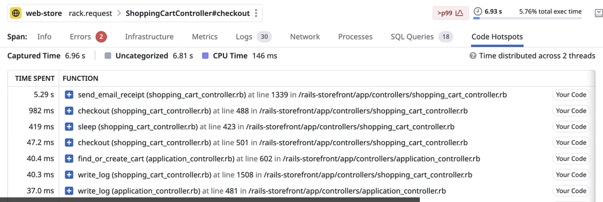
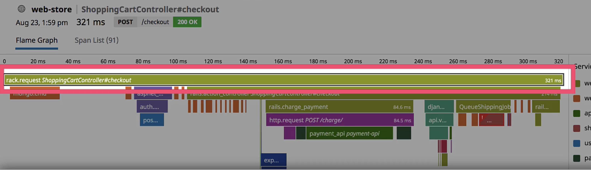

## Monitoring?
- Monitoring is the act of paying attention to the patterns that your metrics are telling you. It's about analyzing your data and acting on it.
### 무엇을 모니터링하는가?
- Perfomance : 아키텍처/애플리케이션이 자원을 어떻게 사용하는지 확인
- Security : 감시하는 환경으로의 보안적 이슈를 탐지
- Usage : 사용자들이 우리 환경에서 무엇을 하는지?
### Alert
- 알림을 받았을 때, 액션을 취해야만 하는 알람들만 선정해야한다.(알람 피로도 유발)

---

## Observability?
- Observability is taking the same data that you've collected and moving beyond "what is happening?" to "why is it happening?"

---

## Observability's Pillars
### Matrics
- These data points are numerical values that can track anything about your environment over time
  - 단일 데이터로 보지 않고, 장기적인 패턴을 보아야 함
- Matrics를 수집하는 이유
  - 애플리케이션의 평소 상태가 어떤지 볼 수 있음
    - 정상과 비정상에 대한 개념을 구축 해 나갈 수 있음
  - 고객으로부터 스노우볼이 오기 전에, 이슈에 대응할 수 있음
  - 문제가 발생하기 전에 대응할 수 있음
    - 메트릭을 수집하여 자동화할 수 있는 것이 많을수록, 문제가 발생하기 전에 문제를 해결할 수 있음
- `Metrics > Summary`에서 수집하고 있는 메트릭들을 볼 수 있음
  - 
- 아래와 같이 `Metrics Info`를 통해 Metric이 어떤 의미인지 확인할 수 있음
  - 
  - 

### Logs
- A computer generated file that contains time stamped informatin about the usage of that system.
### 왜 수집하는가?
- Compliance : 규칙을 준수하기 위해 만들어야 한다.
- Insight : 시스템이나 애플리케이션 성능에 대한 인사이트를 준다.
- Security : 인증된 행동만 시스템에서 행해질 수 있도록 입증해준다.
### Priactical ues for Logs
- Troubleshooting : 모든 문제의 해결은 로그에서 시작된다.
- Auditing
- Monitoring
- Alerting
- Personal History
- Not getting in trouble
### 로그 수집 기간 원칙
- Compliance : 법적인 문제
- Usefulness
- Cost

### Traces
- Used to track the time spent by an application processing a request and the status of this request
- Code Hotspots를 통해 코드의 실행 시간을 확인할 수 있다.
  - 

### Span이란?
- Span은 코드가 수행하는 개별 작업 단위이다.
- Trace 내부에 있는 하나의 작은 단위이다.
- 

### Trace를 수집하는 이유
- Microservices : 작은 서비스들에서 어떤 일들이 일어나는지 볼 수 있다.
- Optimization : 성능 최적화를 위한 추적이 가능하다.
- Troubleshooting : 애플리케이션의 문제를 파악할 수 있다.
