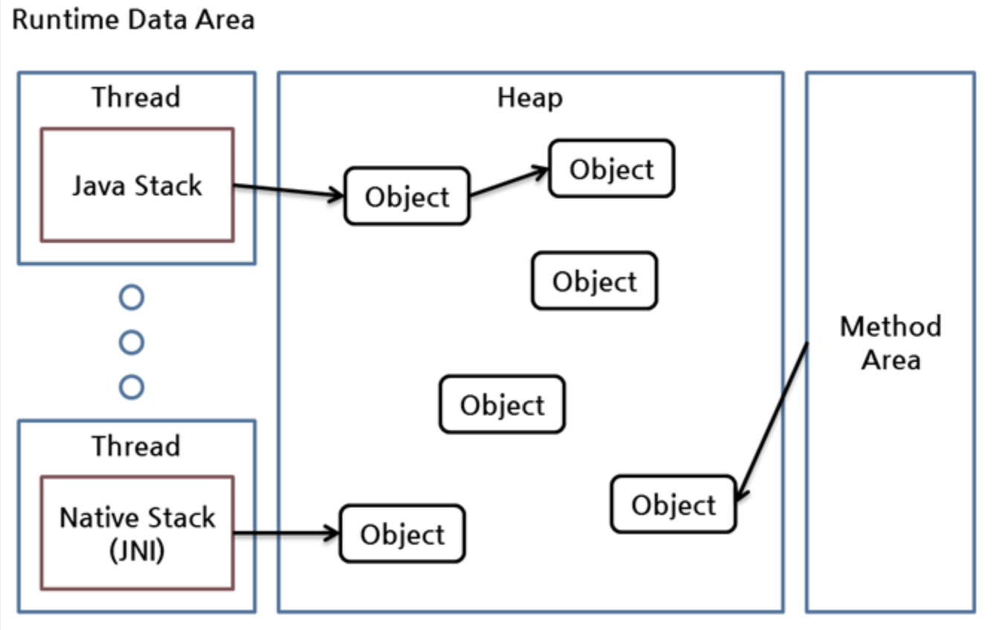
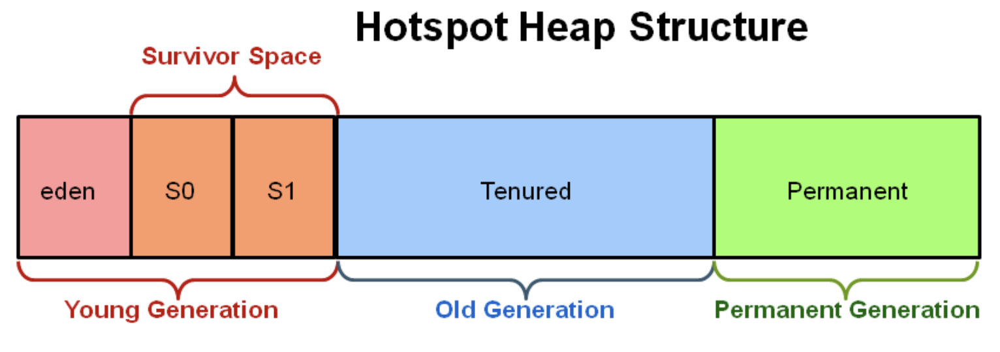
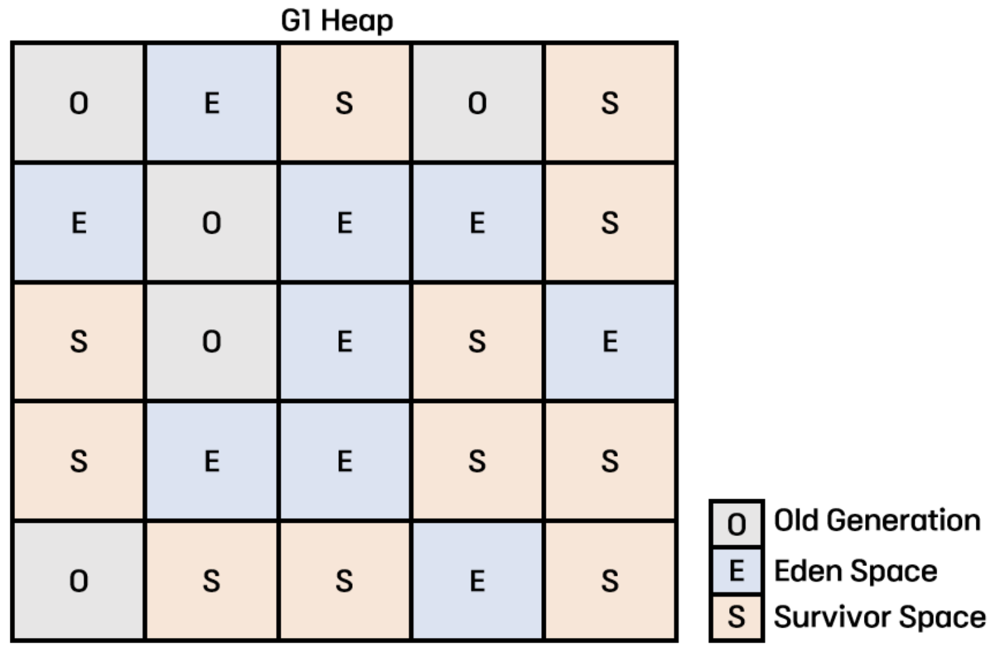

# 가비지 컬렉터
- 사용하지 않는 메모리를 `Garbage Collector` 가 알아서 정리해 줌
- `C` 와 같은 언어에서는 `free()` 와 같은 메서드를 통해 직접 해제해주어야 함
- 메모리는 한정된 자원이기 때문에 주기적으로 정리가 필요

## Reachable & Unreachable

- `Root Set` 
    - 쓰레드의 `Stack`  영역 (메서드의 지역변수나 파라미터)
    - `Method Area` (정적 변수 등)
    - `JNI` (운영체제를 다루기 위해 `C`  / `C++` 로 만든 기능)
- `Root Set` 에서 참조되면, `Reachable` , 참조되지 않으면 `Unreachable` 로 분류됨

## Garbage Collection 과정
- `Mark and Sweap` 
    - `Mark`  : `Reachable`  객체를 마크
    - `Sweap`  : `Unreachable`  객체 영역의 메모리를 해제
    - `Compact`  : `sweap`  이후 분산된 객체들을 `heap` 의 시작주소로 모아 `heap`  영역의 메모리를 할당된 부분과 미 할당된 부분으로 나눔

## Hotspot Heap Structure
- `JVM`  종류 중 하나

- `Young Generation` 
    - 새롭게 생성된 객체가 생성
    - `Minor GC` 가 발생
    - 대부분의 객체는 금방 `Unreachable` 상태가 되기 때문에 여기서 정리 됨
- `Eden Space` 
    - 새로 생긴 객체가 저장 됨
- `Survivor Space` 
    - `S0`  와 `S1` 중 하나는 반드시 비어있어야 함
- `Old Generation` 
    - `Young Generation` 에서 `Reachable` 상태로 N번 이상 살아남은 객체들이 이동
    - 영역의 크기가 크고, `GC` 가 적게 발생
    - `Minor GC`  혹은 `Full GC` 가 발생
- `Permanent Generation` 
    - `Java 7`  까지만 존재, 이후로는 `Metaspace`  영역으로 변경
    - 클래스의 메타데이터들을 저장(클래스와 메소드, 필드 등의 정보)

## Stop the World
- `Garbage Collector` 의 실행을 위해 `JVM` 애플리케이션이 실행을 멈추는 것
- `GC` 를 실행하는 스레드를 제외한 다른 스레드들은 실행을 멈춤

## GC가 일어나는 과정
1. 객체가 점차 생성되고, `Eden Space` 가 모두 할당됨
2. `Minor GC` 가 발생하고, `Garbage Collection` 이 되어 살아남은 객체만 `S0` 으로 이동, `age`  증가
3. 객체가 점차 생성되고, 또 다시 `Eden Space` 가 모두 할당됨
4. `Minor GC` 가 발생하고, `Garbage Collection` 이 되어 `Eden Space` 와 `S0` 에서 살아남은 객체만 `S1` 로 이동, `age`  증가
5. 위 과정이 반복되어 `S0`  혹은 `S1`  중 하나가 모두 할당되거나 `age` 가 정해둔 수치를 넘어갈 경우, `Old Generation` 으로 이동됨(이를 `Promotion` 이라고 함)
6. 위 과정이 반복되어 `Old Generation` 이 모두 할당되면, `Major GC` 가 발생

[순서가 잘 설명되어 있는 블로그](https://velog.io/@impala/JAVA-JVM-Garbage-Collection)

## Garbage Collector 종류
- `Serial GC` 
    - 싱글 쓰레드 어플리케이션을 위한 GC
    - 하나의 쓰레드가 GC를 처리
    - 다른 GC에 비해 `Stop the World` 시간이 길다
    - `Young Generation` 에서는 `Mark-Sweep` ,`Old Generation` 에서는 `Mark-Sweep-Compact` 알고리즘을 사용
    - 메모리와 CPU 코어 개수가 적은 환경에 적합
    - 멀티쓰레드 환경 혹은 low-latency를 추구하는 어플리케이션에서는 사용을 지양
- `Parallel GC` 
    - `Java 8` 의 Default GC
    - 병렬처리가 가능한 GC
    - `Young Generation` 의 GC를 멀티쓰레드로 수행( `Old Generation`  은 단일 쓰레드로 처리)
    - `Serial GC` 에 비해 `Stop the World` 시간 감소
    - 긴 pause가 허용되는 어플리케이션에 사용 가능
    - 멀티 프로세서, 멀티 쓰레드 머신에서 중간~대규모 데이터를 처리하는 어플리케이션을 위해 고안됨
    - 메모리가 충분하고 코어 개수가 많은 환경에 적합
- `Parallel Old GC` 
    - `Parallel GC` 를 개선한 방식
    - `Old Generation` 의 GC도 멀티쓰레드로 수행
    - `Mark-Summary-Compact`  알고리즘을 사용
        - `sweep`  : 단일 쓰레드가 `Old Generation`  전체를 정리
        - `summary`  : 멀티 쓰레드가 `Old Generation` 을 분할해서 정리
- `Concurrent Mark & Sweap (CMS)` 
    - `Stop the World` 시간을 줄이기 위해 고안된 방식(Low Pause)
    - `Parallel Old GC` 와 같이 `Young Generation` 과 `Old Generation` 의 GC를 병렬처리하지만, 어플리케이션 백그라운드에서 진행이 가능하다
    - `Mark-Sweep`  알고리즘을 **Concurrent**하게 수행
    - `Stop the World` 시간이 매우 짧아 모든 어플리케이션의 응답속도가 매우 중요할 때 사용(Low Latency GC)
    - 다른 GC방식보다 메모리와 CPU를 더 많이 사용한다
    - `Compaction` 단계가 기본적으로 제공되지 않아 메모리 단편화가 발생한다
        - CPU 리소스가 부족해지거나 메모리 단편화가 심해 메모리 공간이 부족해지면 `Serial GC` 와 동일하게 동작한다
        - `Compaction` 이 얼마나 자주, 오랫동안 수행되는지 확인해야 함
- `Garbage First GC(G1GC)` 
    - `Java 9+` 의 Default GC
    - `CMS GC` 를 개선한 GC
    - `Heap` 영역을 일정한 크기의 **Region**으로 나누어 Region 단위로 탐색을 진행
    - Garbage가 많은 Region에 대해 우선적으로 GC를 수행
    - `Mark-Sweep-Compact`  알고리즘을 사용하여 메모리 단편화 문제를 해결
    - 위의 모든 GC보다 처리속도가 빠름
    - 큰 메모리공간에서 멀티 프로세스 기반으로 운영되는 어플리케이션을 위해 고안
    - 64Bit 컴퓨터에 최적화된 GC로, 4GB 이상의 Heap Size에 적합

## 참고 사이트
[참고 사이트1](https://velog.io/@yarogono/Java%EA%B0%80%EB%B9%84%EC%A7%80-%EC%BB%AC%EB%A0%89%ED%84%B0Garbage-Collector%EB%9E%80)

[참고 사이트2](https://jsy1110.github.io/2022/JAVA-GC/)

[참고 사이트3](https://velog.io/@impala/JAVA-JVM-Garbage-Collection)
