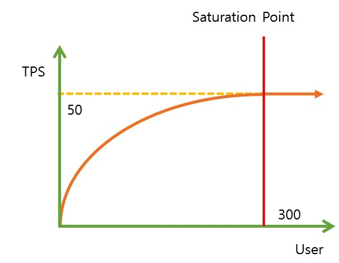
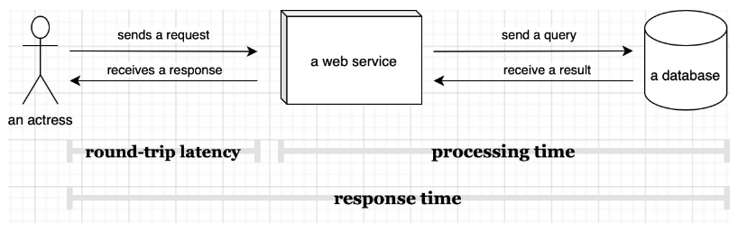
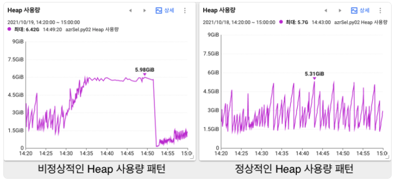

# 서버 모니터링 지표에 대해 알아보고, Jedi 대시보드를 이해해보자.

## 대표적인 모니터링 지표
- `TPS`(Transactions Per Second)
  - 시스템의 처리 능력을 평가하는 지표 
  - 초당 몇개의 트랜잭션을 처리하는지 나타내는 지표 
  - 특정 구간의 트랜잭션의 수를 구하고, 1초단위로 표현 
  - `Saturation Point` : 사용자가 지속적으로 증가하면, `TPS`가 증가하다가 더 이상 증가하지 않는 지점
    - 
    - https://brunch.co.kr/@leedongins/27
    - `Saturation Point`에 도달하면 서버의 트랜잭션 처리는 한계가 있기 때문에, `Scale-Up/Out`을 하거나 성능 개선을 해야 함
- `CPU`
  - CPU의 사용량이 높으면, 전체적인 성능이 떨어짐 → CPU 성능을 높여야 함 
  - CPU의 I/O가 높으면, 디스크를 HDD에서 SSD로 바꾸는 것이 좋음 
  - `IRQ`(Interrupt ReQuest) : 주변기기의 이벤트로 인해 CPU가 하던일을 중단하고 요청을 받는 요청
- 평균응답시간
  - 일정 단위시간 안에 종료된 트랜잭션의 응답시간들을 더하고, 트랜잭션의 수로 나눈 값 
  - 클라이언트의 요청이 전송되는 순간부터, 응답이 클라이언트에게 도달할 때까지의 시간
- `Latency`(지연시간)
  - 
- `Heap Memory`
  - 인스턴스나 배열 등 주요데이터가 저장되는 곳 
  - GC가 동작하여 주기적으로 청소를 함 
  - Heap을 너무 많이써서 사용할 공간이 부족하면, `GC`가 자주 동작 → CPU를 과도하게 점유
  - 
  - https://www.whatap.io/bbs/board.php?bo_table=blog&wr_id=59&page=8
  - 왼쪽과 같은 경우 Old-Gen GC는 STOP_THE_WORLD를 동반, VM의 모든 스레드를 멈춤 → 애플리케이션에 지연 발생 
  - 왼쪽과 같은 패턴이 보인다면 
    - jvm옵션 중 -Xmx값을 올려 힙메모리의 최대값을 늘림 
    - 애플리케이션에 적합한 GC를 사용 
    - 애플리케이션을 수정(메모리 최적화)
- `Thread`
  - 들어온 요청을 처리하는 하나의 작업단위(Thread)
  - 기본적으로 `Thread Pool`에 있는 만큼 사용됨 
  - `Max Thread Count` 만큼 생성 됨 
  - 지속적으로 높아지거나, 일시적으로 높아진 현상이 발생한다면 문제가 발생한 것 (어느 구간에서 적체가 발생)

## POS 서버 대시보드에 존재하는 지표
- `IDC `
  - `TPS` 
  - 평균응답시간 
  - `CPU` 
  - `Heap Memory`(`jvm.heap_memory`, `jvm.heap_memory_max`)
  - `Thread`(`tomcat.threads.count`, `tomcat.threads.busy`)
  - `RequestCount`(`tomcat.request_count`, `tomcat.servlet.request_count`)
- `AWS`
  - `TASK` 수(`aws.ecs.service.running`)
  - 클러스터 CPU(fargate 사용)
  - 클러스터 메모리(fargate 사용)
  - `latency` (`p50`, `p75`, `p90`, `p99`)
    - `p50` : 전체 요청 중 50%가 이 수치 이하의 응답 시간을 가짐(중앙값)
    - 주로 `p90`지표를 성능에 많이 사용 
  - 200 응답(`aws.applicationelb.httpcode_target_2xx`)
  - `heap memory`(`ECS MAX`, `ECS MIN`, `ECS Max jvm.heap_memory`, `ECS Avg`)
