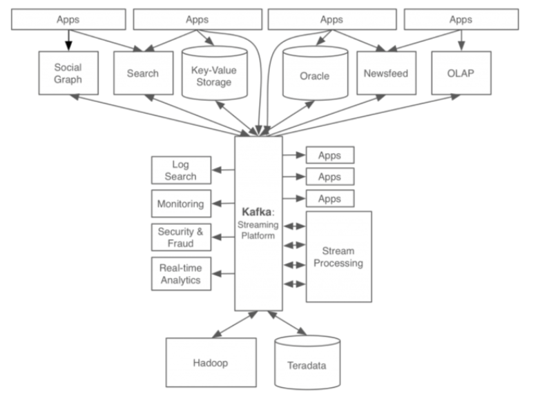
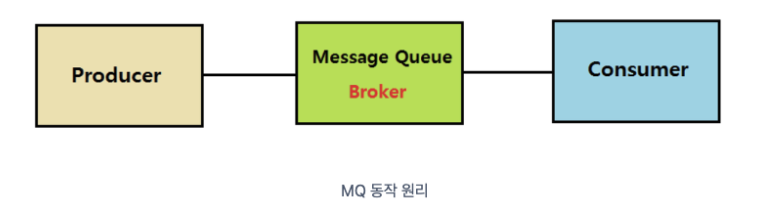
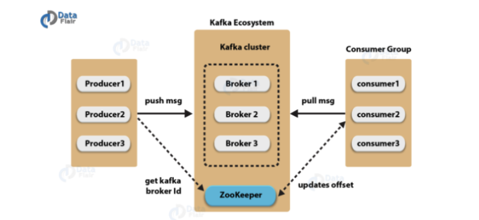
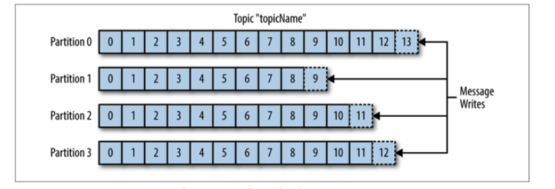

## Kafka 정의
- 파이프라인, 스트리밍 분석, 데이터 통합 및 미션 크리티컬 애플리케이션을 위해 설계된 고성능 분산 이벤트 스트리밍 플랫폼이다.
- Pub-Sub 모델의 메세지 큐 형태로 동작하며 분산 환경에 특화되어 있다.

## Kafka 탄생배경
- Linkedin 에서 개발되었으며 다음과 같은 문제를 해소하기 위해 개발되었다.
    - 각 애플리케이션과 DB가 end to end로 연결되어 있고 시스템의 복잡도가 높아지면서 다음과 같은 문제가 발생되었다.
    - 데이터 흐름을 파악하기 어렵고 관리 문제 발생
    - 연결되어 있는 어플리케이션을 모두 확인해야 하므로 장애 발생 시 조치에 상당시간이 소요
    - 데이터 불일치 가능성이 증가하고 각 파이프라인 별 데이터 포맷과 처리방식이 상이
- 개선 후 데이터 처리 시스템 구조
    - 

## Kafka 동작 방식 및 특징
- Pub-Sub 모델의 메세지 큐 형태로 동작한다.
> 메세지 큐(Message Queue)  
미들웨어 (MOM: Message Oriented Middleware)를 구현한 시스템으로 프로그램 간의 데이터를 교환할 때 사용하는 기술이다.

- 메세지 큐의 장점
    - Queue라는 임시 저장소가 있어 비동기로 데이터를 처리한다
    - 어플리케이션과 분리되어 있고 producer or consumer 서비스에 대한 확장성이 뛰어나다
    - consumer가 다운되더라도 어플리케이션이 중단되는 것은 아니면 메세지는 MQ에 지속하여 남아있다
    - MQ에 들어가면 모든 메세지가 consumer 서비스에 전달된다는 보장을 제공한다

- 메세지 브로커 / 이벤트 브로커
    - 메세지 브로커
        - Publisher가 생산한 메세지를 메세지 큐에 저장하고 저장된 데이터를 consumer가 가져갈 수 있도록 중간다리 역할을 해주는 브로커
        - 서로 다른 시스템 사이에서 데이터를 비동기로 처리
        - Redis, Rabbit MQ가 있고 GCP 의 pub/sub, AWS의 SQS가 있다.
        - 메세지 브로커들은 consumer가 큐에서 데이터를 가져가게 되면 즉시 혹은 짧은 시간내에 큐에서 데이터가 삭제된다.
    - 이벤트 브로커
        - 메세지 브로커의 큐 기능을 가지고 있어 메세지 브로커 역할을 할 수 있다.
        - 차이점은 이벤트 브로커는 publisher가 생산한 이벤트를 처리 후에 바로 삭제하지 않고 저장하여, consumer 가 특정 시점부터 이벤트를 다시 consume 할 수 있는 장점이 있다.
        - 또한 대용량 처리에 있어서는 메세지 브로커보다 더 많은 양의 데이터를 처리할 수 있다.
        - Kafka, AWS의 kinesis 가 있다 

- 카프카의 구성 요소 및 특징
    - 
    - Topic(파일 시스템의 디렉토리와 유사한 개념)
        - 각각의 메세지를 목적에 맞게 구분할 때 사용한다
        - 메세지를 전송하거나 소비할 때 Topic을 반드시 입력한다
        - Consumer는 자신이 담당하는 Topic의 메세지를 처리한다
        - 한 개의 토픽은 한 개 이상의 파티션으로 구성된다
    - Partition
        - 분산 처리를 위해 사용된다
        - Topic 생성 시 partition 개수를 지정할 수 있다. 개수는 변경 가능하며 추가만 할 수 있다
        - 파티션이 1개이면 모든 메세지에 대해 순서가 보장된다
        - 파티션 내부에서 각 메세지는 offset(고유 번호)로 구분된다
        - 파티션이 여러개라면 kafka 클러스터가 라운드 로빈 방식으로 분배해서 분산처리 되기 때문에 순서를 보장하지 않는다
        - 파티션이 많으면 처리량이 좋지만 장애 복구 시간이 늘어난다
    - Offset
        - 컨슈머에서 메세지를 어디까지 읽었는지 저장하는 값
        - 컨슈머들은 각각의 파티션에 자신이 가져간 메세지의 위치정보(offset)를 기록한다
        - 장애 발생 후 원복되면 마지막에 읽었던 위치에서부터 데이터를 다시 읽는다
    - Producer
        - 메세지를 만들어서 카프카 클러스터에 전송한다
        - 메세지 전송 시 Batch처리가 가능하다
        - Key 값을 지정하여 특정 파티션으로만 전송 가능하다
        - 전송 acks 값을 설정하여 효율성을 높일 수 있다
        > acks = 0 -> 매우 빠르게 전송. 파티션 리더가 받았는지 알 수 없다
        acks=1 -> 파티션 리더가 받았는지 확인 (default)
        acks=all -> 파티션 리더뿐만 아니라 팔로워까지 메세지를 받았는지 확인

    - Consumer
        - 카프카 클러스터에서 메세지를 읽어서 처리한다
        - 메세지를 Batch 처리할 수 있다
        - 한 개의 컨슈머는 여러개의 토픽을 처리할 수 있다
        - 메세지를 소비하여도 삭제하지 않는다 (kafka delete policy에 의해 삭제)
        - 한번 저장된 메세지를 여러번 소비도 가능하다

    - Broker
        - 실행된 카프카 서버를 의미한다
        - 프로듀서와 컨슈머는 별도의 어플리케이션으로 구성되는 반면, 브로커는 카프카 자체이다
        - 브로커는 카프카 클러스터 내부에 존재한다
        - 서버 내부에 메세지를 저장하고 관리하는 역할을 수행한다

    - Zookeeper
        - 분산 어플리케이션 관리를 위한 코디네이션 시스템
        - 분산 메세지 큐의 메타 정보를 중앙에서 관리하는 역할을 한다

- 주요 설계 특징
    - 
    - 하나의 Topic 을 여러개의 파티션으로 분산하는 이유
    - 병렬로 처리하기 위해 분산 저장한다
    - 카프카의 토픽에 메세지가 쓰여지는 것도 시간이 필요하며 메세지가 동시에 카프카에 write되면 병목현상이 발생할 수 있으므로 파티션을 여러개 두어 분산저장함으로써 write를 병렬로 처리할 수 있다
    - 늘어난 파티션은 줄일 수가 없으므로 운영중에 파티션을 늘리는 것은 충분한 검토가 필요하며 파티션을 늘렸을 때 메세지는 라운드 로빈 방식으로 쓰여진다
    (하나의 파티션에서는 메세지 순서가 보장되지만 파티션이 여러개일 경우에는 순서가 보장되지 않는다)
    - Consumer Group
        - 컨슈머 그룹은 하나의 토픽에 대한 책임을 가지고 있다
        - 어떤 컨슈머가 Down 되면 파티션 리밸런싱을 통해 다른 컨슈머가 해당 파티션의 sub을 맡아서 한다
        - offset 정보를 그룹간에 공유하고 있으므로 down 되기 전 마지막으로 읽었던 메세지 위치부터 시작한다
         

- Source
    - https://backend-repository.tistory.com/35
    - https://jackcokebb.tistory.com/2