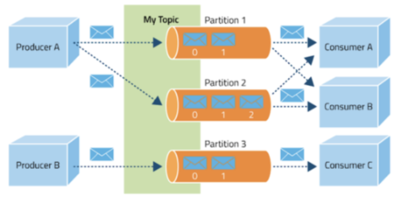
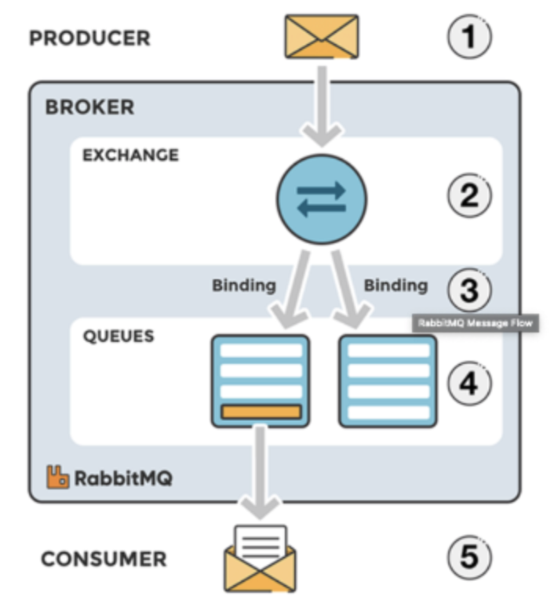

## Pub/Sub 모델을 제공하는 서비스 비교
- 비교 대상 Kafka, Redis, Rabbit MQ 으로 한정한다

- Kafka 동작방식과 특징
    - 
    - 구성요소
        Event : 카프카에서 프로듀서와 컨슈머가 데이터를 주소받는 단위 
        Producer : 카프카에 이벤트를 게시(post, pop) 하는 클라이언트 어플리케이션
        Consumer : Topic을 구독하고 얻어낸 이벤트를 받아 처리하는 클라이언트 어플리케이션
        Topic : 이벤트가 모이는 곳으로 프로듀서는 topic에 이벤트를 게시하고 컨슈머는 topic을 구독해 이벤트를 가져와 처리함
        Partition : Topic은 여러 브로커에 분산되어 저장되며 이렇게 분산된 topic을 Partition이라고 함
        Zookeeper : 분산 메세지의 큐 정보를 관리
    - 동작원리
        1. Publisher는 전달하고자 하는 메세지를 토픽을 통해 카테고리화 한다
        2. Subscriber는 원하는 Topic을 구독함으로써 메세지를 읽어온다
        3. Publisher 와 Subscriber는 오로지 토픽 정보만 알 뿐, 서로에 대해 알지 못한다
        4. 카프카는 브로커들이 하나의 클러스터로 구성되어 동작하도록 설계되어 있다
        5. 클러스터 내 브로커에 대한 분산 처리는 Zookeeper가 담당한다
    - 장점
        - 대규모 트래픽 처리 및 분산처리에 효과적이다
        - 클러스터 구성, fail-over, replication의 기능이 있다
        - 다른 메세지 큐 서비스보다 속도가 빠르다 (100kb/s)
        - 디스크에 메세지를 특정 주기 동안 보관하고 있으며 컨슈머 장애 시 재처리가 가능하다
- Rabbit MQ 동작방식 및 특징
    - 
    - Rabbi MQ는 AMQP 프로토콜을 구현한 메세지 브로커이다
    > AMPQ(Advanced Message Queuing Protocol) 은 메세지 지향 미들웨어를 위한 개방형 표준 응용 계층 프로토콜 클라이언트와 미들웨어 브로커 간의 메세지를 주고받기 위한 프로토콜이다
    - 구성요소
        - 프로듀서, 컨슈머 : 메세지를 보내고 받는 클라이언트 어플리케이션이다
        - exchange : 메세지를 목적지에 맞게 큐에 전달한다
        - Queue : 메세지를 쌓아둔다

    - 메세지 처리과정
        1. 프로듀서가 브로커로 메세지를 보낸다
        2. 브로커 내 exchange 에서 해당하는 key에 맞게 큐에 분배한다 (Binding or Routing이라고 함)
            - Topic 모드 : Routing Key 가 정확히 일치하는 Queue에 메세지 전송 (unicast)
            - Direct 모드 : Routing Key 패턴이 일치하는 Queue에 메세지 전송 (Multicast)
            - Headers 모드 : [key:value] 로 이루어진 header 값을 기준으로 일치하는 큐에 메세지 전송 (Multicast)
            - Fanout 모드 : 해당 Exchange 에 등록되니 모든 큐에 메세지 전송 (Broadcast)
        3. 해당 큐에서 컨슈머가 메세지를 받는다
    - 장점
        - 브로커 중심적인 형태로 퍼블리셔와 컨슈머간의 보장되는 메세지 전달에 초점을 맞추고 복잡한 라우팅을 지원한다
        - 클러스터 구성이 쉽고 Manage UI가 제공되며 플러그인도 제동되어 확장성이 뛰어나다
        - 20kb/s의 속도를 보인다
        - 데이터 처리보단 관리적 측면의 서비스에서 다양한 기능을 제공한다
    - 단점 
        - MQ Server 가 종료 후 재기동되면 기본적으로 큐 내용은 모두 제거된다
- Redis 동작 방식 및 특징
    - 레디스는 데이터베이스, 캐시, 메세지 브로커 및 스트리밍 엔진으로 사용되는 인메모리 데이터 구조 저장소이다
    - 구성 요소
        - Publisher : 메세지를 게시한다 (Pub)
        - Channel : 메세지를 쌓아두는 Queue
        - Subscriber : 메세지를 구독한다 (sub)
    - 동작
        1. 퍼블리셔가 채널에 메세지를 게시한다
        2. 해당 채널을 구독하고 있는 Subscriber가 메세지를 sub해서 처리함
    - 특징
        - 채널은 이벤트를 저장하지 않으며 채널 이벤트가 도착 했을 때 해당 채널의 Subscriber가 존재하지 않는다면 이벤트가 사라진다
        - Subscriber 는 동시에 여러 채널을 구독할 수 있으며 특정한 채널을 지정하지 않고 패턴을 설정하여 해당 패턴에 맞는 채널을 구독할 수 있다
        - 캐시의 역할도 수행하며 처리 속도가 빠르다
        - but, 메모리 기반이므로 서버가 다운되면 레디스내의 모든 데이터가 사라지면 이벤트의 도착 보장을 하지 못한다
