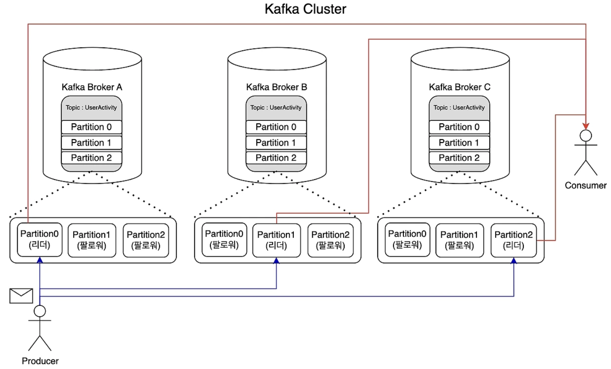
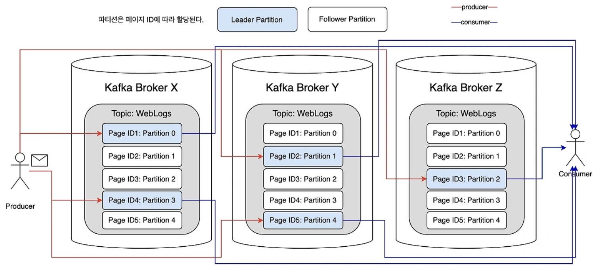
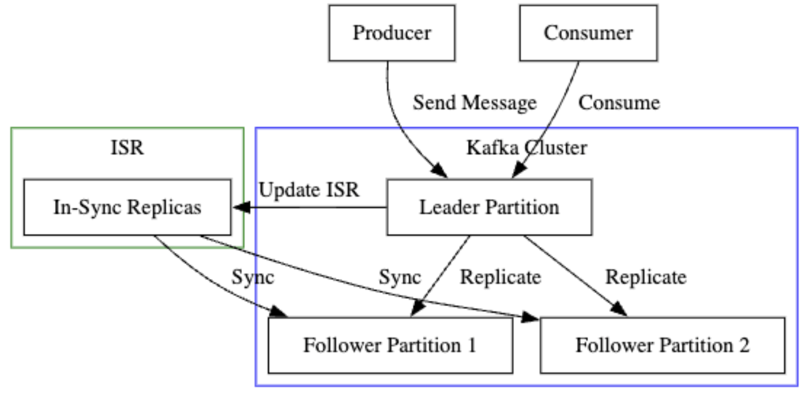

### 카프카의 고가용성 및 대규모 데이터 처리방법
- 토픽 구성
    - UserActivity는 사용자 활동 데이터를 위한 카프카 토픽이다. 해당 토픽은 다양한 활동을 기록하고 저장하는 데 사용된다.
- 브로커, 파티션 구성
    - 클러스터는 브로커 A,B,C 로 구성 되면 각 브로커는 파티션을 관리한다.
    - 토픽은 3개의 파티션으로 나누어져 있으며 각 파티션은 사용자 활동 데이터의 부분 집합을 독립적으로 저장하고 관리한다
- 프로듀서, 컨슈머의 역할
    - 프로듀서 : 사용자 활동 데이터를 생성하고 UserActivity에 전송
    - 컨슈머 : 처리된 사용자 활동 데이터를 카프카 토픽에서 읽어 분석하거나 사용

- 파티션 할당 매커니즘
    - 사용자 id를 메세지의 키로 사용한다. 이 키를 기반으로 메세지를 특정 파티션에 할당하여 동일한 사용자 id를 가진 메시지가 항상 같은 파티션에 저장되도록 한다 (순서의 일관성)
- 브로커와 파티션 관계
    - 클러스터는 브로커 A,B,C로 구성되어 있으며 각 브로커는 여러 파티션을 관리한다. 각 파티션은 하나의 브로커에서 리더 역할을 하며 나머지 브로커에서는 팔로워 역할을 한다.
- 고가용성 구성
    - Partition0 의 리더는 브로커 A에 있으며 브로커 B와 C에 있는 Partition0는 팔로워 역할을 한다
    - Partition1 의 리더는 브로커 B에, Partition2의 리더는 브로커 C에 위치하며 각각 나머리 두 브로커 안에 있는 Partition1, Partition2가 팔로워 역할을 한다.
    - 이는 한 브로커에 장애가 발생하더라고 다른 브로커가 리더 역할을 넘겨 받아 데이터 손실없이 서비스를 지속하기 위함이다.
- 토픽구성 : WebLogs
    - WebLogs는 웹사이트 로그 데이터를 저장하는 토픽으로 웹사이트의 사용자 활동과 관련된 정보를 포함한다.
- 브로커의 파티션 설정
    - 세 개의 브로커는 파티션을 관리하며 각각의 브로커는 데이터의 복제본을 유지하여 시스템의 안정성과 가용성을 높여준다. (로그 데이터를 분산 저장하고 관리)
- 파티션 할당 메커니즘
    - 웹사이트의 페이지 ID를 메세지 키로 사용한다. 이는 동일한 페이지의 로그가 같은 파티션에 저장되도록 보장하여 데이터 관리를 효율적으로 만든다.
    
- 분산 저장
    - 로그 데이터는 페이지 ID에 따라 다른 파티션에 분산 저장된다. 이는 단일 저장 지점을 방지하고 전체 시스템의 안전성을 높인다.
- 병렬 처리
    - 각 파티션은 독립적으로 데이터를 처리할 수 있으며 이는 한 파티션의 지연이 다른 파티션에 영향을 미치지 않음을 의미한다. 또한 다수의 컨슈머가 서로 다른 파티션에서 데이터를 동시에 읽을 수 있어 시스템 전체의 처리량을 증가시킨다.

### 복제와 장애허용 매커니즘
- ISR(In-Sync Replicas)
    - 정의 
        - ISR은 리더 파티션에 복제될 수 있는 팔로워 파티션의 집합이다.
        - ISR은 현재 리더와 동기화 되고 있는 팔로워 파티션들을 의미한다.
    - 동작방식
        - 리더 파티션이 새로운 메세지를 받으면 ISR 내의 팔로워 파티션들도 이 메세지를 복제한다.
        - 모든 팔로워가 메세지를 복제하면 해당 메세지는 commit 된 것으로 간주한다.
        - commit 된 메세지 만이 컨슈머에 의해 소비될 수 있다.
        
- Replication Factor(토픽 데이터의 복제본 설정)
    - 정의
        - Replication Factor는 특정 토픽의 데이터가 몇 개의 복제본을 가질 것인지 설정하는 값이다.
    - 동작방식
        - Replication Factor 가 3이라면 리더 파티션과 두 개의 팔로워 파티션이 생성된다.
        - 이렇게 하면 하나 또는 두개의 노드가 실패해도 데이터 손실이 없다.
        - 그러나 높은 복제본 설정을 하면 안정성은 높아지나 저장 공간과 네트워트 트래픽의 부하가 발생된다.
> 리더 파티션이 실패할 경우 ISR 내의 팔로워 파티션 중 하나가 새로운 리더로 선출된다. 새로운 리더가 선출되면 모든 팔로워 파티션들은 이 새 리더와 동기화를 시작한다.    
