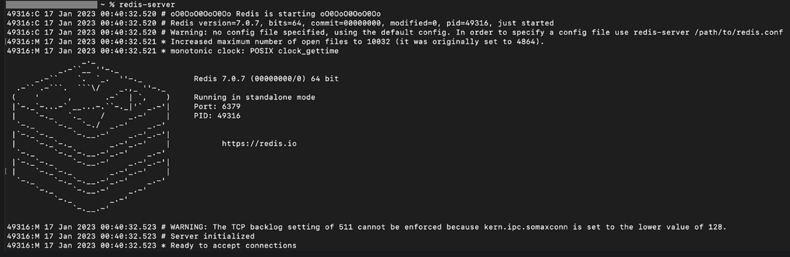

## Redis 설치
1. Mac OS에서 Redis 설치
    - Homebrew 설치 여부 확인 ```brer --version ```
    - redis 설치 ```brew install redis ```
    - redis 설치 제거 ```brew uninstall redis ```
    - redis 설치 확인 ```redis-server --version ```

2. Mac 에서 redis 실행
    - Foreground (MacOS에서 redis 가 정상적으로 설치되었는지 확인하는 용도)
        - Foreground로 실행하면 프로세스가 실행하는 동안 터미널에서 다른 작업을 할 수 없으며 명령처리가 끝날 때까지 다른 작업을 수행할 수 없다 
    - 
    > 참고 
    > - mac 에서 특정 포트의 프로세스 찾는 방법 ```sudo lsof -i :port```
    > - mac 에서 프로세스 종료하는 방법 ```sudo kill -9 pid```

    - Background로 실행하기 (실제 redis를 사용하는 경우)
        - 터미널에서 명령처리가 수행될 동안 다른 프로세스를 함께 수행할 수 있다
    
    - redis Background로 실행하는 방법 ```brew services start redis```
    - redis Background로 재실행하는 방법 ```brew services restart redis```
    - redis background로 중지하는 방법 ```brew services stop redis```

3. redis 실행 상태 확인
    - ```brew services info redis```

4. rediscli 로 redis 사용해 보기
    - redis-cli 사용 ```redis-cli```
    - redis 데이터 생성 및 수정 (같은 key 값이 존재하면 데이터만 업데이트됨)
       ```set {key}{value} / set mykey, myvalue```
    - redis 데이터 조회 ```get mykey```
    - redis 데이터 key 목록 조회 ```keys *```
    - redis key 수정 ```rename 기존키 변경키 / rename mykey kykey2```
    - redis key 조회 ```dbsize```
    - redis key 삭제 ```del mykey2```
    - redis key 전체 삭제 ```flushall```

*- 참고*
*https://herojoon-dev.tistory.com/170*


