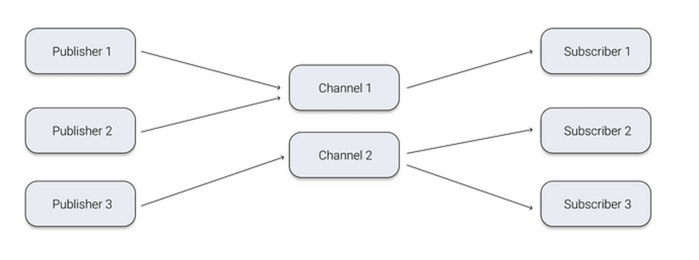
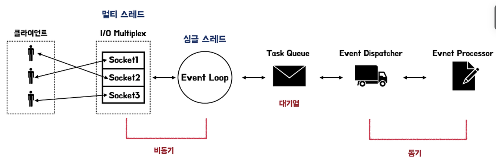
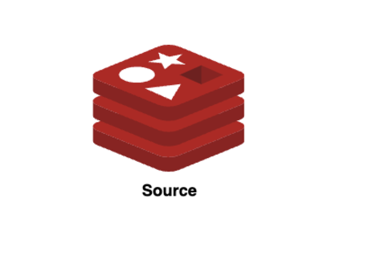
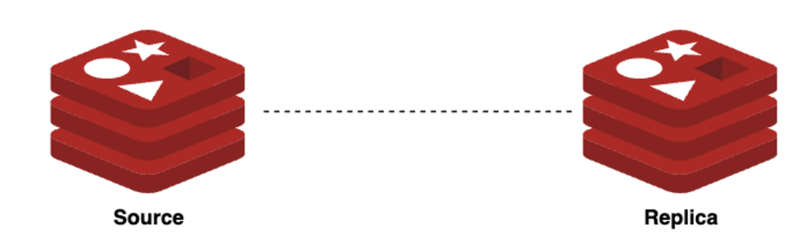
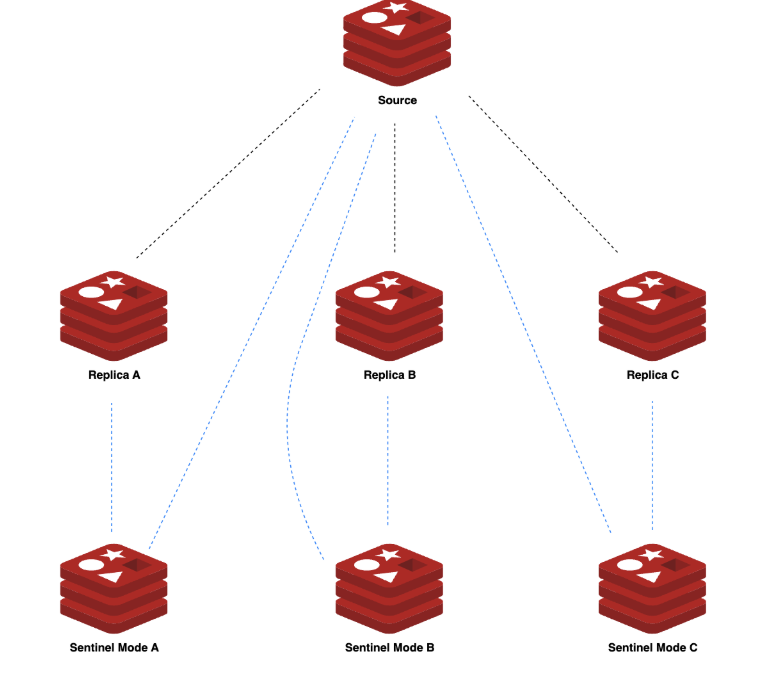
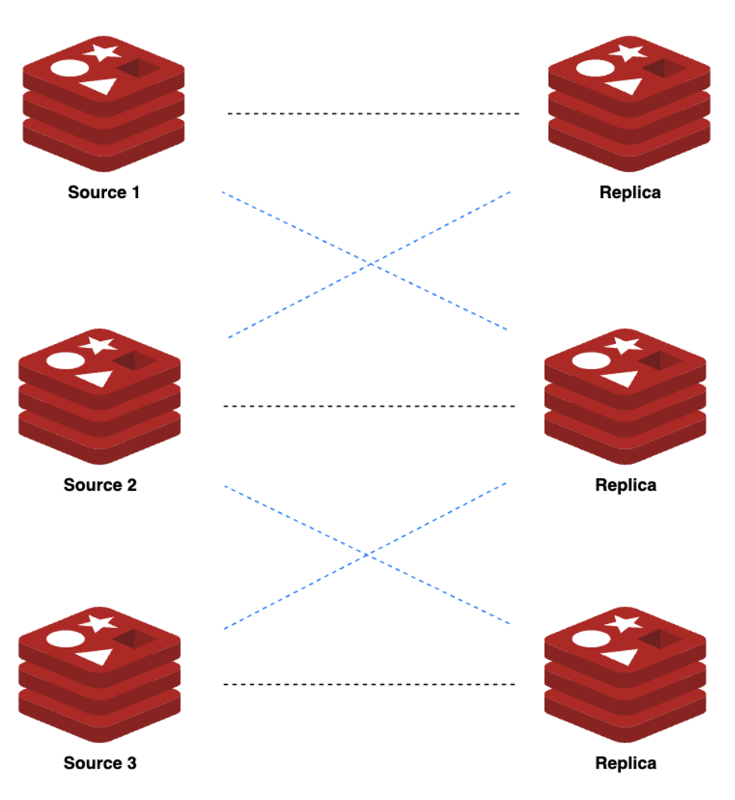

- Redis 특징
    - Persistence (영속성) 지원
        - 휘발성인 인메모리에 데이터를 저장하기 때문에 데이터를 영구적으로 저장할 수 없으며 cache 용도로 사용한다면 상관없지만
          Redis를 cache 이외의 용도로 사용한다면 데이터 백업이 필요하다. 데이터를 영속화 하기 위해서는 ```RDB``` 와 ```AOF```의 2가지 방법이 있다
            - RDB (Redis Database) : 설정한 시간 단위로 레디스 DB의 스냅샷을 백업하고 필요 시 특정한 시점의 스냅샷으로 롤업할 수 있다.

            - AOF(Append Only File) : 쓰기 명령어들을 개별적으로 특정 로그 파일에 기록해두고, 이 로그 파일을 기반으로 서버 재시작/재구성 시    
              복구가 가능하다
    - Single Thread
        - Redis는 싱글 쓰레드이므로 1번에 1개의 명령어만 실행할 수 있다. 멀티 스레드를 사용하면서 발생하는 컨텍스트 스위칭과 메모리 사용을 줄일 수 있어 빠르게 응답할 수 있고 Atomic(원자성)을 보장할 수 있다.
    - Pub / Sub

        
        - 장점
            - 비동기 통신 방식으로 발행자와 구독자는 서로를 알 필요가 없다
            - 하나의 메세지를 여러 구독자에게 동시 전달이 가능하다
            - 모든 데이터를 메모리에서 처리해 빠른 처리 및 실시간 처리가 가능하다
        - 단점
            - 발행된 메세지는 저장되지 않는다
            - Subscriber가 없으면 메세지는 유실된다
            - At Most Once : 전달 - 수신을 확인하지 않기 때문에 메세지 전달이 보장되지 않는다
        - 활용
            - Redis Pub /Sub 사용의 목적에 따라 실시간 채팅, 실시간 알림, SNS 피드 등에 사용할 수 있다
            - Pub/Sub 는 메세지를 저장하지 않기 때문에 Redis의 List 자료형으로 제한된 메세지를 저장하고 조회하도록 구현할 수 있다
- Redis 의 Multiplexing과 Event Loop 방식
    - Redis 가 싱글 스레드 임에도 여러 요청을 빠르게 처리하는 것은 I/O 작업을 처리하는 데에 백그라운드로 여러 개의 스레드를 사용해 처리하기 
    때문이다. 즉, redis 가 싱글 스레드 라는 것은 클라이언트의 요청인 redis 의 명령어를 처리하는 것을 의미하는 것이다
    (데이터 처리는 단일 스레드로 동기처리하여 원자성을 보장한다)
    
    1. 클라이언트가 연결을 요청하면 클라이언트의 Socket과 Redis의 Socket이 연결된다
    2. I/O Multiplex는 멀티 스레드를 사용하고 비동기로 여러 클라리언트의 요청을 동시에 받는다
    3. Event Loop는 비동기로 클라이언트 연결 이벤트를 감지하고 Task Queue 처리 작업을 전달한다
    4. Task Queue 는 전달받은 이벤트들을 순서대로 Queue에 저장한다
    5. Event Dispatcher는 Task Queue 에 저장된 작업을 가져와 적절한 이벤트 처리기로 전달한다
    6. Event Prodessors는 실제 데이터를 처리하고 결과를 반환한다
- Redis 아키텍쳐 
    - Standalone(단일구성)
        - 
        - Source 노드라고 하며 서버 다운 시 AOF 또는 RDB 파일을 이용해서 재시작한다
    - Replication(복제)
        - 
        - 레디스 서버 2로 구성되며 (Redis-Replica) 1개의 Source에 여러개의 Replica를 구성할 수 있고 Replica에 또 다른 Replica를 둘 수 있다. Redis의 모든 구조에서 복제는 비동식으로 동작하므로 Source에서 Replica에 데이터가 잘 전달되었는지 확인할 수가 없어 정합성을 보장하지 않는다. 
    - Sentinel(감시자)
        - 
        - 센티널을 추가해 자신을 제외한 각 서버들을 감시하는 구조이다. HA(High Availability_고가용성으로 서버 2대를 통해 한쪽 서버가 장애 시 다른 서버가 해당 서비스를 대신 운영하여 가용성을 높이는 솔루션을 말한다) 기능을 제공하여 감시 중 Source가 다운되면 센티널끼리 다수결로 선정된 Replica를 Source로 승격시킨다. (Fail Over) Sentinel 구조를 사용하기 위해서는 Sentinal 프로세스를 추가로 띄워야 하는데 장애판단을 다수결로 결정할 수 있도록 Sentinel은 항상 최소 3대 이상의 홀수로 구성되어야 한다
    - Cluster
        - 
        - 데이터가 여러 Source에서 자동으로 분할되어 저장되는 샤딩 기능을 제공한다. 데이터를 나누는 방식은 Hash를 사용하고 slot 단위로 데이터를 관리하기 때문에 특정 키를 어디에 전송할지를 명시적으로 전송이 가능하다. 이 구성에서 모든 노드가 PING/PONG 메세지 교환으로 서로를 감시하다가 Source 장애 발생 시 자동으로 Replica를 Source로 승격시킨다

 - 레디스 활용 예시
    - I/O가 빈번히 발생하는 데이터 캐싱
        - 상품 찜 기능, 판매상품 수 같은 카운터 쿼리 데이터가 가장 I/O가 빈번히 발생한다. 특히 사용자별로 사이드 바에 찜 수, 장바구니 수들을 카운터 쿼리로 반환된 데이터 수를 view에 뿌려주는데 이 사이드 바는 여러 페이지에서 노출되어 페이지 이동마다 카운트 쿼리를 호출하게 된다.
        그렇게 때문에 매번 카운트 쿼리를 호출하지 않고 해당 데이터를 캐싱 처리하여 카운트 수가 변경되지 않을 경우에 redis를 통해 해당 값을 반환하도록 하여 빠른 속도로 응답하고 RDB의 부담을 최소화 한다
    - API 제한
        - 사용자별로 api 사용량 제한이 필요하다면 redis를 사용할 수 있다. RDB를 사용할 경우 동시성 문제를 해결하기 위해 Lock를 사용할 수 있지만 Dead Lock발생위험이 있다. 요청마다 TTL(time to live_네트워크에서 데이터의 유효기간을 나타내기 위한 방법)을 30으로 설정하여 count를 1씩 올리면서 제한을 체크하는 것이 가능하다
    - Ranking 구현
        - 점수 업데이트 시 자동으로 순위가 정렬되고 대규모 데이터도 빠르게 처리가 가능하다. 또한 싱글 스레드로 Atomic 하기 때문에 Lock없이 여러 업데이트가 동시에 발생해도 안전하다
    - 세션, 인증 토큰 관리
        - Scale Out하여 N대 서버를 운영할 경우 인증 저장소에서 세션을 공유하지 않기 때문에 세션 불일치 문제가 야기된다. 레디스를 사용하면 Key-Value 로 빠르게 찾아 인증정보들이 많을 경우 빠르게 인증을 처리할 수 있고 TTL 설정으로 만료 시간을 설정할 수도 있다.


