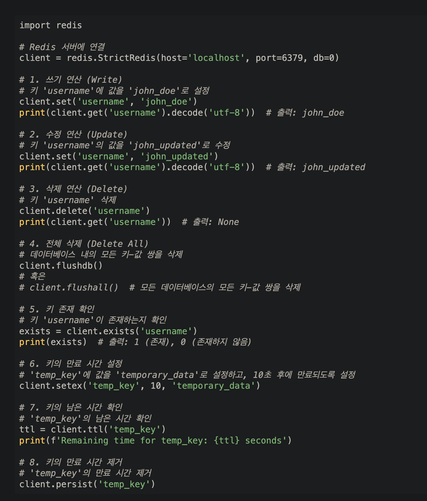

### Redis 총론
- Key, Value 구조의 비정형 데이터를 저장하고 관리하기 위한 오픈 소스 기반의 비관계형 데이터 베이스 관리시스템(DBMS)
    - *비정형데이터 : 예측이 불가능하여 고정되어 있는 필드에 저장되어 있지 않은 데이터이며 테이블과 스키마가 정해져 있지 않음*
- 데이터베이스, 캐시, 메세지 브로커로 사용되며 인메모리 구조를 가진 저장소임
- String, Lists, Sets, Sorted Sets, Hashes 자료 구조를 지원함
    - String : 가장 일반적인 Key-Value 구조의 형태
    - Sets 
        - String 의 집합이며 여러 개의 값을 하나의 Value에 넣을 수 있음
        - 순서를 보장하지 않는 고유한 문자열의 컬렉션. 이 고유한 문자열을 멤버라고 함
        - Redis Set에서 가능한 작업  
            - 고유한 값들의 관리: 특정 사이트에 접근하는 모든 IP들의 목록을 중복 없이 관리 
            - 관계 표현: 크리에이터 계정과 일반 계정과 같이 역할에 따라 사용자들의 목록 분류 
            - 일반적인 집합 관련 연산 수행: 교집합, 합집합, 차집합 등
    - Sorted Sets : 중복된 데이터를 담지 않는 Set 구조에 Sort를 적용한 구조로 랭킹 보드 서버 구현에 사용
    - Lists : Array 형식의 데이터 구조. List를 사용하면 처음과 끝에 데이터를 넣고 빼는 건 빠르지만 중간에 데이터를 삽입하거나 삭제하는 것이 어려움
- Single Thread 형태로 한 번에 하나의 명령만 처리 가능함. 중간에 처리 시간이 긴 명령어가 생기면 그 뒤에 명령어들은 앞의 명령어가 처리될 때까지 대기가 필요함
  그러나 get, set 명령어의 경우 초당 10만개 처리가 가능함

### Redis 사용 시 주의점
- 인메모리 데이터 저장소의 특징으로 서버에 장애가 발생하면 데이터 유실이 발생할 수 있음. 이에 따라 장애에 대한 운영 플랜이 필요함
- 싱글 스레드의 특성상 한 번에 하나의 명령어만 처리가 가능함으로 시간이 오래 걸리는 스레드를 처리하는 명령은 상황에 따라 사용하는 것이 필요함 
- 이에 따라 Master-slave 데이터 이중화 구조에 대한 Redis Replication, 분산처리를 위한 Redis Cluster, 장애 복구 시스템 Redis Sentinel, 
  Redis Topology, Redis Sharding, Redis Failover 등의 구조가 있음 

### Redis 데이터 처리 명령어
|종류|역할|
|:--:|:--:|
|Set|데이터 저장|
|Get|저장된 데이터 조회|
|rename|저장된 데이터 변경|
|randomkey|저장된 key 중에 하나의 key를 랜덤하게 검색|
|keys|저장된 모든 key를 검색|
|exits|검색 대상 key 존재여부 확인|
|mset|여러 개의 데이터 저장|
|mget|여러 개의 데이터 검색|

### Redis 사용 방법
- 설치는 [redis.io](redis.io/) 또는 ```brew install redis```로 설치가 가능함
- 도커 환경에서는 ```docker run -p 6379:6379 redis ``` 에서 설치 가능함
- ```redis_cli``` 를 통해 명령어 실행이 가능함
- Redis 중지는 ctrl + c 로 가능함
- Redis Key-Value 기능
 


### Cache Server
- Redis 를 공부하기에 앞서 Redis에서 사용하는 Cache Server를 선행해서 공부함
    - 데이터베이스 있는데 Redis(인메모리 데이터 구조 저장소)를 사용하는 이유는 무엇인가
         - DB는 데이터를 물리 디스크에 직접 쓰기 때문에 서버에 문제가 발생하여 다운되더라도 데이터는 손실되지 않으나 매번 디스크에 접근하기 때문에 사용자가 많아지면 부하가 발생함
         - 서비스 초기에는 기본적인 **"WEB-WAS-DB"** 구조로 부하가 없으나 USER가 늘어난다면 부하 문제가 발생하므로 캐시 서버를 도입하여 사용함
         - 이 캐시 서버로 이용할 수 있는 것이 Redis 임


* *출처*
 *- https://bugoverdose.github.io/development/redis-set-basics/*
 *- https://seokhyun2.tistory.com/63*
 *- https://velog.io/@coastby/Redis-Redis%EC%9D%98-%ED%8A%B9%EC%A7%95%EA%B3%BC-%EC%82%AC%EC%9A%A9%EB%B2%95*
 *- https://datasciencebeehive.tistory.com/22*
