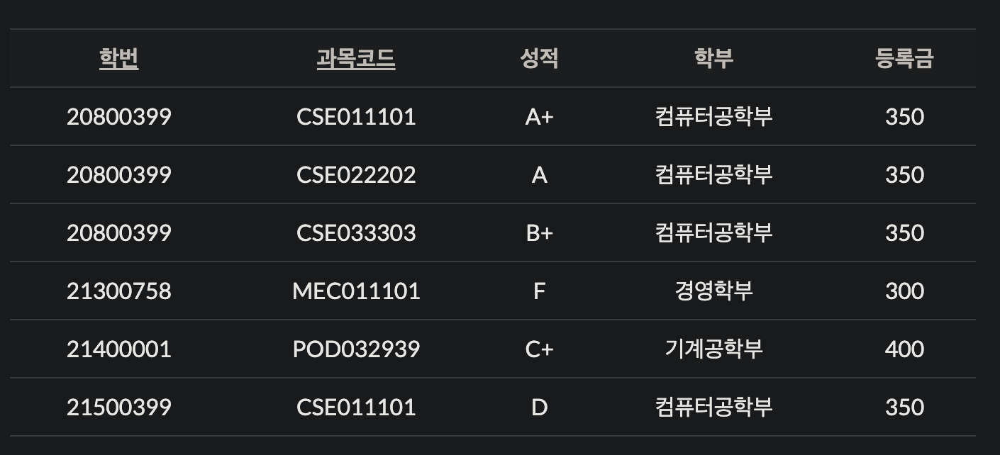

## 정규화
- 정의
    - 관계형 데이터 베이스의 설계에서 중복을 최소화하게 데이터를 구조화 하는 프로세스를 정규화(Normalization)이라 한다.
    정규화의 목표는 이상이 있는 관계를 재구성하여 작고 잘 조직된 관계를 생성하는 것에 있다
    - 정규화를 통해 데이터에 중복을 제거하고 삽입이상, 갱신이상, 삭제이상을 나타나지 않도록 테이블 설계하는 과정을 일컫는다.

- 제 1정규형
    - 릴레이션을 구성하는 모든 도메인이 원자값만으로 구성되도록 하는 정규형을 말한다.
    - 아래 테이블을 예로 들어.. 한 개의 컬럼에는 1개의 데이터만 들어가야 한다. 

|이름|취미|
|:--:|:--:|
|철수|축구, 야구, 농구|
|영희|농구, 배구|
|민수|골프, 축구, 탁구|

이를 제1정규형에 의해 정규화 하면 아래와 같다

|이름|취미|
|:--:|:--:|
|철수|축구|
|철수|야구|
|철수|농구|
|영희|농구|
|영희|배구|
|민수|골프|
|철수|축구|
|철수|야구|
|철수|농구|

- 제 2정규형
    - 후보키가 복합키(다중컬럼)로 설정되어 있을 때 복합키의 일부칼럼에 다른 칼럼들이 결정되어서는 안되다는 뜻이다.
    - 즉, 1정규화를 진행한 테이블에 대해 완전 함수 종속을 만족하도록 테이블을 분해하는 것을 말한다. (완전함수종속이란 기본키의 부분집합이 결정자가 되어서는 안된다는 뜻이다)
    
    - 위의 릴레이션에서 학번 > 학부, 학번 > 등록금 2개의 부분함수 종속성을 가지고 있으며 이를 제거하는 것을 제 2정규화라고 한다.
    - 이를 학번, 학부, 등록금 속성을 가지는 학생 릴레이션과 학번, 과목코드, 성적 속성을 가지는 성적 릴레이션으로 나누면 함수 종속성을 제거할 수 있다.
    - 함수 종속성을 제거하여 분리한 두 개의 릴레이션 (정규화를 통해 분해된 릴레이션들이 조인을 통해 원래의 구조로 복원이 가능해야 함)
    - 학생 릴레이션

    |학번|학부|등록금|
    |:--:|:--:|:--:|
    |208000399|컴퓨터공학부|350|
    |21300758|경영학부|300|
    |21400001|기계공학부|400|
    |21500399|컴퓨터공학부|350|

    - 성적 릴레이션
    
    |학번|과목코드|성적|
    |:--:|:--:|:--:|
    |20800399|cse01101|A+|
    |20800399|cse02202|A|
    |20800399|cse03303|B+|
    |21300758|MEC011101|F|
    |21400001|POD032939|C+|
    |21500399|CSE011101|D|

- 제 3정규형
    - 이행적 함수 종속(Transitive Functional Dependency)_x,y,z 값이 x>y, y>z, x>z사 성립하고 이 경우의 z가 x에 이행적으로 함수 종속되었다고 한다. 
    - 이를 [x,y], [y,z] 두 릴레이션으로 분해하면 이행적 종속관계를 제거했다고 볼 수 있다.
    - 해당 릴레이션으로 보면 [학번, 학부], [학부, 등록금]으로 나뉠 수 있다. 

## 관계형 데이터베이스 개념
- 관계형 데이터베이스는 2차원 표(table)를 이용해서 데이터 상호관계를 정의하는 데이터베이스를 말한다.
- 개체(Entity)와 관계(Relationship)를 모두 Relation이라는 표로 표현하기 때문에 개체를 개체 릴레이션과 관계 릴레이션이 존재한다.
- 관계형 데이터베이스의 릴레이션 구조

   - 튜플  
   릴레이션을 구성하는 각각의 행을 말하며 속성의 모임으로 구성된다.(= 레코드) 튜플의 수를 카디널리티(Cardinality) 또는 기수라 한다.
   - 속성(Attribute)  
   속성은 데이터베이스를 구성하는 가장 작은 논리 단위이며 개체의 특성을 기술한다. 데이터 항목 또는 필드에 해당하며 속성의 수를 degree 또는 차수라고 한다.
   - 도메인(Domain)  
   도메인은 하나의 속성(attribute)이 취할 수 있는 같은 타입의 원자값들의 집합이다.

 
*참고
- https://computer-science-student.tistory.com/194
- https://mangkyu.tistory.com/110
- https://yaboong.github.io/database/2018/03/09/database-normalization-1/