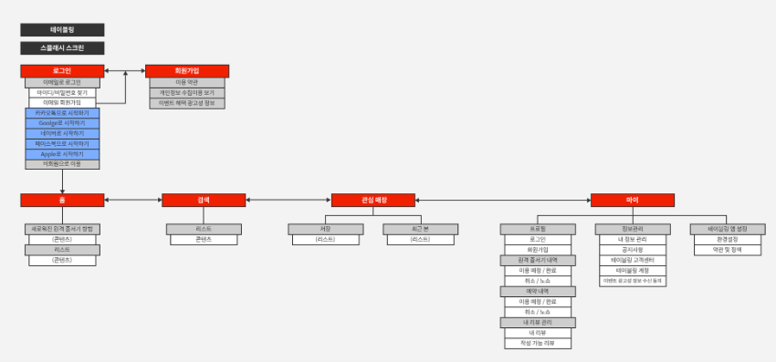
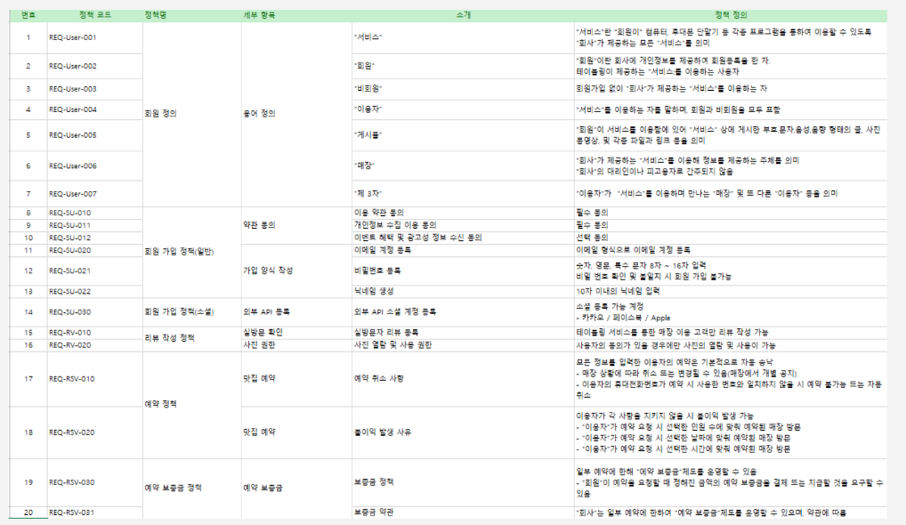
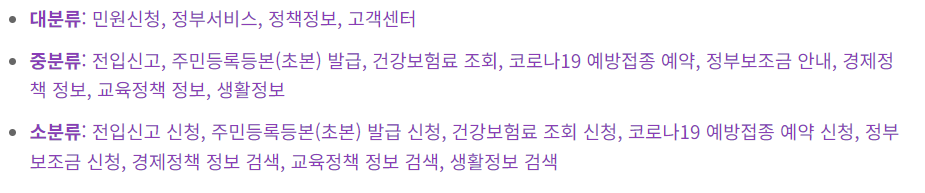
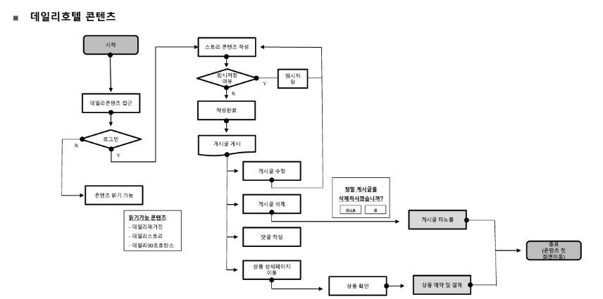

### IA, Flow Chart 개념
#### IA 개념
- IA(Information Architecture) 는 정보 구조도라고 불리며 기능, 정책을 이해하기 쉽게 정의한 문서이다 
- 상세 기획을 하기 전 서비스의 구성 요소를 기록하고 논의하는 용도로 사용된다
-트리형 IA
    - 
- 메뉴형 IA
    -  
- IA 설계를 위한 필수 요소
    - 분류
    - 서비스의 Depth
    - 서비스 화면 번호
    - 화면 ID (LOGIN, MAIN)
    - 페이지 정의 및 요구사항
    - 세부사항
    - 진행 단계
    - 실무적으로는 메뉴 구조가 단계적일 경우 사용한다. 예를 들어 화면 1과 기능 1,2,3이 연결되어 있고 화면 2화 기능2,3이 연결되어 있고 화면 3과 기능1이 연결되어 있는 경우에는 연결된 화면과 기능이 많아 IA가 아닌 플로우 차트를 사용한다 
- IA 설계방법론
    - 목표설정 : 프로젝트 목적과 목표를 정의하고 사용자의 니즈와 요구사항을 파악합니다
    - 사용자 분석 : 사용자의 행동 패턴을 분석하고 사용자의 니즈와 요구사항을 파악합니다. 페르소나를 설정할 경우 프로덕트를 사용하기 위한 연령, 성별, 직업을 고려하고 사용자를 세분화 하여 각 그룹의 특성을 파악합니다
    - 정보분류 : 프로덕트에서 제공할 정보를 분류하고 각 정보의 중요도를 파악합니다. 정보는 대분류, 중분류, 소분류로 구분하고 각 분류의 계층구조를 정의합니다
    - 레이블링 : 정보의 분류에 따라 적절한 레이블링을 부여합니다. 사용자 정보를 쉽게 찾을 수 있도록 도와주는 중요한 요소입니다
    - 네비게이션 설계 : 사용자가 프로덕트내에서 이동할 수 있게 하는 네이게이션을 설계합니다. 메인 메뉴, 서브메뉴, 링크가 포함됩니다.
    - 화면 설계 : 정보 분류, 레이블링, 네비게이션을 바탕으로 화면을 설계하고 화면의 와이어 프레임 구성, 버튼, 링크를 배치합니다.
    - 테스트 : IA를 UT 를 고려하여 테스트를 하나 실무에서는 생략합니다
    - 프로덕트가 오픈될 때 까지 IA, 기획서, 정책서는 수시로 수정합니다. 이는 프로덕트가 출시한 이후에도 관리합니다.
    - 정부24의 레이블링 예시
        - 

#### Flow Chart 개념
- 화면 흐름도라고 불리며 화면 및 기능 단위로 사용 동선을 도식화 한다
- 서비스의 퍼널이나 진입 단계 파악 시 사용한다
    -  
- 플로우 차트를 위한 필수 설계 요소
    - 화면 ID
    - 영/국문 화면명

  
#### IA 와 Flow Chart 의 공통점
- 상세 기획 전 단계에서 사용하며 전체 구조를 파악하는데 사용한다
- 각 단위별로 구현 여부 및 기간을 파악하며 프로젝트 진행 시 진행 현황을 파악하는 용도로 사용한다
