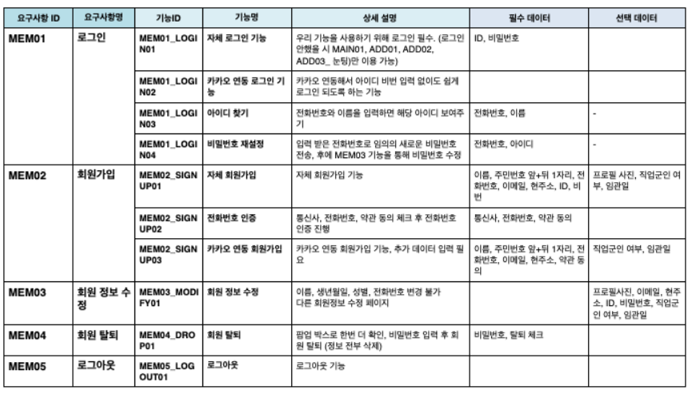
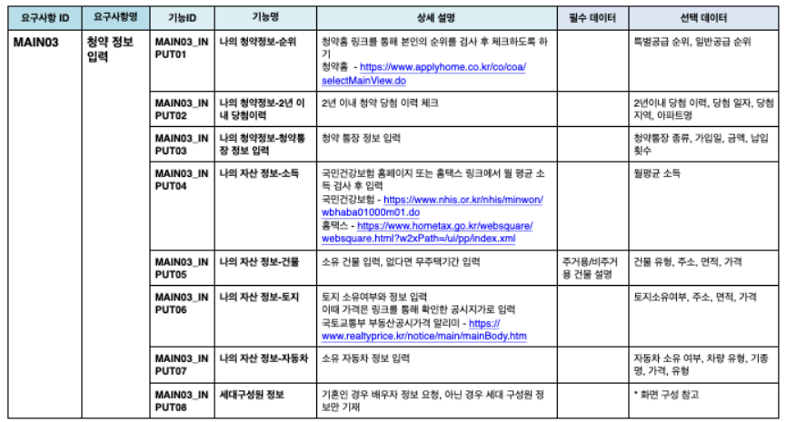
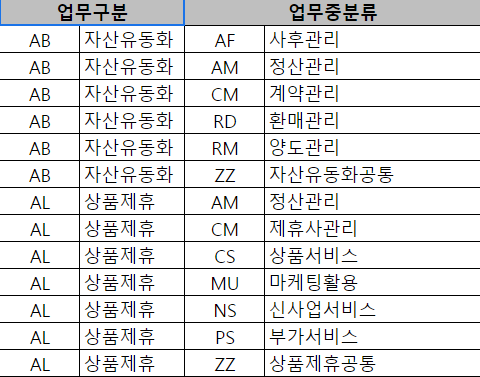

# Prd

### 정의
- 기획서 작성 중 가장 기본이 되는 뼈대
- si 입장에서는 고객사가 원하는 장표라고 보면 되면 일반적인 기획을 담당하는 경우 현업 및 내부 담당자간의 프러덕트에 대한 본모습이라고 할 수 있음
- 요구사항 정의서는 기본적으로 
    - 구분 : 구현하고자 하는 매체
    - e.g. 웹/앱/admin/기간계/MO
    - 요구사항명 과 ID
    - 세부기능명 과 세부기능 ID 로 구성
    - 이에 따른 Description : 상세설명과 필수 데이터, 선택데이터를 넣고 table명 포함 

 

### 요구사항 정의서 >

- 요구사항 ID
  - 네이밍 규칙은 각 회사별로 상이하며
  - Mem (회원관리), Main(메인기능 요구사항), ADD(부가기능), WEB(웹 호스팅)
  - 각 ID에서 기능ID로 이어지고 기획서가 작성됨

- 요구사항 명
  - 요구사항을 명시하고 명사형으로 표현
  - Desc 가 아닌 요구사항의 대명사 격 명칭만 삽입

- 기능 ID
  - 요구사항 ID_기능별 변수를 id 표현 하는 방식으로 사용
  - MEM01_LOGIN01, MAIN02-WEB05

- 기능명
  - 각 기능 ID 가 가지고 있는 기능명을 기재하며 기능명을 읽었을 때 의미 전달이 쉬워야 함

- 필수 데이터 / 선택 데이터
  - 로그인을 위한 ID,PW 
  - 고객 정보를 위한 PK 값 - 이름, 전화번호, 이메일 등
  - 

### 버전관리

요구사항 정의서는 수정사항 및 버전관리를 위해 아래의 데이터 관리를 필수로 한다

| Header | Description | Description | Description | Description |
|--|--|--|--|--|
|표지|개정이력|작성가이드|요구사항 정의서|업무 구분코드|

>업무구분 코드
 기능ID 또는 요구사항 ID 에 구분해서 작성

