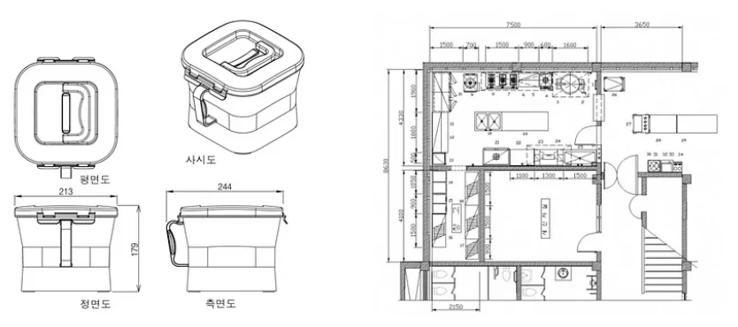
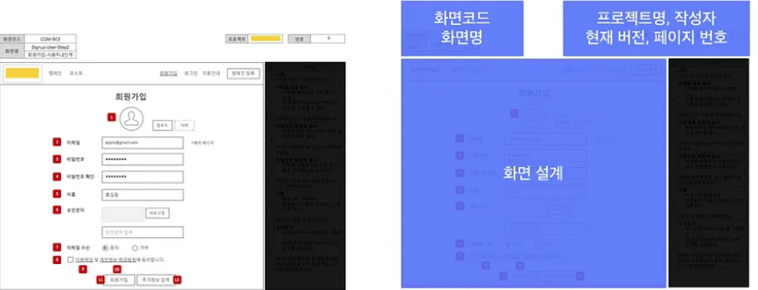

## 화면설계서(Wireframe)와 스토리보드(Storyboard)

- 화면설계서(Wireframe)과 스토리보드(Storyboard)는 다른 문서이며 두 문서는 작성 목적부터 다름
- 금주 주제는 화면설계서(Wireframe)로 한정함

출처 : 오토코리아, 대한주방산업
제품을 개발하기 위해서는 제품 설계 도면(좌), 건물을 짓기 위해서는 건축 설계 도면(우)을 설계해야 함

- 마찬가지로 서비스를 구현하기 위해서는 ‘화면 설계’를 해야 하며 사용자가 웹/모바일을 통해 서비스를 접하기 때문에 화면 단위로 작성하는 기본임

- 화면설계서는 선(Wire)으로 이루어진 화면 구조(Frame)를 표현하는 문서이며 화면을 도식화하기 때문에 시각적인 이해도에 주안점을 두고 있음

(실제 작업자가 아닌 관계자도 화면설계서로 커뮤니케이션을 할 수 있으며 간혹 IT에 대한 경험이 부족한 관계자라면 선으로 그려진 구조를 보고, 실제 화면을 예상하기에 버거워하는 경우도 있는데, 이 분들은 디자인 단계까지 진행되어야 비로소 화면을 이해할 수 있음)

- 화면설계서는 표면적으로 텍스트, 선, 버튼으로 이루어져 있지만 그 안에는 많은 정보를 표현하고 있음

    - 요구사항명세서에 작성된 기능을 시각적으로 배치
    - User Interface (UI) 설계가 담김
    - User Experience (UX) 설계 담김

- 화면설계서에 담겨할 내용
1) 버전 관리

- 화면설계서가 완성되기까지 오랜 시간이 걸리기 때문에 다른 작업자가 지속적으로 문서를 확인해야 하며 화면설계서의 내용이 변경되면 다른 작업자가 확인할 수 있게 표시가 되어야 함

2) 화면

- 화면설계서(파란색), 기능명세서(검은색)
- 버전과 작성일은 파일명, 표지에만 작성해도 됨
- 화면코드를 부여하는 이유는 빠르게 화면을 찾고 구분하기 위함

- 화면설계서 작성 범위
    - 서비스 기획 목적은 서비스 정책을 수립하고 프로세스를 설계하는 업무이며 기획자는 서비스 운영에 필요한 모든 기획 업무를 해야함. 그렇기 때문에 고객만 생각하는 것이 아니라, 서비스를 운영하는 관리자(Administrator)도 함께 고려하는 것이 필요함

- 고객 화면 (Supply Side, Demand Side)
- 관리자 화면 (Administrator)

- 여기서 사용자(Actor)는 단순히 우리가 말하는 고객(End User, Supply Side)만 말하는 것이 아니라, 이 비즈니스에 관계된 관리자(Administrator), 공급자(Supply Side), 수요자(Demand Side) 등 다양한 사용자(Actor)를 포함함

- 기능명세서 (Functional Specification)

    - 기능명세서는 구현해야하는 기능에 대해 상세하게 설명하는 문서이며 해당 기능이 어떻게 작동해야하고, 작동이 되지 않았을 때는 어떻게 처리(에러)해줘야하는지에 대한 상태를 기재함

    - 기능명세서만 잘 작성해도 프로젝트가 성공적으로 개발될 수 있음

    - 앞서 요구사항명세서, 화면흐름도, 화면설계서를 소개 하였는데, 그 중에서 가장 중요한 것이 ‘기능명세서’ 라고 판단됨

    - 기능명세서에 작성되는 부분
        - 기능을 작동하게 하기 위해서는 1) 무엇을 2) 어떻게 만드는지 정의되어야 구현됨

        - 기획자는 ‘무엇을’ 만들 것인지에 초점을 두고 기재하면 되며 개발자는 기능명세서를 보고 전체 구조/설계를 함께 고려하여 ‘어떻게' 구현할지를 검토함

