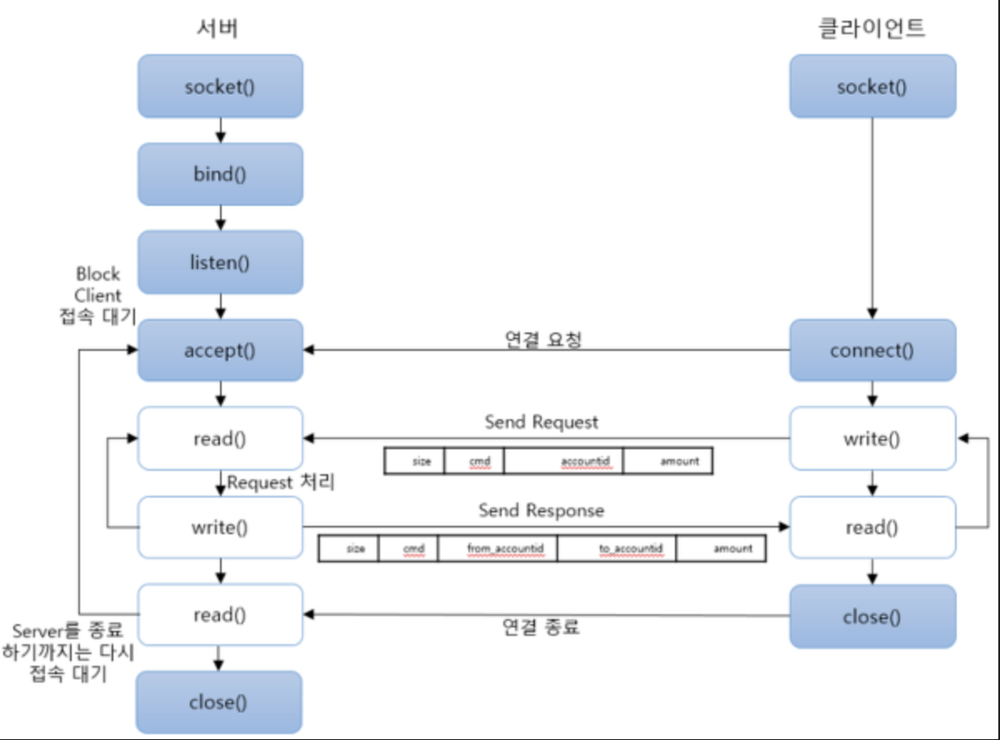
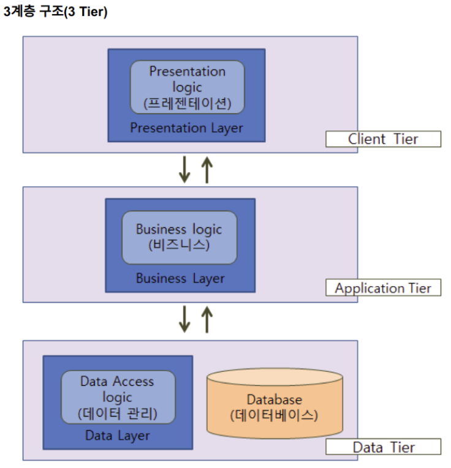

### 개념
- 클라이언트(client) : 서버로 요청을 보내고, 요청한 내용 응답(리소스)를 받아 사용하는 역할.(웹/앱을 이용하는 사용자)  
    - 종류 : 브라우저 웹(Web) 플랫폼의 웹사이트(웹 앱), 스마트폰/태블릿 플랫폼, 그리고 데스크탑 플랫폼에서 이용하는 앱 등
- 서버(server) : 클라이언트의 요청에 따라 적절한 응답(리소스)를 전달해주는 곳. 필요에 따라 서버는 데이터베이스에 요청을 보내고, 회신 받은 응답(리소스)을 활용한다.
    - 종류 : 파일 서버(파일을 제공하는 앱), 웹 서버(웹사이트에서 필요로 하는 정보들을 제공하는 앱), 메일 서버
- 데이터베이스 : 리소스를 저장하는 공간 (일종의 서버라고 볼 수 있음) 서버의 요청을 따라 적절한 응답(리소스)을 꺼내 서버에게 전달한다.

### 2-Tier 아키텍쳐
- 리소스를 사용하고(클라이언트) 리소스를 제공하는 (서버) 구조
- 요청 <> 과 응답이 존재
- 소켓통신 WorkFlow

- 단점 
    - 클라이언트의 성능 향상으로 다양한 처리를 클라이언트에서 할 수 있으나 데이터의 무결성 (Integrity) 를 담보할 수 없다
    - 또한 비지니스 로직을 클라이언트에 두기 어려운 경우도 있다 (클라이언트 간 메시지 전송)
    

### 3-Tier 아키텍쳐
- 클라이언트-서버 구조에 데이터를 저장하는 데이터베이스를 총칭해서 3-Tier 아키텍쳐라고 한다
- 구조

    - 정보, 중간, 클라이언트 계층으로 나뉜다
    - 정보 계층(Information tier)
        - 데이터 계층(data tier) 혹은 최하위 계층(bottom tier)이라 부릅니다. 어플리케이션을 위한 데이터를 관리합니다. 일반적으로 관계형 데이터 베이스(Relational Database)이용해 데이터를 저장합니다.
    - 중간계층(Middle tier)
        - 어플리케이션 계층(application tier)으로 부르기도 합니다. 비즈니스 로직(business logic) 및 프리젠테이션 로직(presentation logic)을 구현합니다. 어플리케이션 클라이언트와 데이터 간의 상호작용을 제어합니다. 정보 계층의 데이터와 어플리케이션 클라이언트 간의 매개자(intermediary)역할을 수행합니다.
    - 클라이언트 계층(Client tier)
        - 최상위(top) 계층으로 부르기도합니다. 어플리케이션의 사용자 인터페이스 역할을 수행합니다. 중간 계층과 상호작용을 통해 요청을 전달하고 정보 계층에서 데이터를 조회합니다.

### 클라이언트-서버 구조의 장점
- 이 아키텍처는 데이터와 리소스의 중앙 집중화를 통해 데이터 관리와 보안을 강화 가능하다. 왜냐하면 모든 데이터가 서버에 저장되어 있기 때문에 데이터의 일관성과 무결성을 유지하기 쉽고, 보안 정책을 중앙에서 관리할 수 있다. 
- 클라이언트-서버 아키텍처는 다양한 클라이언트 디바이스에서 서비스를 이용할 수 있게 한다. 왜냐하면 서버가 클라이언트의 유형에 관계없이 동일한 서비스를 제공할 수 있으며, 클라이언트는 서버로부터 받은 데이터를 자신의 환경에 맞게 표시할 수 있기 때문이다. 
- 이 아키텍처는 시스템의 확장성과 유지보수성을 향상시킨다. 왜냐하면 서버와 클라이언트가 분리되어 있어, 각각 독립적으로 개발하고 업데이트할 수 있으며, 시스템의 규모가 커져도 유연하게 대응할 수 있기 때문이다. (따라서 클라이언트-서버 아키텍처는 대규모 웹 애플리케이션 개발에 적합)

- *출처*
    - *https://velog.io/@estell/%ED%81%B4%EB%9D%BC%EC%9D%B4%EC%96%B8%ED%8A%B8-%EC%84%9C%EB%B2%84-%EC%95%84%ED%82%A4%ED%85%8D%EC%B2%98*
    - *https://f-lab.kr/insight/understanding-client-server-architecture*
    - *https://12bme.tistory.com/297*
    - *https://puzzle-puzzle.tistory.com/entry/%EC%84%9C%EB%B2%84-%ED%81%B4%EB%9D%BC%EC%9D%B4%EC%96%B8%ED%8A%B8-%EA%B5%AC%EC%A1%B0*

