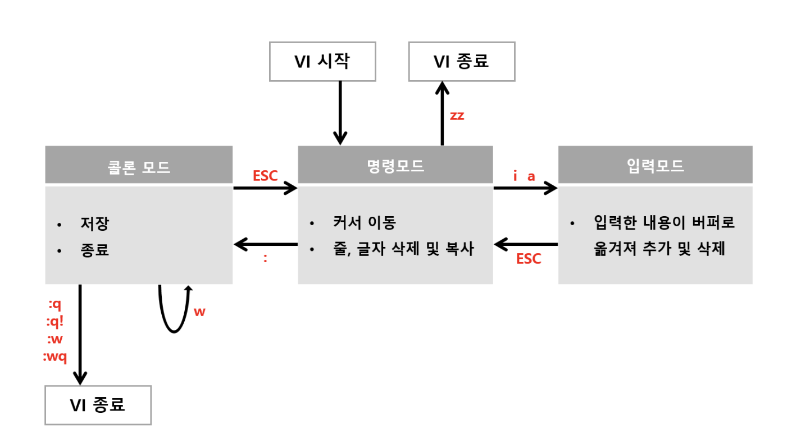

### Linux 편집기 및 사용방법
- Shell 에서 vi [파일명] 을 입력하면 새로운 문서를 편집할 수 있는 환경이 만들어진다.
- vi 의 3가지 모드  
    - 명령모드(Command Mode)  
        - vi 명령어를 통해 vi 를 시작할 경우 실행되는 모드로 방향키를 통해 커서를 이동할 수 있다.  
    - 입력모드(Insert Mode)  
        - 명령모드 ```i ``` 또는 ```a``` 를 눌러서 입력모드로 넘어갈 수 있다. 입력 모드에서는 자유롭게 코드나 글을 작성할 수 있으며 명령모드로 돌아갈 때는 ```ESC``` 를 누르면 된다.
            - i : 커서가 현재 위치한 부분에서 시작
            - a : 커서 다음부터 시작
            - shift+spaca : 한/영 변환

    - 콜론 모드
        - 명령 모드에서 ```:```를 입력하면 화면 아랫줄에 입력 가능한 공간이 나타나고 여기서 vi를 종료할 수 있다.
- 구성4


- vi명령어
    - 명령모드에서 입력 모드로 전환  
        - i : 커서 앞에 입력
        - a : 커서 다음에 입력
    - 입력모드에서 명령모드 전환
        - ESC
    - 저장/종료 (명령 모드에서 ```:``` 를 사용하여 작업 가능)
        - ```:q``` : 종료 (저장여부를 물어보고 종료)
        - ```:q!``` : 저장하지 않고 강제 종료 (저장여부를 물어보지 않고 강제 종료)
        - ```:w``` : 저장
        - ```:wq``` : 저장 후 종료 (=ZZ)
        - ```:wq 파일이름``` : 저장 후 파일이름 지정 (비정상 종료 시 .swp 파일이 생성)
    - 삭제
        - x : 커서에 있는 글자 삭제
        - X : 커서 앞에 있는 글자 삭제
    - Undo / Redo
        - u : Undo
        - ctrl + r : Redo


*Source*
- https://withcoding.com/112
- https://blockdmask.tistory.com/25
- https://velog.io/@zeesoo/Linux-vi-%ED%8E%B8%EC%A7%91%EA%B8%B0-%EC%82%AC%EC%9A%A9%EB%B2%95-%EB%B0%8F-%EB%AA%85%EB%A0%B9%EC%96%B4