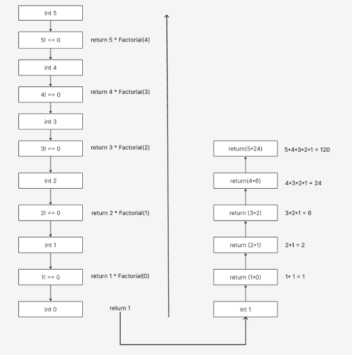
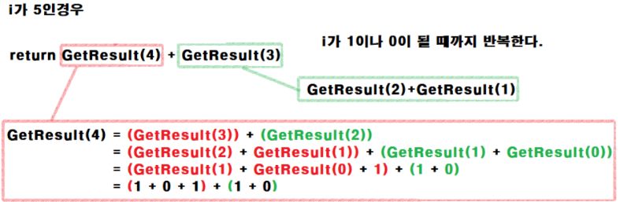

- RecursionFunction
    - 

  ```c#
  using System;
  using System.Collections.Generic;
  using System.Linq;
  using System.Text;
  using System.Threading.Tasks;
  
  namespace RecursionFunction
  {
    public partial class Program
    {
     static void Main(string[] args)
      {
        Console.WriteLine($"Factorial :{Factorial(5)}");
      }

      public static int Factorial(int n)
       {
        if (n == 0)
        {
          return 1;
        }

        return n * Factorial(n - 1);
       }
    }
  }
  ```


- 피보나치 수열

  - 


  ``` C#
  using System;
  using System.Collections.Generic;
  using System.Linq;
  using System.Text;
  using System.Threading.Tasks;
  
  namespace Pibonacci
  {
    using System;

    namespace _Fibonacci
    {
      class Program
        {
          static void Main(string[] args)
           {
            Console.WriteLine(Fibonacci(5));
           }

          static uint Fibonacci(uint number)
           {
            if (number == 0)
              {
               return 0;
              }
               if (number == 1)
               {
                return 1;
               }
                return Fibonacci(number - 1) + Fibonacci(number - 2);
           }
        }
    }
  }
  ```

