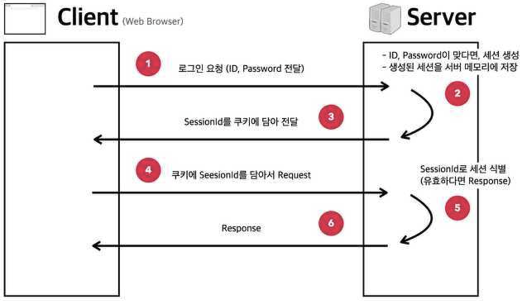

### HTTP 특성
- 무상태성과 비연결성 때문에 HTTP 에서는 정보가 유지되지 않으나 로그인 정보, 화면에서의 데이터를 유지해야 한다. HTTP의 무상태성을 보완하기 위해 사용되는 저장소가 쿠키와 세션이다. 
    - 무상태성(Stateless) : 클라이언트와 데이터를 주고 받아도 다음 연결 시 이전 데이터를 유지하지 않음
    - 비연결성(Connectionless) : 요청에 대한 응답 이후 클라이언트와 연결을 끊는 방식을 이용

### 쿠키

- 개념
    - 쿠키는 사용자가 방문한 웹사이트에서 사용자의 브라우저에 전송하는 작은 텍스트 조각이다. 쿠키가 있으면 웹사이트에서 사용자의 방문에 관한 정보를 기억하여 다음 방문 시 동일한 정보를 중복하여 작업하지 않아도 된다
    - 사용자 인증이 유효한 시간을 명시할 수 있으며 쿠키가 유효한 시간 지정이 가능하다. 쿠키는 클라이언트의 상태정보를 로컬에 저장했다가 참조하는 식으로 사용한다
    - 클라이언트에 300개까지 쿠키가 저장 가능하며 하나의 도메인당 20개의 값만 가질 수 있다. (하나의 쿠키값은 4kb까지 저장 가능하다)

- 쿠키 구조
    - 이름 : 쿠키 고유 이름
    - 값 : 쿠키의 이름과 관련된 값
    - 유효시간 :쿠키 유효시간
    - 도메인 : 쿠키 대상 도메인
    - 경로 :쿠키 전송요청

- 쿠키 프로세스
    1. 클라이언트 요청 및 서버에서 쿠키를 생성
    2. HTTP 헤더에 쿠키를 포함시켜 전송
    3. 클라리언트의 브라우저가 받은 쿠키를 생성 및 보존
    4. 재접속 시, HTTP 헤더에 쿠키를 실어서 서버에 전달

### 세션

- 개념
    - 서버에 저장되는 쿠키로 중요한 데이터를 저장 시 사용한다(로그인 정보 유지) 로컬이 아닌 서버에 저장이 되므로 세션내의 데이터 탈취가 어려워 보안성이 높은 편이다. 그러나 사용자가 많아질 수록 서버 메모리를 많이 차지해서 성능저하 문제가 발생할 수도 있다

- 특징
    - 세션은 웹 서버에 저장한다
    - 또한 서버에 저장하므로 쿠키보다 비교적 안전하다
    - 저장 데이터에 제한은 없으나 자원이 서버에 있으므로 성능에 대한 이슈가 발생할 수 있다
    - 고유의 세션 ID로 클라이언트를 구분한다

- 세션 프로세스
    1. 클라이언트 접속 시 세션 ID를 발급한다
    2. 클라이언트로 발급해준 세션 ID를 쿠키를 이용하여 전송한다
    3. 재접속 시, 쿠키에 저장된 세션 ID를 서버에 전달한다
    4. 서버는 요청 Header에 쿠키 정보(세션 ID)로 클라이언트를 판별한다

### 캐시(Cache)
- 개념
    - 자주 사용하는 데이터나 값을 미리 복사해 놓는 임시 장소를 일컬으며 자주 사용되는 만큼 빠른 접근을 위해 메모리상에 저장하여 사용한다. 
    - 저장 대상은 변화가 없는 Static파일, 이미지 또는 사진 파일, CSS, JS 등 정적이고 용량이 큰 파일이 대상이 된다
    - 앱 성능 개선을 위한 플래시 메모리로 분류된다

    *- 참고*
    - https://velog.io/@carrotsman91/%EC%BF%A0%ED%82%A4-%EC%84%B8%EC%85%98-%EC%BA%90%EC%8B%9C-%ED%86%A0%ED%81%B0
    - https://hstory0208.tistory.com/entry/%EC%BF%A0%ED%82%A4-%EC%BA%90%EC%8B%9C-%EC%84%B8%EC%85%98-%EC%9D%B4%EB%9E%80-%EA%B0%81-%EA%B0%9C%EB%85%90%EB%93%A4%EC%97%90-%EB%8C%80%ED%95%B4-%EC%95%8C%EC%95%84%EB%B3%B4%EC%9E%90