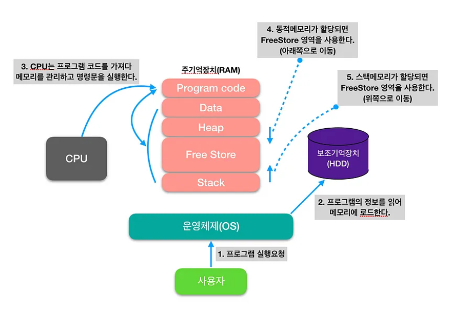
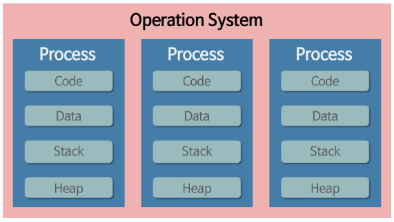

## CS 총론 1
### 운영 체제
- 시스템의 자원과 동작을 관리하는 소프트웨어
- 프로세스, 저장장치, 네트워킹, 사용자, 하드웨어를 관리
### 메모리 구조
- 메모리 공간 종류 4가지 
    - Code, Data, Heap, Stack
    - 
    - 운영체제에서 프로그램을 실행하면 프로그램 정보를 읽어 RAM에 로드하고
    - cpu 는 프로그램 코드를 가져다 주기억장치에서 실행한다
    
    - 프로그램을 실행하면 OS 는 메모리에 공간을 할당하고 할당해주는 메모리 공간은 아래의 4가지가 있다
    - 
    - Code : 실행할 프로그램의 코드가 저장되는 영역. 함수, 제어문, 상수
    - Data : 전역변수와 static 변수가 할당되는 영역. 프로그램 시작과 동시에 할당되고 프로그램이 종료되어야 메모리가 소멸되는 영역
    - Stack(LIFO) : 프로그램이 사용하는 임시 메모리 영역. 함수 호출 시 생성되는 지역변수와 매개변수가 저장되는 영역이고 함수 호출이 완료되면 사라짐
    - Heap (FIFO) : 사용자가 관리하는 공간으로 데이터가 동적으로 할당됨. 가바지 컬렉터가 자동으로 해제하는 공간(=동적할당)
### 프로세스, 스레드
- 프로세스 : 메모리에 올라와 실행중인 프로그램
    - 
    - 프로세스는 각각의 독립된 메모리를 할당받는다
    - 별도의 주소 공간에서 실행되며, 각 프로세스는 다른 프로세스의 변수나 자료구조에 접근할 수 없다
    - but, 프로세스 간의 통신 (파이프, 소켓 등의 통신)으로 접근 가능하다
- 스레드 : 프로세스 안에서 실행하는 단위. 스레드가 여러개가 돌면 프로세스화 된다
     - Stack 만 따로 할당받고(독립적으로 사용) Code, Data, Heap 영역은 공유한다
     - 같은 프로세스 안에 있는 여러 스레드들은 같은 힙공간을 공유한다. 반면에 프로세스는 다른 프로세스의 메모리에 직접 접근할 수 없다
     - 각각의 스레드는 별도의 레지스터와 스택을 갖고 있지만 힙 메모리는 서로 읽고 쓸 수 있다
     - 한 스레드가 프로세스 자원을 변경하면 다른 이웃 스레드 (sibling thread)도 그 변경 결과를 볼 수 있다
### CPU 스케쥴러
- 준비 QUEUE에 있는 프로세스에 대해 CPU 할당하는 방법
     - 비선점 스케쥴링(Non-preemptive scheduling)
          - FCFS(first come first served) : 먼저 cpu를 요청하는 프로세스를 처리하는 방식
          - SJF(Shortest job first) : 평균 waiting time을 최소화하기 위해 사용하는 방식으로 버스트 시간이 짧은 프로세스부터 cpu 를 할당한다
          (버스트 타임 : 어떤 프로세스의 작업 완료에 소요되는 시간)
     - 선점 스케쥴링(Preemptive scheduling)
          - 높은 우선순위를 가지는 프로세스가 먼저 스케쥴 된다
          - I/O bound process 는 cpu bound process 보다 높은 우선순위에 있어야 한다
          - Time slice(한 프로세스가 할당받은 시간) 양은 Burst time 보다 조금 더 많아야 한다
          - SRT(Shortest remaining time) : 최단 잔여시간을 우선으로 하는 스케쥴링으로 진행 중인 프로세스가 있어도 최단 잔여 시간인 프로세스를 위해 sleep 시키고 짧은 프로세스를 먼저 할당
          
          - RR(Round robin) : 모든 프로세스가 같은 우선순위를 가지고 time slice를 기반으로 스케쥴링 함. time slice burst가 일어나면 해당 프로세스는 스케쥴링 큐의 끝으로 이동
          - time slice가 클경우 FCFS와 다를바가 없고 너무 작으면 불필요한 context switch가 많이 일어남(리소스 낭비)
     - 우선 순위 스케쥴링
          - 우선 순위가 높은 프로세스에 cpu를 할당하는 방식
          - 시간제한, 메모리 요구량, 프로세스의 중요성, 리소스에 따라 정해짐 

### 가상메모리
- 사용하는 부분만 메모리에 올리고 나머지는 디스크에 보관
- 디스크를 효율적으로 사용하는게 목적
- 
    - 페이징 테이블을 통해서 메인 메모리에 접근

### 데드락
- 프로세스가 자원을 얻지 못해 다음 작업을 못하는 상태
- 다음 조건이 동시에 성립할 때 데드락이 발생
    - 상호배제 : 자원은 한 번에 한 프로세스만 사용
    - 점유 대기 : 최소한 하나의 자원을 점유하고 있으면서 다른 프로세스에 할당되어 사용하고 있는 자원을 추가로 점유하기 위해 대기하는 프로세스가 있음
    - 비선점 : 다른 프로세스에 할당된 자원은 사용이 끝날 때까지 강제로 뺏을 수 없다
    - 순환 대기 : 프로세스의 집합에서 p0은 p1이 점유한 자원을 대기하고 p1은 p2 가 점유한 자원을 대기하고 Pn은 P0가 점유한 자원을 요구해야 한다
    
